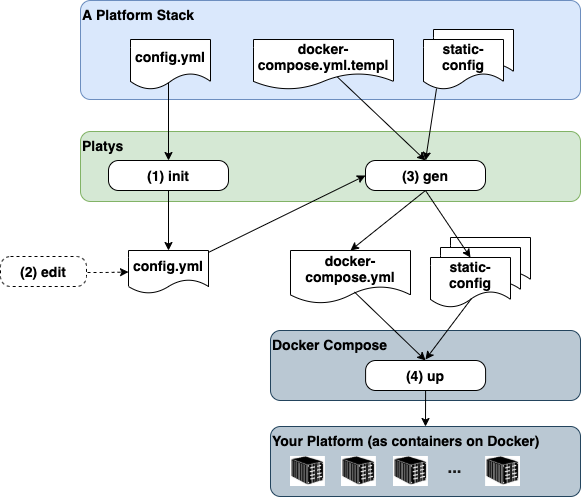

# platys - Trivadis Platform in a Box
Copyright (c) 2019-2020 Trivadis

THIS IS STILL WORK IN PROGRESS .... USE IT WITH CAUTION! 

## What is `platys`?

`platys` is a tool for generating and provisioning Modern Data Platforms based on [Docker](https://www.docker.com/get-started) and [Docker Compose](https://docs.docker.com/compose/). 

Its main use is for small-scale Data Lab projects, Proof-of-Concepts (PoC) or Proof-of-value (PoV) projects as well as trainings.

The user of `platys` can choose which services to use from a list of supported services and generate a fully working `docker-compose.yml` file including all necessary configuration files. This replaces the old approach, where we only had a static `docker-compose.yml` file with all services enabled by default. By generating the `docker-compose.yml`, the user has very fine-grained control on which services to include for a given platform. 

A concrete _Platform_ is always generated based on a given _Platform Stack_. A platform stack defines the set of available and usable services and has a name and a version. 

Currently only one Platform Stack is available:

* [`modern-data-platform`](./platform-stacks/modern-data-platform) - a Platform Stack for supporting a Modern (Analytical) Data Platforms

In the future, other platform stacks might be added.

## How does `platys` work?

The following diagram shows the building blocks of `platys` and the basic flow when working with it. 

1. Initialize a new _Platform_ context by specifying a _Platform Stack_. Optionally a set of services to be enabled can be specified with the `init` command. 
2. Optionally edit the `config.yml` to enable services and change default values of configuration settings.
3. Generate the artefacts for the platform (mainly the `docker-compose.yml` but also some configuration files) by running the `gen` command.
4. Run `docker-compose up` to start your platform.

## Where can I run `platys`?

The **platys** toolset runs on Windows, macOS and 64-bit Linux. 

`platys` runs the generator (supporting given Platform Stack) as a Docker container in the background. Therefore you need to have [Docker](https://www.docker.com/get-started) installed on the machine where you create the Platform. To run the Platform, you also need to have [Docker Compose](https://docs.docker.com/compose/) installed on the target machine, which can be different to the one where you generate the platform.  

See [Installing platys](./documentation/install.md) for how to install `platys` and then the [Getting Started with Platys and the Modern Data Platform Stack](./platform-stacks/modern-data-platform/documentation/getting-started.md) for how to use `platys`.

## Where can I run a generated platform ?

The generated platform can be provisioned either locally or in the cloud. See [Provisioning of Modern Data Platform](./documentation/environment/README.md) for various versions of how to deploy the platform. 

## Changes 
See [What's new?](./documentation/changes.md) for a detailed list of changes.

## Documentation

**Usage**

* [Installing platys](./documentation/install.md)
* [Getting Started with `platys` and the `modern-data-platform` platform stack](./platform-stacks/modern-data-platform/documentation/getting-started.md)
* [Frequently Asked Questions](./documentation/faq.md)
* [Command line reference](./documentation/command-line-ref.md)
* [Glossary of Terms](./documentation/glossary.md)
* [Available Platform Stacks](./platform-stacks)

**Development**

* [Service Design Decisions](./documentation/service-design.md)
* [Creating and maintaining a Platform Stack](./documentation/creating-and-maintaining-platform-stack.md)

