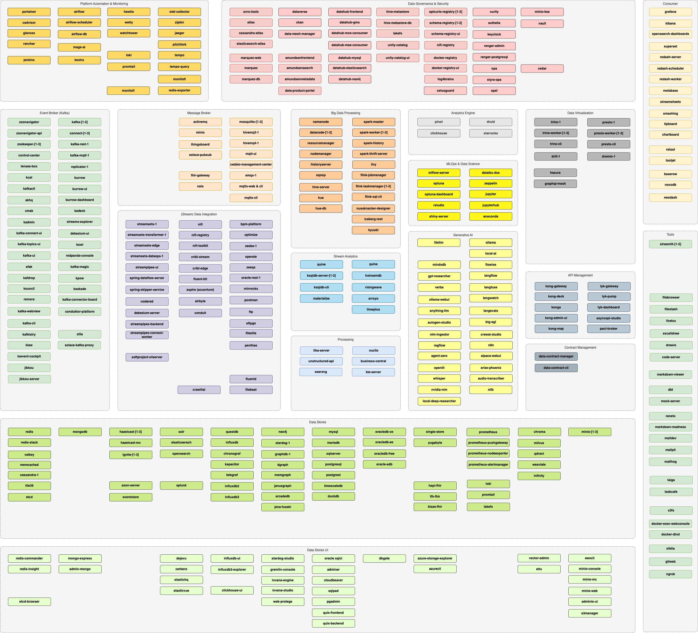

# Platform Stack: `modern-data-platform` - v1.15.0

This Platform Stack defines the set of services for a Modern Data Platform, such as

* Kafka
* Spark
* Hadoop Ecosystem
* StreamSets & NiFi
* Zeppelin & Jupyter
* NoSQL

and many others. 

## Which services can I use? 

The following services are provisioned as part of the Modern Data Platform: 

For new services to be added, please either create an [GitHub issue](https://github.com/TrivadisPF/modern-data-analytics-stack/issues/new) or create a Pull Request.

## Changes 
See [What's new?](./documentation/changes.md) for a detailed list of changes.

## Documentation

* [Getting Started with `platys` and `modern-data-platform` stack](./documentation/getting-started.md)
* [Configuration](./documentation/configuration.md) - all settings configurable in the `config.yml`
* [Tutorials](./tutorials/README.md) - various tutorials detailed instructions on how to work with `platys`
* [Cookbooks](./cookbooks/README.md) - various recipes showing how to use specific features of `platys`
* [Port Mapping](./documentation/port-mapping.md)
* [Frequently Asked Questions](./documentation/faq.md)
* [Troubleshooting](./documentation/troubleshooting.md)
* [Adding additional services not supported by a platform stack](https://github.com/TrivadisPF/platys/blob/master/documentation/docker-compose-override.md)
* [How to use a platys-generated stack without Internet](https://github.com/TrivadisPF/platys/blob/master/documentation/docker-compose-without-internet.md)
* [Upgrade to a new platform stack version](https://github.com/TrivadisPF/platys/blob/master/documentation/upgrade-platform-stack.md)