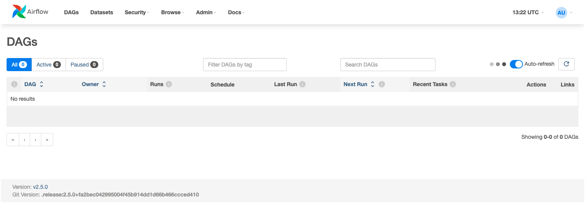
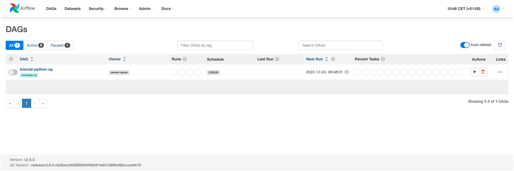
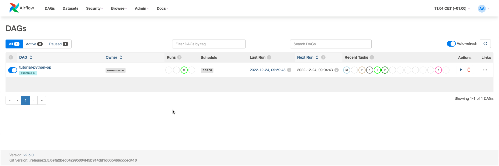
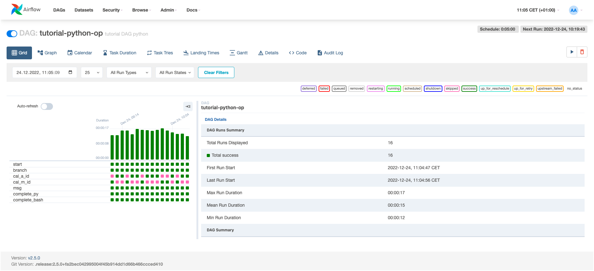
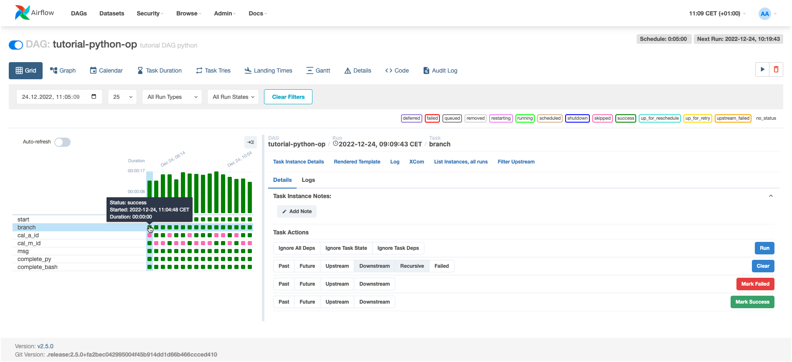
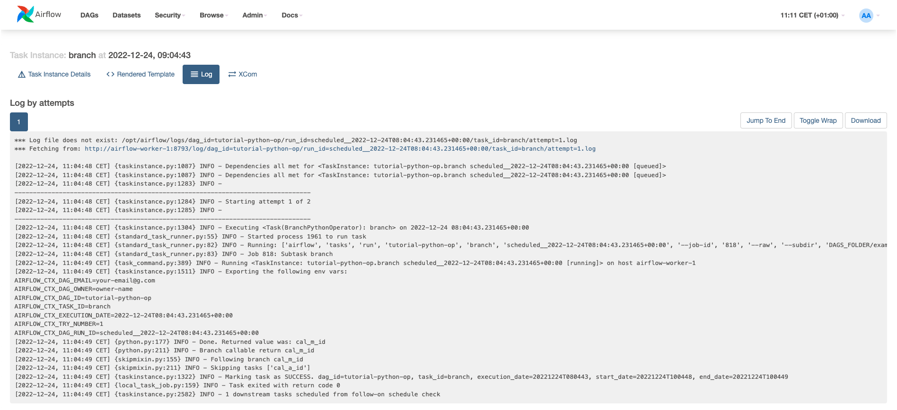

# Schedule and Run Simple Python Application with Airflow

This recipe will show how to use the [Apache Airflow](https://airflow.apache.org/) job orchestration engine with the [Bash Operator](https://airflow.apache.org/docs/apache-airflow/stable/_api/airflow/operators/bash/index.html#airflow.operators.bash.BashOperator) and [Python Operator](https://airflow.apache.org/docs/apache-airflow/stable/howto/operator/python.html).

## Initialise data platform

First [initialise a platys-supported data platform](../documentation/getting-started) with the following services enabled

```bash
platys init --enable-services AIRFLOW -s trivadis/platys-modern-data-platform -w 1.16.0
```

add to `config.yml`

```yaml
      AIRFLOW_executor: celery
      AIRFLOW_dag_dir_list_interval: 30
```

Now generate and start the platform 

```bash
platys gen

docker-compose up -d
```

Check the log of `airflow` to be up and running by running `docker logs -f airflow`. Airflow is ready if you see the **Listing at:...** in the log 

```
...
[2022-12-23 13:20:59,065] {providers_manager.py:235} INFO - Optional provider feature disabled when importing 'airflow.providers.google.leveldb.hooks.leveldb.LevelDBHook' from 'apache-airflow-providers-google' package
[2022-12-23 13:20:59 +0000] [54] [INFO] Listening at: http://0.0.0.0:8080 (54)
[2022-12-23 13:20:59 +0000] [54] [INFO] Using worker: sync
[2022-12-23 13:20:59 +0000] [62] [INFO] Booting worker with pid: 62
[2022-12-23 13:20:59 +0000] [63] [INFO] Booting worker with pid: 63
[2022-12-23 13:20:59 +0000] [64] [INFO] Booting worker with pid: 64
[2022-12-23 13:20:59 +0000] [65] [INFO] Booting worker with pid: 65
```

## Open Airflow Dashboard

Navigate to <http://dataplatform:28139> and login with user `airflow` and password `abc123!`. You should see the empty Airflow dashboard.



## Create an Airflow DAG

Now let's create a first example DAG.

In the `./scripts/airflow/dags` create a new file with the following DAG logic (we start the DAG every 5 minutes with a start date of today minus 2 hours.

`example-python.py`

```python
from datetime import datetime, timedelta
from textwrap import dedent

from airflow import DAG

# Operators; we need this to operate!
from airflow.operators.bash import BashOperator
from airflow.operators.dummy import DummyOperator
from airflow.operators.python import BranchPythonOperator
from airflow.operators.python_operator import PythonOperator
from airflow.utils.trigger_rule import TriggerRule

default_args = {
    'owner': 'owner-name',
    'depends_on_past': False,
    'email': ['your-email@g.com'],
    'email_on_failure': False,
    'email_on_retry': False,
    'retries': 1,
    'retry_delay': timedelta(minutes=15),
}

dag_args = dict(
    dag_id="tutorial-python-op",
    default_args=default_args,
    description='tutorial DAG python',
    schedule_interval=timedelta(minutes=5),
    start_date=datetime.today() - timedelta(hours=2, minutes=0),
    tags=['example-sj'],
)

def random_branch_path():
    # 필요 라이브러리는 여기서 import
    # https://airflow.apache.org/docs/apache-airflow/stable/best-practices.html#writing-a-dag 참고
    from random import randint

    return "cal_a_id" if randint(1, 2) == 1 else "cal_m_id"

def calc_add(x, y, **kwargs):
    result = x + y
    print("x + y : ", result)
    kwargs['task_instance'].xcom_push(key='calc_result', value=result)
    return "calc add"

def calc_mul(x, y, **kwargs):
    result = x * y
    print("x * y : ", result)
    kwargs['task_instance'].xcom_push(key='calc_result', value=result)
    return "calc mul"

def print_result(**kwargs):
    r = kwargs["task_instance"].xcom_pull(key='calc_result')
    print("message : ", r)
    print("*"*100)
    print(kwargs)

def end_seq():
    print("end")

with DAG( **dag_args ) as dag:
    start = BashOperator(
        task_id='start',
        bash_command='echo "start!"',
    )

    branch = BranchPythonOperator(
        task_id='branch',
        python_callable=random_branch_path,
    )

    calc_add = PythonOperator(
        task_id='cal_a_id',
        python_callable=calc_add,
        op_kwargs={'x': 10, 'y':4}
    )

    calc_mul = PythonOperator(
        task_id='cal_m_id',
        python_callable=calc_mul,
        op_kwargs={'x': 10, 'y':4}
    )

    msg = PythonOperator(
        task_id='msg',
        python_callable=print_result,
        trigger_rule=TriggerRule.NONE_FAILED
    )

    complete_py = PythonOperator(
        task_id='complete_py',
        python_callable=end_seq,
        trigger_rule=TriggerRule.NONE_FAILED
    )

    complete = BashOperator(
        task_id='complete_bash',
        depends_on_past=False,
        bash_command='echo "complete~!"',
        trigger_rule=TriggerRule.NONE_FAILED
    )


    start >> branch >> calc_add >> msg >> complete_py >> complete
    start >> branch >> calc_mul >> msg >> complete
```

After > 30 seconds (the `AIRFLOW_dag_dir_list_interval` configured in `config.yml`), the Airflow dashboard should refresh and show the newly created DAG.



By default the DAG will be initially in paused mode. Click on the button to the left of the DAG to unpause it. 

Jobs will be immediately started for the last 2 hours, with an interval of 5 minutes between them. 



If you click on the job you can see the details of the job with a graphic of each run. 



Click on one of the successful tasks to see the details of this task



Clock on the **Log** tab to see the log output of this task's run

