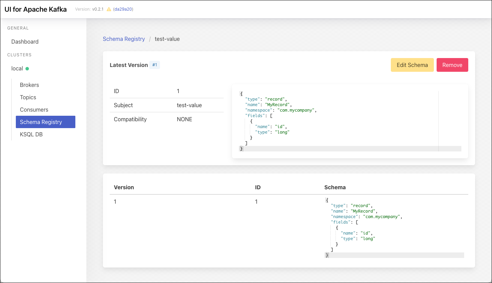

# Apicurio Registry with SQL Storage (PostgreSQL)

This recipe will show how to use the Apicurio Registry as a Confluent-compliant Schema Registry.

## Initialise data platform

First [initialise a platys-supported data platform](../documentation/getting-started.md) with the following services enabled

```
platys init --enable-services KAFKA,SCHEMA_REGISTRY,POSTGRESQL,KAFKA_UI,ADMINER -s trivadis/platys-modern-data-platform -w 1.14.0
```

edit the `config.yml` and add the followin properties right after `SCHEMA_REGISTRY_enable: true`:


```yaml
      SCHEMA_REGISTRY_flavour: apicurio
      APICURIO_SCHEMA_REGISTRY_storage: sql  
```

By default, Apicurio Registry is configured to use Postgresql with a database of `apicuriodb`, a user of `apicurio` with a password of `abc123!`. 

Therefore we need to configure PosgreSQL accordingly by adding the following properties after the `POSTGRESQL_enable: true`: 

```yaml
      POSTGRESQL_multiple_databases: 'apicuriodb'
      POSTGRESQL_multiple_users: 'apicurio'
      POSTGRESQL_multiple_passwords: 'abc123!'
```

Now start the platform

```bash
export DATAPLATFORM_HOME=${PWD}

platys gen

docker-compose up -d
```

## Using Confluent Schema-Registry Compliant URL

The Apicurio Registry is available on port 8081. It offers a confluent-compliant REST interface available under this base URL:

```bash
http://dataplatform:8081/apis/ccompat/v6
```

## Register a schema using Kafka UI

Kafka UI has the option to view and edit a schema registry. It is configured using the confluent-compliant REST API of Apicurio Registry. 

In a web browser, navigate to the Kafka UI: <http://192.168.142.129:28179>.

In the menu on the left, click on **Schema Registry**. Click **Create Schema** and add a schema using

* **Subject**: `test-value` 
* **Schema**:

```json
{
  "type" : "record",
  "name" : "MyRecord",
  "namespace" : "com.mycompany",
  "fields" : [ {
    "name" : "id",
    "type" : "long"
  } ]
}
```
 * **Schema Type**: `AVRO`

and click **Submit**. The schema should get registered as shown




## Check the database schema

In a web browser, navigate to the Adminer UI: <http://192.168.142.129:28131>.

Login using the following information

 * **System**: `PostgreSQL`
 * **Server**: `postgresql`
 * **Username**: `apicurio`
 * **Password**: `abc133!`
 * **Database**: `apicuriodb`

and click **Login**.

You should the various tables, such as `apicurio`, `artifacts`, `content` and many others.


