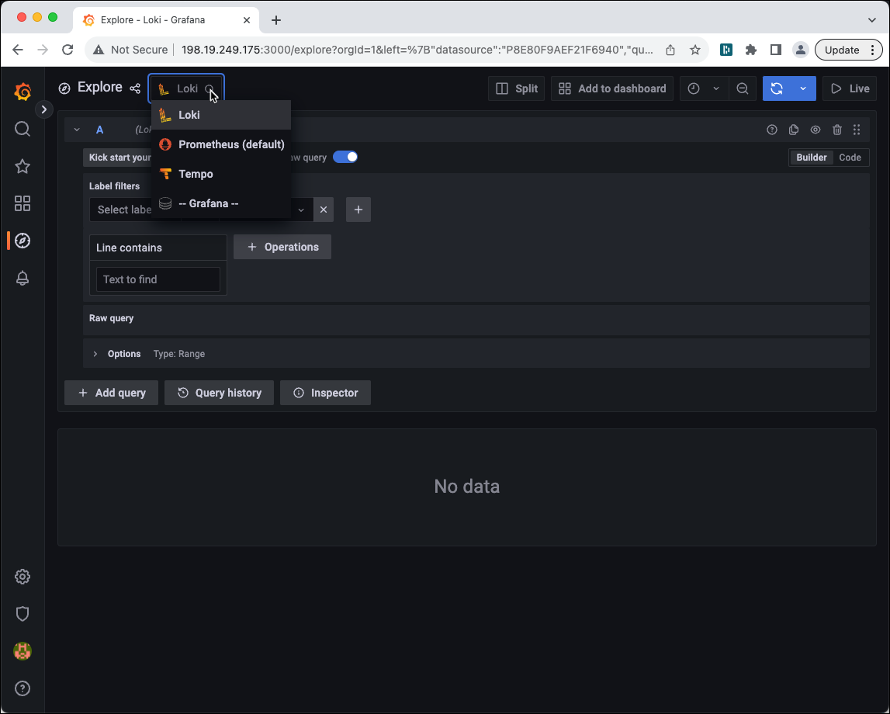
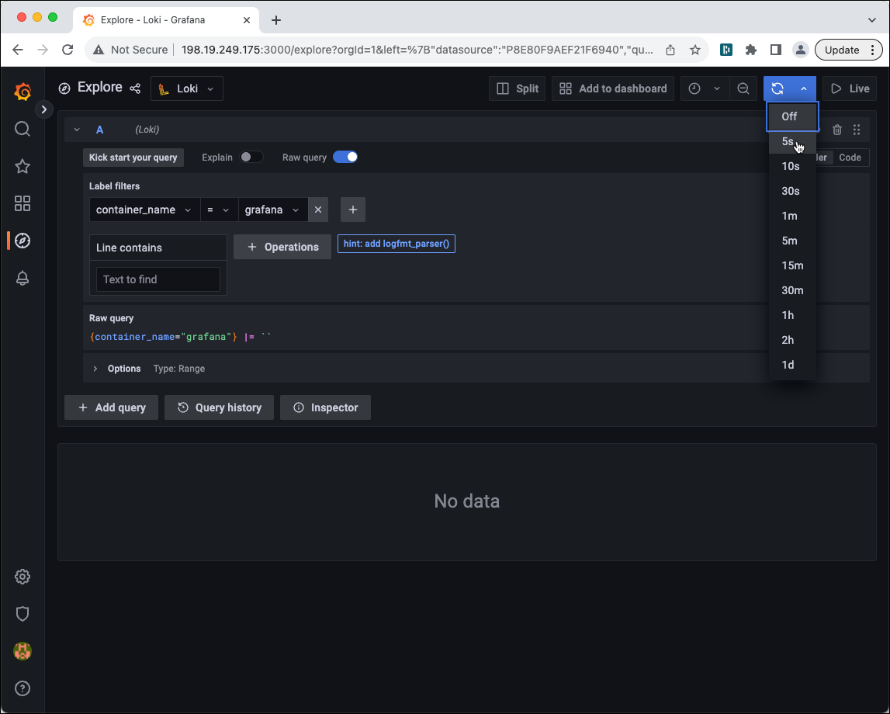
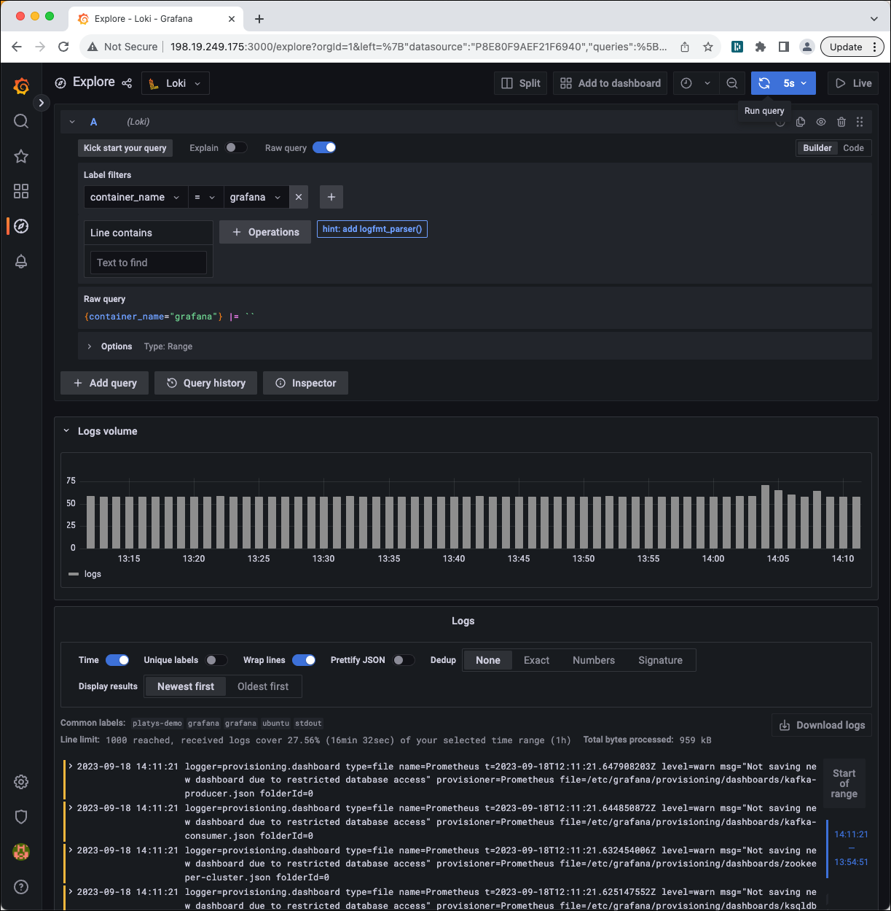

# Collecting Docker Logs with Loki

This recipe will show how to use Loki to collect all the logs from Docker and visualize it in Grafana.

## Initialise data platform

First [initialise a platys-supported data platform](../documentation/getting-started) with the following services enabled

```bash
platys init --enable-services LOKI,GRAFANA -s trivadis/platys-modern-data-platform -w 1.17.0
```

edit `config.yml` and insert the `logging_driver` configuration setting after the `use_timezone`

```yaml
      # Timezone, use a Linux string such as Europe/Zurich or America/New_York
      use_timezone: ''

      # Docker Logging Driver to use, either 'json-file', 'fluentd' or 'loki'
      logging_driver: 'loki'
```

To ship logs to Loki automatically for every container we add to our setup, we need to add the Loki logging driver once to our Docker setup


```bash
docker plugin install grafana/loki-docker-driver:latest --alias loki --grant-all-permissions
```

Restart the docker daemon after installing the plugin.

```bash
sudo systemctl restart docker
```

verify it is enabled

```bash
docker plugin ls
```


Now generate and start the platform 

```bash
platys gen

docker-compose up -d
```

## Check Container Logs in Loki

Grafana Loki exposes an HTTP API for pushing, querying, and tailing log data. Find the documentation here: <https://grafana.com/docs/loki/latest/reference/api/>.

Let's see the labels stored in Loki:

```bash
$ curl http://198.19.249.175:3100/loki/api/v1/labels | jq
  % Total    % Received % Xferd  Average Speed   Time    Time     Time  Current
                                 Dload  Upload   Total   Spent    Left  Speed
100   110  100   110    0     0  33013      0 --:--:-- --:--:-- --:--:-- 36666
{
  "status": "success",
  "data": [
    "compose_project",
    "compose_service",
    "container_name",
    "filename",
    "host",
    "source"
  ]
}
```

Let's see the values for the `container_name`:


```bash
$ curl http://198.19.249.175:3100/loki/api/v1/label/container_name/values | jq
  % Total    % Received % Xferd  Average Speed   Time    Time     Time  Current
                                 Dload  Upload   Total   Spent    Left  Speed
100    85  100    85    0     0  26529      0 --:--:-- --:--:-- --:--:-- 28333
{
  "status": "success",
  "data": [
    "grafana",
    "wetty"
  ]
}
```

Let's query the log of container `grafana` (we only display 2 lines, and format the log)

```bash
$ curl -G -s "http://198.19.249.175:3100/loki/api/v1/query" --data-urlencode 'query={container_name="grafana"} |= "" | logfmt ' --data-urlencode 'limit=2' | jq
{
  "status": "success",
  "data": {
    "resultType": "streams",
    "result": [
      {
        "stream": {
          "compose_project": "platys-demo",
          "compose_service": "grafana",
          "container_name": "grafana",
          "file": "/etc/grafana/provisioning/dashboards/ksqldb-cluster.json",
          "filename": "/var/log/docker/cd8bfc668214c9c5b4a423a18efebbbd415df38b95525128673f88a3cf9fb5ac/json.log",
          "folderId": "0",
          "host": "ubuntu",
          "level": "warn",
          "logger": "provisioning.dashboard",
          "msg": "Not saving new dashboard due to restricted database access",
          "name": "Prometheus",
          "provisioner": "Prometheus",
          "source": "stdout",
          "t": "2023-09-18T12:00:31.626005761Z",
          "type": "file"
        },
        "values": [
          [
            "1695038431626162301",
            "logger=provisioning.dashboard type=file name=Prometheus t=2023-09-18T12:00:31.626005761Z level=warn msg=\"Not saving new dashboard due to restricted database access\" provisioner=Prometheus file=/etc/grafana/provisioning/dashboards/ksqldb-cluster.json folderId=0"
          ]
        ]
      },
      {
        "stream": {
          "compose_project": "platys-demo",
          "compose_service": "grafana",
          "container_name": "grafana",
          "file": "/etc/grafana/provisioning/dashboards/zookeeper-cluster.json",
          "filename": "/var/log/docker/cd8bfc668214c9c5b4a423a18efebbbd415df38b95525128673f88a3cf9fb5ac/json.log",
          "folderId": "0",
          "host": "ubuntu",
          "level": "warn",
          "logger": "provisioning.dashboard",
          "msg": "Not saving new dashboard due to restricted database access",
          "name": "Prometheus",
          "provisioner": "Prometheus",
          "source": "stdout",
          "t": "2023-09-18T12:00:31.631375319Z",
          "type": "file"
        },
        "values": [
          [
            "1695038431631605691",
            "logger=provisioning.dashboard type=file name=Prometheus t=2023-09-18T12:00:31.631375319Z level=warn msg=\"Not saving new dashboard due to restricted database access\" provisioner=Prometheus file=/etc/grafana/provisioning/dashboards/zookeeper-cluster.json folderId=0"
          ]
        ]
      }
    ],
    "stats": {
      "summary": {
        "bytesProcessedPerSecond": 4623449,
        "linesProcessedPerSecond": 19474,
        "totalBytesProcessed": 6885,
        "totalLinesProcessed": 29,
        "execTime": 0.001489,
        "queueTime": 6.2e-05,
        "subqueries": 0,
        "totalEntriesReturned": 2,
        "splits": 0,
        "shards": 0,
        "totalPostFilterLines": 29,
        "totalStructuredMetadataBytesProcessed": 0
      },
      "querier": {
        "store": {
          "totalChunksRef": 0,
          "totalChunksDownloaded": 0,
          "chunksDownloadTime": 0,
          "chunk": {
            "headChunkBytes": 0,
            "headChunkLines": 0,
            "decompressedBytes": 0,
            "decompressedLines": 0,
            "compressedBytes": 0,
            "totalDuplicates": 0,
            "postFilterLines": 0,
            "headChunkStructuredMetadataBytes": 0,
            "decompressedStructuredMetadataBytes": 0
          },
          "chunkRefsFetchTime": 0
        }
      },
      "ingester": {
        "totalReached": 1,
        "totalChunksMatched": 1,
        "totalBatches": 1,
        "totalLinesSent": 2,
        "store": {
          "totalChunksRef": 0,
          "totalChunksDownloaded": 0,
          "chunksDownloadTime": 0,
          "chunk": {
            "headChunkBytes": 6885,
            "headChunkLines": 29,
            "decompressedBytes": 0,
            "decompressedLines": 0,
            "compressedBytes": 0,
            "totalDuplicates": 0,
            "postFilterLines": 29,
            "headChunkStructuredMetadataBytes": 0,
            "decompressedStructuredMetadataBytes": 0
          },
          "chunkRefsFetchTime": 390329
        }
      },
      "cache": {
        "chunk": {
          "entriesFound": 0,
          "entriesRequested": 0,
          "entriesStored": 0,
          "bytesReceived": 0,
          "bytesSent": 0,
          "requests": 0,
          "downloadTime": 0
        },
        "index": {
          "entriesFound": 0,
          "entriesRequested": 0,
          "entriesStored": 0,
          "bytesReceived": 0,
          "bytesSent": 0,
          "requests": 0,
          "downloadTime": 0
        },
        "result": {
          "entriesFound": 0,
          "entriesRequested": 0,
          "entriesStored": 0,
          "bytesReceived": 0,
          "bytesSent": 0,
          "requests": 0,
          "downloadTime": 0
        },
        "statsResult": {
          "entriesFound": 0,
          "entriesRequested": 0,
          "entriesStored": 0,
          "bytesReceived": 0,
          "bytesSent": 0,
          "requests": 0,
          "downloadTime": 0
        },
        "volumeResult": {
          "entriesFound": 0,
          "entriesRequested": 0,
          "entriesStored": 0,
          "bytesReceived": 0,
          "bytesSent": 0,
          "requests": 0,
          "downloadTime": 0
        }
      }
    }
  }
}
```

## Visualize in Grafana

Navigate to <http://dataplatform:3000> and login as `admin` with password `abc123!`.

In the menu to the left, click **Explore** and in the drop down list on the top, select **Loki**.



Select `container_name` for the label to filter and select `grafana` for the value. 



Change the  automatic refresh interval to `5s` and click on the blue **Run Query** button and you should see the logs of the `grafana` container refreshed every 5 seconds: 



