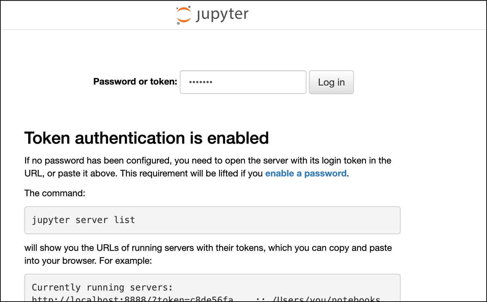
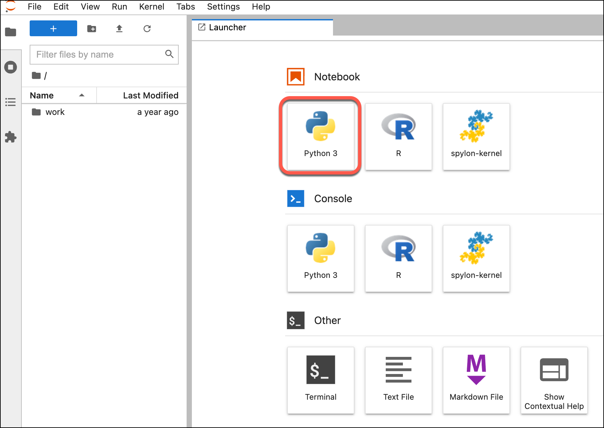

# Using Jupyter notebook with Spark and Avro

This recipe will show how to use Jupyter with the local Spark engine and working with Avro data. By that we also show how to specify an additional dependency (to Avro).

## Initialise data platform

First [initialise a platys-supported data platform](../documentation/getting-started.md) with the following services enabled

```
platys init --enable-services JUPYTER,PROVISIONING_DATA -s trivadis/platys-modern-data-platform -w 1.16.0
```

Edit the `config.yml` and add the following properties after `JUPYTER_enable`

```yaml
      JUPYTER_edition: 'all-spark'
      JUPYTER_spark_jars_packages: 'org.apache.spark:spark-avro_2.12:3.1.1'
      JUPYTER_tokenless: false
      JUPYTER_token: 'abc123!'
```

We specify the `all-spark` edition of Jupyter and specify the dependency on `org.apache.spark:spark-avro_2.12:3.1.1` to be added to the Spark environment. This will automatically be added to `spark-defaults.conf` when starting Jupyter.
Additionally we specify the token to login into Jupyter as `abc123!`.

Generate and start the platform

```bash
export DATAPLATFORM_HOME=${PWD}

platys gen

docker-compose up -d
```

The `PROVISIONING_DATA_enable` setting will copy data to the `data-transfer` folder. We will use from `flight-data` folder the `airports.avro` file.

```
docker@ubuntu ~/platys-demo [SIGINT]> ls -lsa data-transfer/flight-data/
total 57056
    4 drwxr-xr-x 4 root   root       4096 Oct  3 10:26 ./
    4 drwxr-xr-x 8 docker docker     4096 Oct  3 10:26 ../
    4 -rw-r--r-- 1 root   root       1952 Oct  3 10:26 README.md
  140 -rw-r--r-- 1 root   root     141544 Oct  3 10:26 airports.avro
  240 -rwxr-xr-x 1 root   root     244438 Oct  3 10:26 airports.csv*
  588 -rw-r--r-- 1 root   root     598901 Oct  3 10:26 airports.json
   44 -rwxr-xr-x 1 root   root      43758 Oct  3 10:26 carriers.csv*
   76 -rw-r--r-- 1 root   root      76537 Oct  3 10:26 carriers.json
    4 drwxr-xr-x 2 root   root       4096 Oct  3 10:26 flights-medium/
    4 drwxr-xr-x 2 root   root       4096 Oct  3 10:26 flights-small/
54580 -rw-r--r-- 1 root   root   55888790 Oct  3 10:26 pilot_handbook.pdf
  420 -rwxr-xr-x 1 root   root     428558 Oct  3 10:26 plane-data.csv*
  948 -rw-r--r-- 1 root   root     968807 Oct  3 10:26 plane-data.json
```
 
## Using Jupyter to read the Airports.avro file

Navigate to Jupyter on <http://dataplatform:28888>. 

Enter `abc123!` into the **Password or token** field and click on **Log in**:



On the **Launcher** page, click on **Python 3** Notebook. 



Add the following block as the first cell

```python
import os
# make sure pyspark tells workers to use python3 not 2 if both are installed
#os.environ['PYSPARK_PYTHON'] = '/usr/bin/python3'

import pyspark
conf = pyspark.SparkConf()

from pyspark.sql import SparkSession
spark = SparkSession.builder.appName('abc').config(conf=conf).getOrCreate()
sc = spark.sparkContext
```

and execute it. 

If you check the Jupyter log using `docker log -f jupyter` you can see that the avro jar has been downloaded:

```bash
docker logs -f  jupyter
Set username to: jovyan
usermod: no changes
/usr/local/bin/start-notebook.sh: running hooks in /usr/local/bin/before-notebook.d
/usr/local/bin/start-notebook.sh: running /usr/local/bin/before-notebook.d/spark-config.sh
/usr/local/bin/start-notebook.sh: done running hooks in /usr/local/bin/before-notebook.d

...

WARNING: Please consider reporting this to the maintainers of org.apache.spark.unsafe.Platform
WARNING: Use --illegal-access=warn to enable warnings of further illegal reflective access operations
WARNING: All illegal access operations will be denied in a future release
:: loading settings :: url = jar:file:/usr/local/spark-3.1.1-bin-hadoop3.2/jars/ivy-2.4.0.jar!/org/apache/ivy/core/settings/ivysettings.xml
Ivy Default Cache set to: /home/jovyan/.ivy2/cache
The jars for the packages stored in: /home/jovyan/.ivy2/jars
org.apache.spark#spark-avro_2.12 added as a dependency
:: resolving dependencies :: org.apache.spark#spark-submit-parent-3d132608-dd55-4339-acd9-04808d1fd502;1.0
	confs: [default]
	found org.apache.spark#spark-avro_2.12;3.1.1 in central
	found org.spark-project.spark#unused;1.0.0 in central
downloading https://repo1.maven.org/maven2/org/apache/spark/spark-avro_2.12/3.1.1/spark-avro_2.12-3.1.1.jar ...
	[SUCCESSFUL ] org.apache.spark#spark-avro_2.12;3.1.1!spark-avro_2.12.jar (78ms)
downloading https://repo1.maven.org/maven2/org/spark-project/spark/unused/1.0.0/unused-1.0.0.jar ...
	[SUCCESSFUL ] org.spark-project.spark#unused;1.0.0!unused.jar (38ms)
:: resolution report :: resolve 5160ms :: artifacts dl 120ms
```

Now add the cell to read the `airports.avro` file and show the data

```python
airportDF = spark.read.format("avro").load("/data-transfer/flight-data/airports.avro")

airportDF.show()
```

