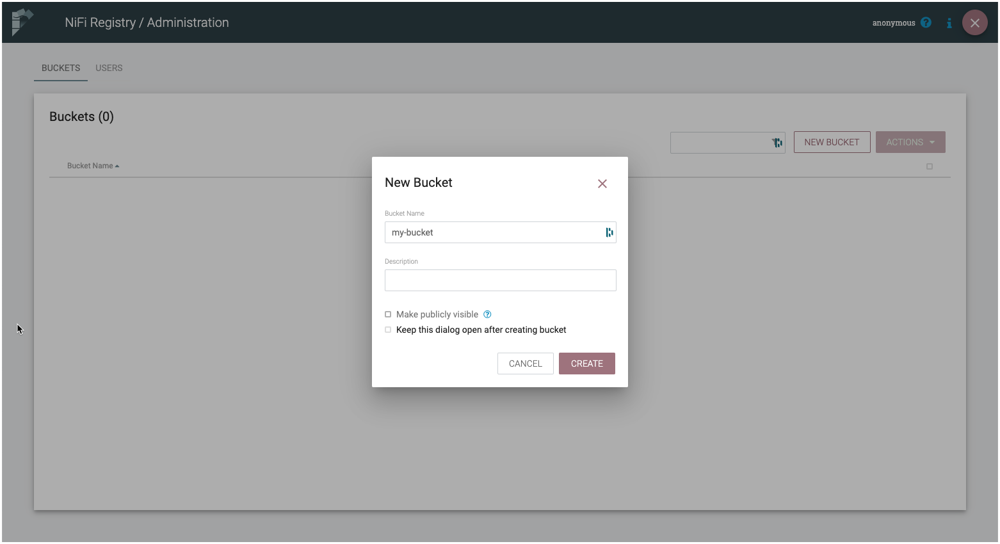
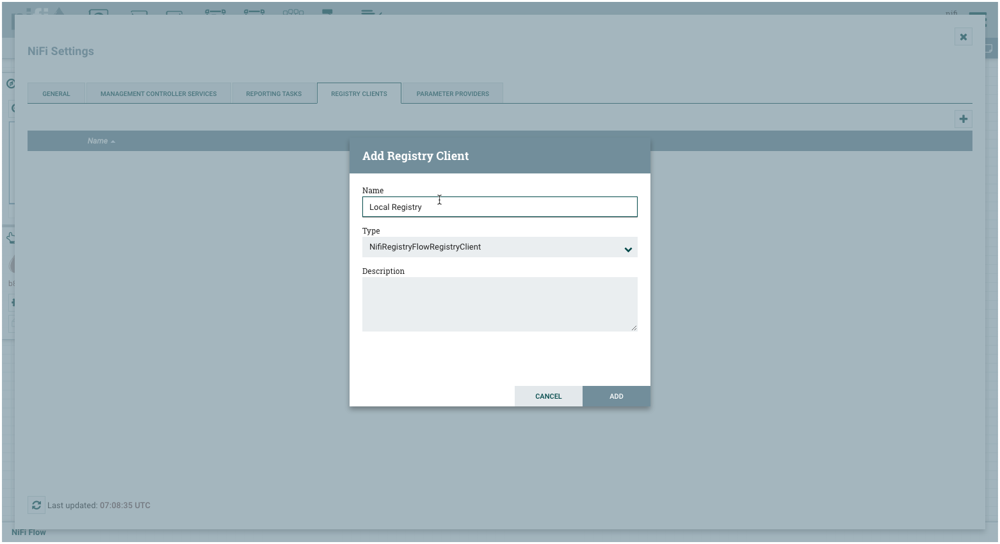
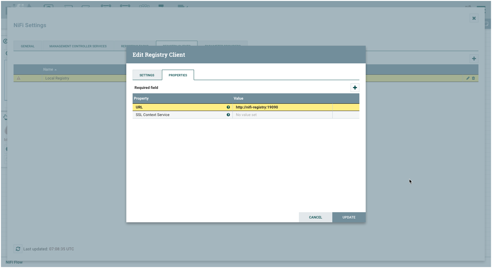
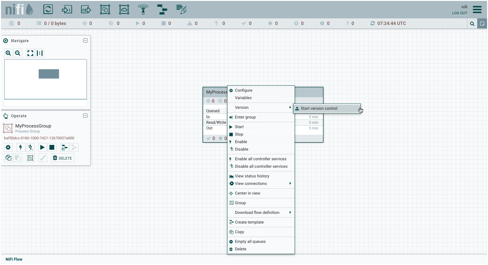
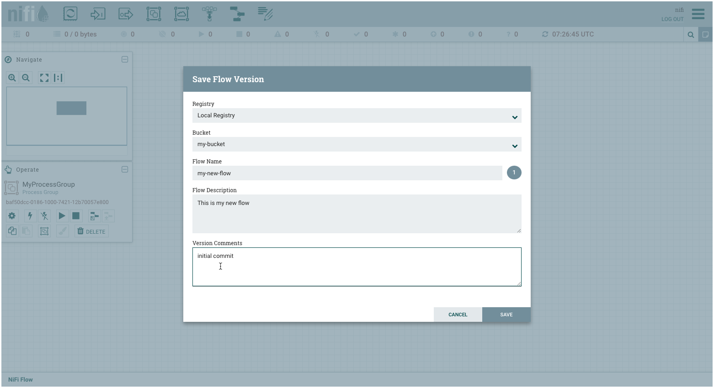

# NiFi Registry with Git Flow Persistence Provider

This recipe will show how to use [NiFi Registry](https://nifi.apache.org/registry.html) with the [Git Flow Persistence Provider](https://nifi.apache.org/docs/nifi-registry-docs/html/administration-guide.html#gitflowpersistenceprovider) enabled. We will show various configurations and their behaviour. 

## Initialise data platform

First [initialise a platys-supported data platform](../documentation/getting-started.md) with the following services enabled

```bash
export DATAPLATFORM_HOME=${PWD}
platys init --enable-services NIFI,NIFI_REGISTRY -s trivadis/platys-modern-data-platform -w 1.17.0
```

Before we can generate the platform, we need to create a Git Repository and extend the `config.yml` with the necessary configuration.

## Create a Git Repository

Create a new Git repository which will be used as the storage for the Flow Persistence. In this cookbook we will assume that the repository is named `nifi-git-flow-provider`. 

## Using Git Flow Persistence Provider without automatic Push

Enable authentication by adding the following settings to the `config.yml`

```yaml
      NIFI_REGISTRY_volume_map_flow_storage: true
      NIFI_REGISTRY_flow_provider: git
      NIFI_REGISTRY_git_user: gschmutz
      NIFI_REGISTRY_git_repo: http://github.com/<owner>/nifi-git-flow-provider
      NIFI_REGISTRY_flow_storage_folder_on_dockerhost: ./nifi-git-flow-provider
```

The password could also be specified using the `NIFI_REGISTRY_git_password` configuration setting. But to avoid it ending up in the `docker-compose.yml` file, we rather use the option to add it as an environment variable:

Create a `.env` file 

```
nano .env
```

and add the following environment variable to specify the access token for the Git Repo (

```bash
PLATYS_NIFI_REGISTRY_GIT_PASSWORD=XXXXXXXXXXXXXXXXXXXX
```

Save the file and generate and start the data platform.

```bash
platys gen
docker-compose up -d
```

Now let's use NiFi together with the Registry. Here we will only show the most important steps, you can find a more tutorial like documentation [here](https://nifi.apache.org/docs/nifi-registry-docs/index.html). 

Navigate to the NiFi Registry: <http://dataplatform:19090/nifi-registry> and create a new bucket and name it `my-bucket`.



Navigate to NiFi <https://dataplatform:18080> and login as user `nifi` with password `1234567890ACD`.

Click on the Sandwich menu in the top right and open **Controller Settings**. Navigate to the **Registry Clients** tab and add a new Registry Client. 



Click **Add** and then edit the client and set the **URL** of the NiFi Registry to `http://nifi-registry:19090` and click on **UPDATE**.



Now with the link to NiFi Registry configured, we can start using it. 

Add a new **Process Group** to the NiFi canvas. Right click on the process group and select **Version** | **Start version control** to add it to version control. 



Add the information to the **Save Flow Version** screen and hit **SAVE**.



You now have a process group which is under version control, shown by the green checkmark in the top left corner. 

If you want the NiFi Registry to automatically push changes to the remote 

## Using Git Flow Persistence Provider with automatic Push

Enable authentication by adding the following settings to the `config.yml`

```yaml
      NIFI_REGISTRY_flow_provider: git
      NIFI_REGISTRY_git_remote: origin
      NIFI_REGISTRY_git_user: gschmutz
      NIFI_REGISTRY_git_repo: http://github.com/<owner>/nifi-git-flow-provider
      NIFI_REGISTRY_flow_storage_folder_on_dockerhost: ./container-volume/nifi-registry/flow-storage
```

## Using Git Flow Persistence Provider with SSH authentication

To enable authentication by SSH key, change the settings in the `config.yml` to

```yaml
      NIFI_REGISTRY_flow_provider: git
      NIFI_REGISTRY_git_remote: origin
      NIFI_REGISTRY_git_user:
      NIFI_REGISTRY_git_use_ssh_auth: true
      NIFI_REGISTRY_git_repo:
      NIFI_REGISTRY_flow_storage_folder_on_dockerhost: ./<git-repo-folder>
```


cp /home/${USER}/.ssh/id_rsa.pub ./security/nifi-registry/git/ssh

When using SSH authentication, the automatic Git Clone will not work. Therefore manually clone the repo to `./<git-repo-folder>` and then start the `nifi-registry` service.

