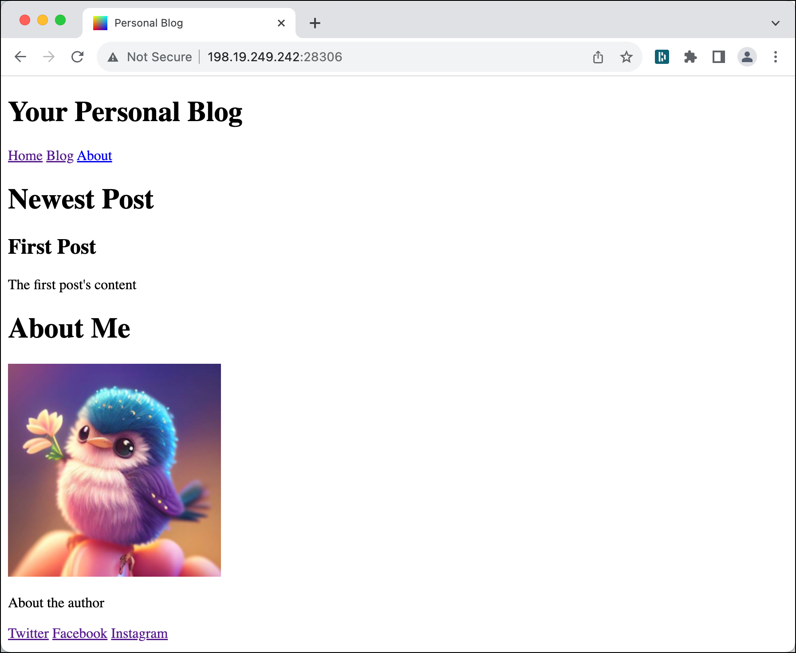

# Serving a static Web application from MinIO

This recipe will show how to provide a static Web Application from MinIO using the Minio-Web Server. We will upload all the artefacts to MinIO object storage from where the application is served.

The artefacts (files) we are going to use are available through the data docker container (`PROVISIONING_DATA` flag). The originals are also available in the `./artefacts` folder.

## Initialise data platform

First [initialise a platys-supported data platform](../documentation/getting-started) with the following services enabled

```bash
platys init --enable-services MINIO,MINIO_WEB,PROVISIONING_DATA -s trivadis/platys-modern-data-platform -w 1.17.0
```

edit `config.yml` and add the following configuration setting after the `MINIO_enable`

```yaml
      # add additional buckets, comma separated, admin-bucket will be created by default
      MINIO_buckets: 'webapp-bucket'
      MINIO_browser_enable: true
```

add the following configuration setting after the `MINIO_WEB_enable `

```yaml
      MINIO_WEB_s3_bucket_name: 'webapp-bucket'
      MINIO_WEB_s3_prefix: 'my-web-app/'
      MINIO_WEB_default_html: 'myblog.html'
      MINIO_WEB_favicon: ''
      MINIO_WEB_md_template: ''     
```      

Now generate and start the platform 

```bash
platys gen

docker-compose up -d
```

## Upload artefacts to MinIO

First let's upload the data to Minio. We can use the `minio-mc` command line tool for that. The bucket `webapp-bucket` has been created upon start of the platform.

Upload the html files

```bash
docker exec -ti minio-mc mc cp /data-transfer/platys-cookbooks/html/myblog.html minio-1/webapp-bucket/my-web-app/myblog.html
```

then upload the image

```bash
docker exec -ti minio-mc mc cp /data-transfer/platys-cookbooks/html/profile-picture.png minio-1/webapp-bucket/my-web-app/images/profile-picture.png
```

now let's make sure that the files have been uploaded correctly

```bash
docker exec -ti minio-mc mc tree --files minio-1/webapp-bucket/
```

you should get the following hierarchy

```
$ docker exec -ti minio-mc mc tree --files minio-1/webapp-bucket/
minio-1/webapp-bucket/
└─ my-web-app
   ├─ myblog.html
   └─ images
      └─ profile-picture.png
```

## Test the Application

Now test the application by navigating to <http://dataplatform:28306> and you should get the following result


## Replace the favourite icon

Minio-Web comes with a default favourite icon, which can be replaced if desired. Let's use this icon instead: 

```bash
cp ./data-transfer/platys-cookbooks/html/myapp.ico ./custom-conf/minio-web
```

update the configuration in `config.yml` to specify the custom favicon (replacing the default one)

```yaml
      MINIO_WEB_favicon: 'myapp.ico'
```      

and regenerate and restart the `minio-web` container

```bash
platys gen
docker compose up -d minio-web
```

Test the application again by navigating to <http://dataplatform:28306> and you should see your own favourite icon:


