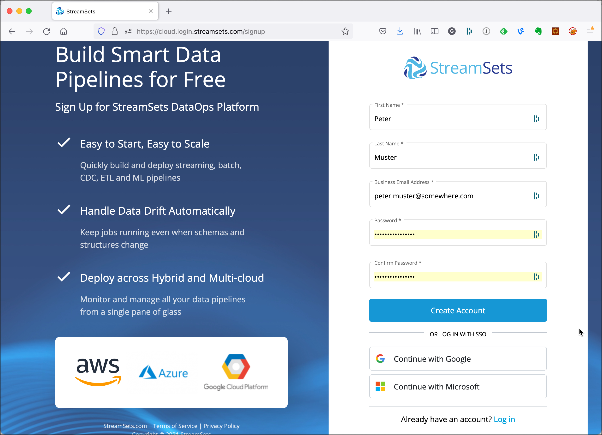
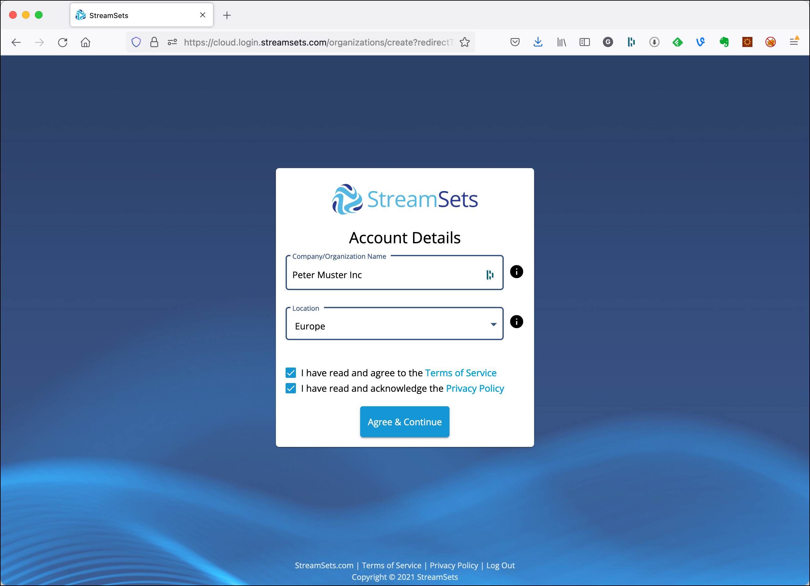
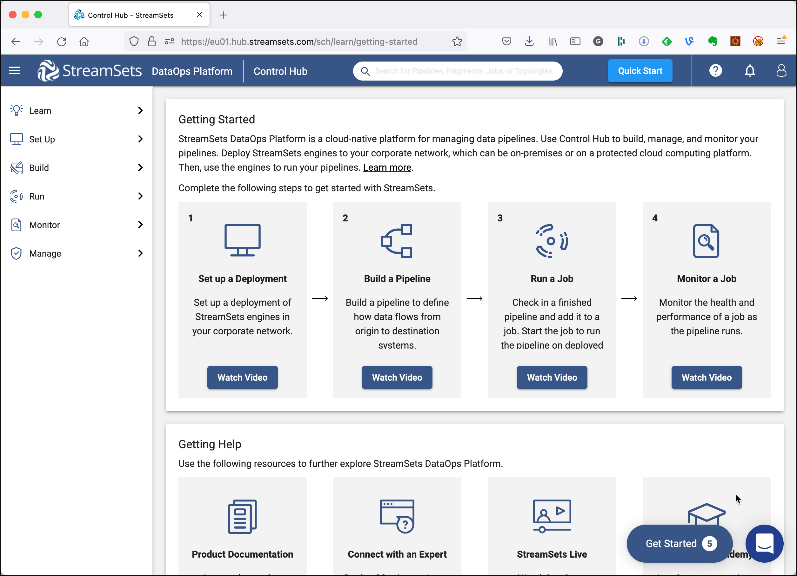
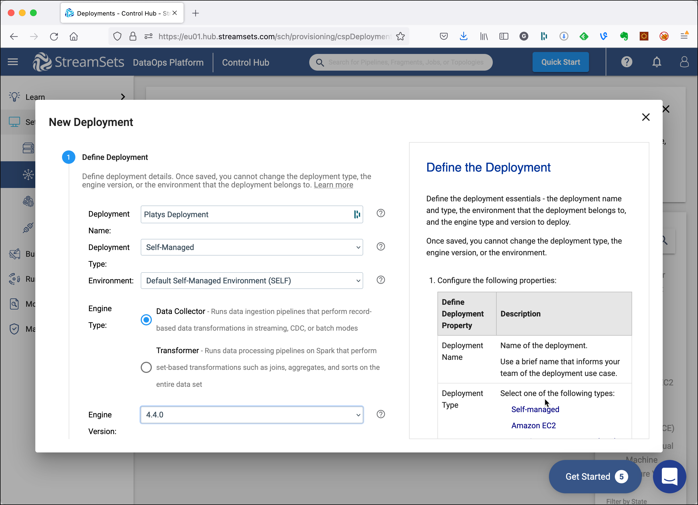
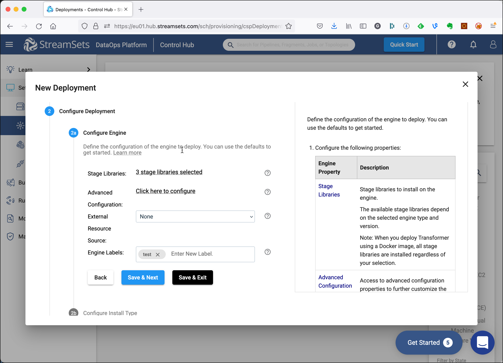
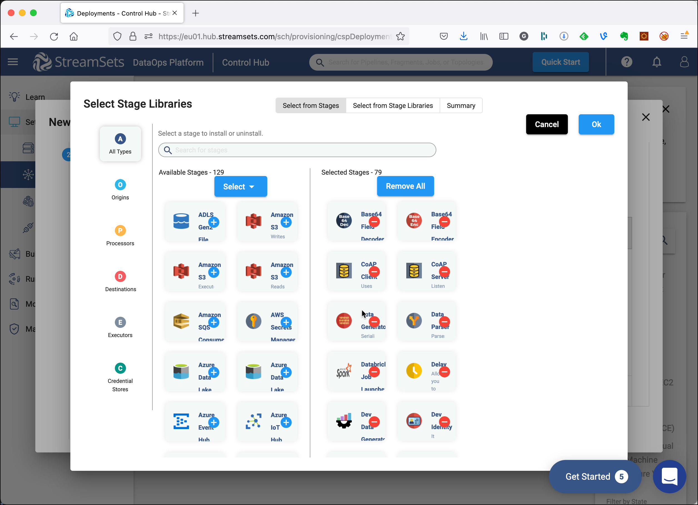
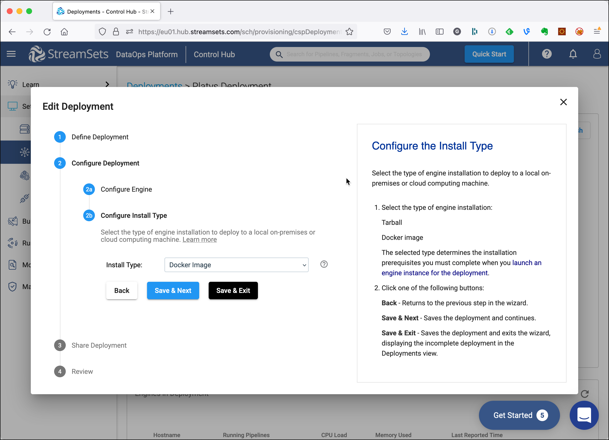
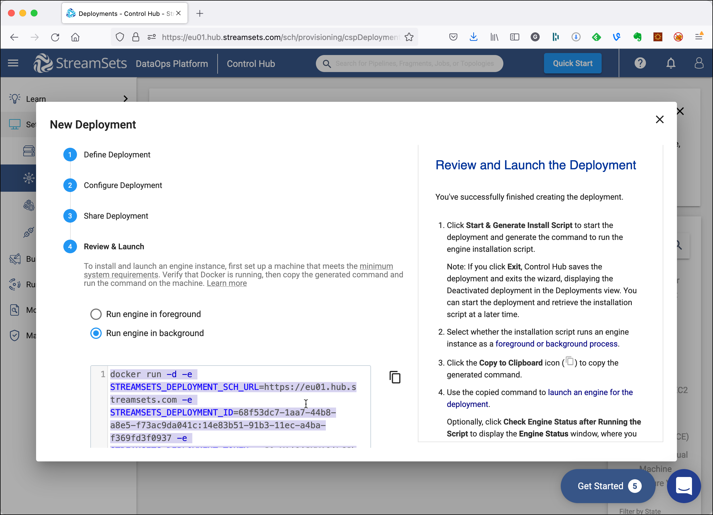
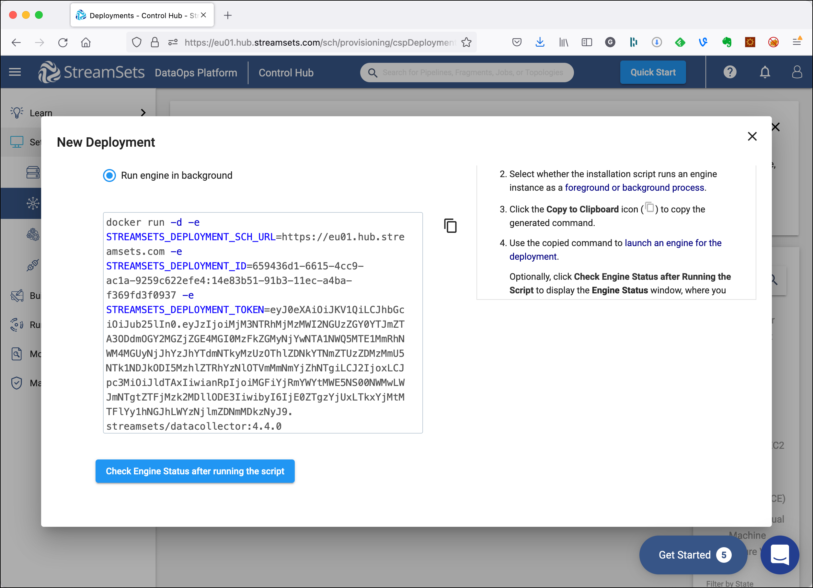
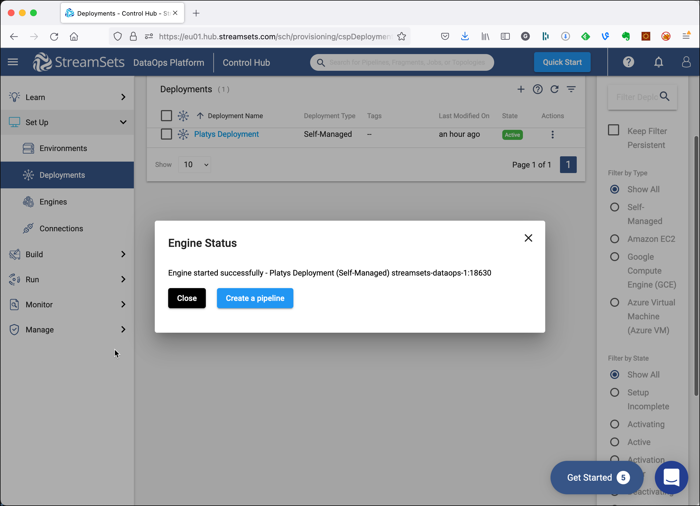

***

## 技术：流集&#xA;版本： 1.14.0&#xA;验证时间： 19.2.2022

# 使用 Platys 创建自我管理的 StreamSet 数据运维环境

此配方将展示如何为[流集数据运维平台](https://streamsets.com/products/dataops-platform/).

## 注册流集数据平台

导航到<https://cloud.login.streamsets.com/signup>并创建一个帐户，如图所示。



点击**创建账户**.使用您应该在提供的emil上收到的电子邮件中的链接验证帐户。

现在登录到新创建的帐户并填写帐户详细信息，然后单击**同意并继续**



您将进入StreamSets DataOps主页



## 创建流集数据收集器部署

在左侧导航器中，单击**建立**并导航到**环境**项目。您应该会看到一个默认的自我管理环境**默认的自我管理环境**.我们将使用它，接下来创建一个部署。

导航到**部署**，然后单击**创建部署**主画布中的链接。



向下滚动并点击**保存和下一步**.

在下一步中，单击链接**已选择 3 个阶段库**



以配置要安装的其他库。在 rigtht 侧，显示已安装的舞台库，在左侧，可以找到可用的舞台库。通过单击**+**图标。



完成后，单击**还行**以返回部署的配置。

现在再次点击**保存和下一步**.选择`Docker Image`对于**安装类型**.



点击**保存和下一步**再一次**保存和下一步**和**启动和生成安装脚本**你应该看到启动 docker 容器的脚本。



保持屏幕打开，我们在 配置服务时将需要环境变量`platys`.

    docker run -d -e STREAMSETS_DEPLOYMENT_SCH_URL=https://eu01.hub.streamsets.com -e STREAMSETS_DEPLOYMENT_ID=68f53dc7-1aa7-44b8-a8e5-f73ac9da041c:14e83b51-91b3-11ec-a4ba-f369fd3f0937 -e STREAMSETS_DEPLOYMENT_TOKEN=XXXXXX streamsets/datacollector:4.4.0

部署令牌已被替换，实际价值将大得多。

## 初始化数据平台

现在让我们[初始化平台支持的数据平台](../documentation/getting-started.md)启用以下服务

    platys init --enable-services STREAMSETS_DATAOPS -s trivadis/platys-modern-data-platform -w 1.14.0

要么将值添加到`STREAMSETS_DEPLOYMENT_ID`和`STREAMSETS_DEPLOYMENT_TOKEN`到`config.yml`

          STREAMSETS_DATAOPS_deployment_id: '68f53dc7-1aa7-44b8-a8e5-f73ac9da041c:14e83b51-91b3-11ec-a4ba-f369fd3f0937'
          STREAMSETS_DATAOPS_deployment_token: 'XXXXXX'

或将环境变量添加到环境中，例如通过使用`.env`文件

    STREAMSETS_DATAOPS_DEPLOYMENT_ID=68f53dc7-1aa7-44b8-a8e5-f73ac9da041c:14e83b51-91b3-11ec-a4ba-f369fd3f0937
    STREAMSETS_DATAOPS_DEPLOYMENT_TOKEN=XXXXXX

默认情况下，URL 设置为`https://eu01.hub.streamsets.com`.如果需要其他值，请在`config.yml`使用属性的文件`STREAMSETS_DATAOPS_deployment_sch_url`.

## 检查 Streamset DataOps Platform 中的状态

在 StreamSets DataOps Platform 屏幕中，单击**运行脚本后检查引擎状态**，如果您尚未执行此操作。



现在生成并启动平台

```bash
export DATAPLATFORM_HOME=${PWD}

platys gen

docker-compose up -d
```

在 StreamSets DataOps Platform 中，过了一会儿，您应该会收到以下确认消息。



在 docker 中运行的引擎已成功连接到 StreamSets DataOps Platform。点击**关闭**.

环境已准备就绪，可供使用。
