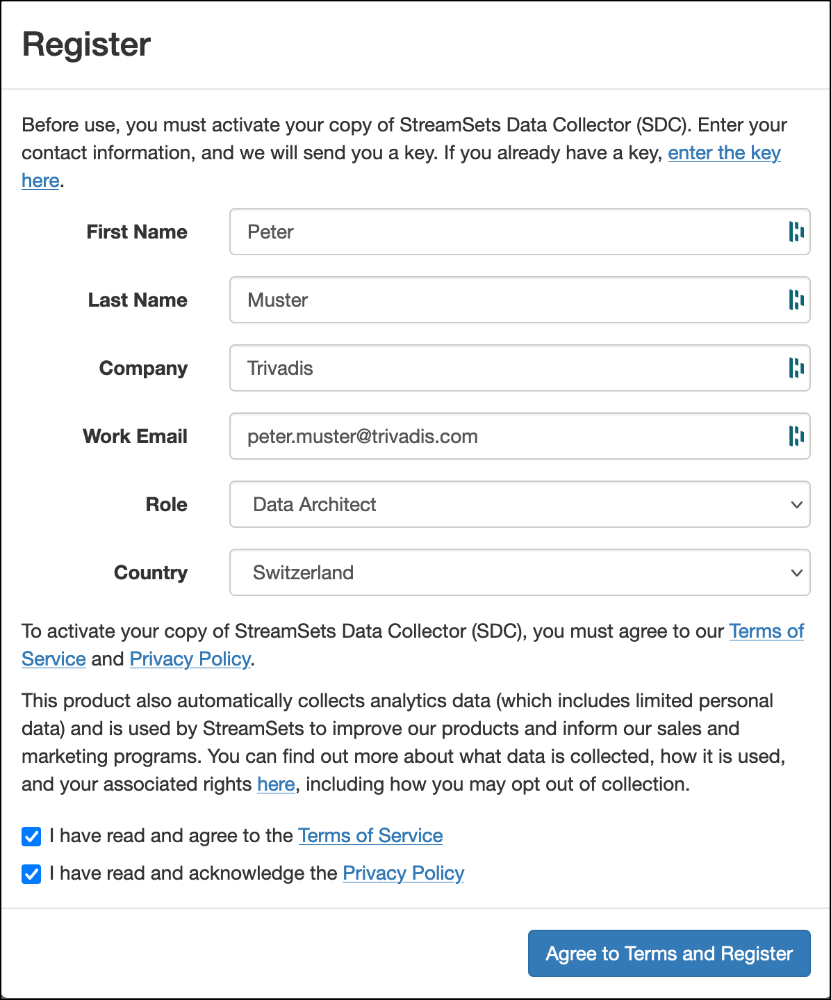
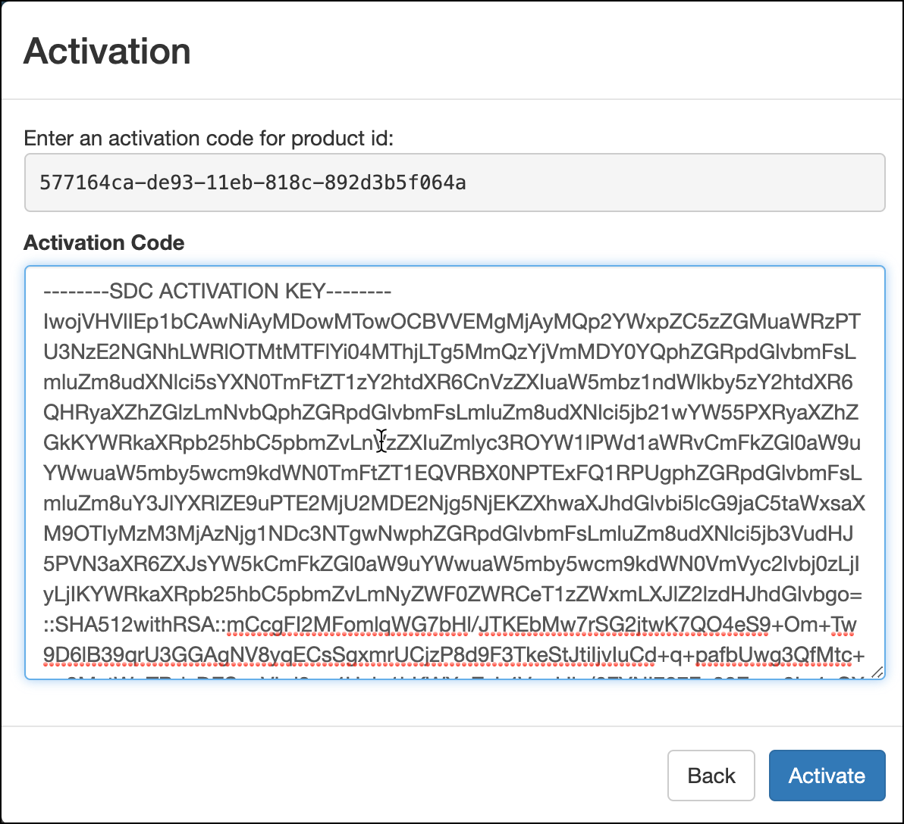

***

## 技术：流集&#xD;&#xA;版本： 1.13.0&#xD;&#xA;验证时间： 6.7.2021

# 支持流集数据收集器激活

此配方将演示如何以持久且可重放的方式支持激活 StreamSets 数据收集器。

激活 StreamSets 的问题在于，为给定的激活码提供`SDC ID`（又名产品 ID）。如果重新启动 StreamSets 数据收集器容器，一切正常，但如果停止、删除并重新定向容器，则新的`SDC ID`，您必须重新激活流集。

这个食谱显示，如何`SDC ID`可以固定为一个值，以便重新创建容器不会更改它。

## 初始化数据平台

第一[初始化平台支持的数据平台](../documentation/getting-started.md)启用以下服务

    platys init --enable-services STREAMSETS -s trivadis/platys-modern-data-platform -w 1.13.0

编辑`config.yml`并添加以下配置设置。

          STREAMSETS_http_authentication: 'form'
          STREAMSETS_sdc_id: ''

现在生成数据平台

    platys gen

然后启动平台：

    docker-compose up -d

## 激活流集

导航到<http://dataplatform:18630>并登录**用户**设置为`admin`和**密码**设置为`admin`.

点击**输入代码**和**激活**页面点击**返回**.这**注册**页面应显示。

填写所有字段，然后单击**同意条款并注册**.

检查您的电子邮件收件箱，一段时间后，您应该收到并通过电子邮件发送激活码。

复制以下部分中的部分`--------SDC ACTIVATION CODE--------`（下面的示例已被篡改，因此不再可用）

    --------SDC ACTIVATION CODE--------
    xcvxcvcxvxvxcvxcvxvxvxvsdfsfsfsf=::SHA512withRSA::mCcgFI2MFomlqWG7bHl/JTKEbMw7rSG2jtwK7QO4eS9+Om+Tw9D6lB39qrUd3GGAgNV8yqECsSgxmrUCjzP8d9F3TkeStJtiIjvIuCd+q+pafbUwg3QfMtc+xn8MxtWpTBdyDESoxVLd3qy4Heje1hKWXpZyL4VcvxcvxcvcxvmJJia/6FYNI787Fn30Evxo9Lr4vCXrB4jY+3mFbzJy1G64ZJgF7fRz8RNe3D0XwklhemcmbX0c8i+82qdCIU58b/xvl+n+RwyFC9F6sVBfEDVAS9aQJu99EkF+Nm0aHtp8GAaNEOwi6nYCInAboetDTNqZxkaopwAXogGB/0r88+gqO+Dx8ce8a60hRoRX/8fqqr4ZtPin9WQrxPLdiSCcUZLQs/0r88+gqO+Dx8ce8a60hRoRX/8fqqr4ZtPin9WQrxPLdiSCcUZLQs/0r88+gqO+Dx8ce8a60hRoRX/8fqqr4ZtPin9WQrxPLdiSCcUZLQs/zx8svPy1YWpLR5fj8wQXSt3uGBi+pdalivMzazxcvxxcvxcxvvxxcvxcvGNrdJlvLSf70ugQzp6oMrm1edZHzsX9MPNliRyFMGhVsBB8tot3sZW4xVPOYaR3ndXRHVMUYtkU8fOMBFBnaF7XYKmTe4cLaAHTMDYaev32d/8ZMt09BMAjv32IqEhBjp6YZvVkYs2wbcX35EPOxcvxvxvccxvxxvxvcRdtBQWvwJXghFqa0aa+Ln3pYW1z7L1pKlWj4kViqex06BfVAlwSlj8I7CG0RBPth4dLDJPQPbVrpU4nKJHGZIr7THJxpB133PZrXr6JI15DyYk5xnURve5F0=
    --------SDC ACTIVATION CODE--------

并将其粘贴到**激活码**字段上的**激活**屏幕。记下上面显示的产品 ID**激活码**（将在下一节中使用它）。

确保将两者都替换`SDC ACTIVATION CODE`跟`SDC ACTIVATION KEY`，然后点击**激活**.窗口应该关闭，在另一个弹出对话框中，您应该能够单击**重新加载**以完成流集的激活。

## 将 SDC ID 修复为用于激活的值

现在我们将输入`SDC ID`（产品 ID） 放入`config.yml`以便它“超越”容器停止并移除。

要获得正确的值，您可以检查日志或使用之前“激活”页面中的值。

要从日志中检索它，请执行

    docker-compose logs -f streamsets-1 | grep "SDC ID"

您应该会看到类似于下面的输出

    docker@ubuntu:~/platys-cookbook$ docker-compose logs -f streamsets-1 | grep "SDC ID"
    streamsets-1         | 2021-07-06 19:49:59,955 [user:] [pipeline:] [runner:] [thread:main] [stage:] 
    INFO  Main -   SDC ID        : 577164ca-de93-11eb-818c-892d3b5f064a

复制 SDC ID 信息`577164ca-de93-11eb-818c-892d3b5f064a`并将其粘贴到`STREAMSETS_sdc_id`的`config.yml`.

    STREAMSETS_sdc_id: '577164ca-de93-11eb-818c-892d3b5f064a'

重新生成堆栈

    platys gen

重新启动 docker-compose

    docker-compose up -d

并且输出应显示在控制台上

    Recreating streamsets-1 ... 
    wetty is up-to-date
    Recreating streamsets-1    ... done
    Starting markdown-renderer ... done

如您所见，`streamsets-1`容器将被重新创建，使用相同的`SDC ID`如故。

重新加载 StreamSets UI 时，必须重新激活，但现在可以使用与以前完全相同的激活码。
