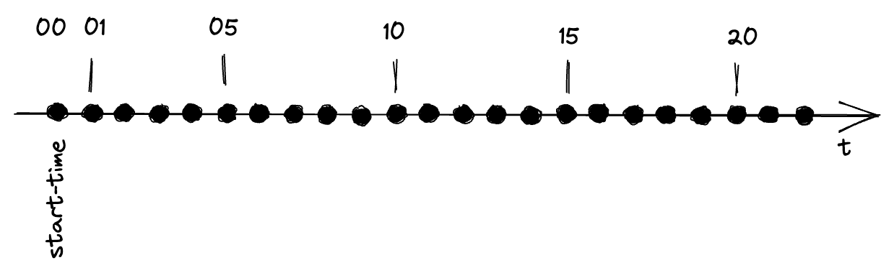

# Using Dev Simulator Origin to simulate streaming data

This recipe shows how to use the StreamSets Dev Simulator Origin to simulate event data taken from one or more CSV files. Each CSV row must contain a timestamp which tells the simulator when to publish the data. 

## Initialise data platform

First [initialise a platys-supported data platform](../documentation/getting-started.md) with the following services enabled

```
platys init --enable-services STREAMSETS,KAFKA,KAFKA_AKHQ -s trivadis/platys-modern-data-platform -w 1.16.0
```

Edit the `config.yml` and add the following configuration settings.

```
      STREAMSETS_stage_libs: 'streamsets-datacollector-apache-kafka_2_7-lib'
```

Now generate data platform and download the Streamsets Custom origin to the right folder. 

```
platys gen
```

Download and unpack the Dev Simulator custom origin

```
cd plugins/streamsets/user-libs

wget https://github.com/TrivadisPF/streamsets-dev-simulator/releases/download/0.8.1/dev-simulator-0.8.2.tar.gz 

tar -xvzf dev-simulator-0.8.2.tar.gz 
rm dev-simulator-0.8.2.tar.gz 

cd ../../..
```

Download the data and unpack into `data-transfer` folder

```
cd data-transfer
wget https://github.com/TrivadisPF/platys-modern-data-platform/raw/master/cookbooks/recipes/using-dev-simulator-origin/data.tar.gz

tar -xvzf data.tar.gz
rm data.tar.gz
```

Start the platform:

```
docker-compose up -d
```

You can find the StreamSets pipelines of this cookbook recipe in the folder `streamsets`.

## Using Relative from Anchor Time

When using the **Relative from Anchor Time** mode, the anchor is representing the start of the simulation and all the timestamp of the rows of the input file(s) are relative to that anchor.  The following diagram represents the data of the input files shown below.


### File without header row

The following examples shows the simulator used for a file without a header row and with the timestamp resolution of second.

`relative-anchor-without-header.csv`

```
1,10,1
5,10,2
10,10,3
15,10,4
20,10,5
```

Streamsets Pipeline: `RelativeAnchorTimeWithoutHeader`

Dev Simulator Properties (only the ones which have to change from the defaults):

* **Files**
  * **Files Directory:** `/data-transfer/cookbook-data`
  * **File Name Pattern:** `relative-anchor-without-header.csv`
  * **Different Record Types?:** `false`
* **Event Time**
  * **Timestamp Mode:** `Relative from Anchor Timestamp`
  * **Timestamp Field:** `/0`
  * **Relative Time Resolution:** `seconds`
  * **Anchor Time is Now?:** `true`
* **Data Format**
  * **Header Line:** `No Header Line`

### File without header and milliseconds

The following examples shows the simulator used for a file without a header row and with the timestamp resolution of milli-seconds.

`relative-anchor-without-header-millisec.csv`

```
1000,10,1
5000,10,2
10000,10,3
15000,10,4
20000,10,5
```

Streamsets: `RelativeAnchorTimeWithoutHeaderMillisec`

Dev Simulator Properties (only the ones which have to change from the defaults):

* **Files**
  * **Files Directory:** `/data-transfer/cookbook-data`
  * **File Name Pattern:** `relative-anchor-without-header-millisec.csv`
  * **Different Record Types?:** `false`
* **Event Time**
  * **Timestamp Mode:** `Relative from Anchor Timestamp`
  * **Timestamp Field:** `/0`
  * **Relative Time Resolution:** `milliseconds`
  * **Anchor Time is Now?:** `true`
* **Data Format**
  * **Header Line:** `No Header Line`

### File without header and milliseconds (with decimals)

The following examples shows the simulator used for a file without a header row and with the timestamp resolution of milli-seconds with decimals.

`relative-anchor-without-header-millisec-decimals.csv`

```
1000.10,10,1
5000.11,10,2
10000.12,10,3
15000.00,10,4
20000.50,10,5
```

Streamsets: `RelativeAnchorTimeWithoutHeaderMillisecDecimals`

Dev Simulator Properties (only the ones which have to change from the defaults):

* **Files**
  * **Files Directory:** `/data-transfer/cookbook-data`
  * **File Name Pattern:** `relative-anchor-without-header-millisec.csv`
  * **Different Record Types?:** `false`
* **Event Time**
  * **Timestamp Mode:** `Relative from Anchor Timestamp`
  * **Timestamp Field:** `/0`
  * **Relative Time Resolution:** `milliseconds`
  * **Anchor Time is Now?:** `true`
* **Data Format**
  * **Header Line:** `No Header Line`


### File with header

The following examples shows the simulator used for a file with a header row and with the timestamp resolution of second.

Input File: `relative-anchor-with-header.csv`

```
time,id,value
1,10,1
5,10,2
10,10,3
15,10,4
20,10,5
```

Streamsets: `RelativeAnchorTimeWithHeader`

Dev Simulator Properties (only the ones which have to change from the defaults):

* **Files**
  * **Files Directory:** `/data-transfer/cookbook-data`
  * **File Name Pattern:** `relative-anchor-with-header.csv`
  * **Different Record Types?:** `false` 
* **Event Time**
  * **Timestamp Mode:** `Relative from Anchor Timestamp`
  * **Timestamp Field:** `/time`
  * **Relative Time Resolution:** `seconds`
  * **Anchor Time is Now?:** `true`
* **Data Format**
  * **Header Line:** `With Header Line`
  
### with header and empty values (to remove)

The following examples shows the simulator used for a file with a header row and with some empty values. 

Input File: `relative-anchor-with-header-and-empty-values.csv` `

```
time,id,value,emptyval1,emptyval2
1,10,1,,
5,10,2,A,
10,10,3,,
15,10,4,A,
20,10,5,,
```

Streamsets: `RelativeAnchorTimeWithHeaderAndEmptyValues`

Dev Simulator Properties (only the ones which have to change from the defaults):

* **Files**
  * **Files Directory:** `/data-transfer/cookbook-data`
  * **File Name Pattern:** `relative-anchor-with-header-and-empty-values.csv`
  * **Different Record Types?:** `false` 
* **Event Time**
  * **Timestamp Mode:** `Relative from Anchor Timestamp`
  * **Timestamp Field:** `/time`
  * **Relative Time Resolution:** `seconds`
  * **Anchor Time is Now?:** `true`
* **Data Format**
  * **Header Line:** `With Header Line`
  * **Remove Empty Fields**: `true`
 

## Using Relative from Anchor Time with Fast Forward

When using the **Relative from Anchor Time with Fast Forward** mode, the anchor is representing the start of the simulation and all the timestamp of the rows of the input file(s) are relative to that anchor. The fast forward parameter represents the time-span to move the start-time from the anchor. 

The following diagram represents the data of the input files shown below and a fast forward by a time span of 10 seconds.


### File without header row

The following examples shows the simulator used for a file without a header row and with the timestamp resolution of second.

`relative-anchor-without-header.csv`

```
1,10,1
5,10,2
10,10,3
15,10,4
20,10,5
```

Streamsets: `RelativeAnchorTimeWithoutHeaderAndFastForward`

Dev Simulator Properties (only the ones which have to change from the defaults):

* **Files**
  * **Files Directory:** `/data-transfer/cookbook-data`
  * **File Name Pattern:** `relative-anchor-without-header.csv`
  * **Different Record Types?:** `false`
* **Event Time**
  * **Timestamp Mode:** `Relative from Anchor Timestamp`
  * **Timestamp Field:** `/0`
  * **Relative Time Resolution:** `seconds`
  * **Anchor Time is Now?:** `true`
  * **Fast forward in data:** `X`
  * **Fast forward by time span:** `10`
* **Data Format**
  * **Header Line:** `No Header Line`

The output on `kcat` should show 3 events

```bash
{"0":"1","1":"10","2":"1","EventTimestamp":1669478407184,"EventTimestampString":"16:00:07","StartEventTimestampString":"16:00:16"}
{"0":"5","1":"10","2":"2","EventTimestamp":1669478411184,"EventTimestampString":"16:00:11","StartEventTimestampString":"16:00:16"}
{"0":"10","1":"10","2":"3","EventTimestamp":1669478416184,"EventTimestampString":"16:00:16","StartEventTimestampString":"16:00:16"}
{"0":"15","1":"10","2":"4","EventTimestamp":1669478421184,"EventTimestampString":"16:00:21","StartEventTimestampString":"16:00:16"}
{"0":"20","1":"10","2":"5","EventTimestamp":1669478426184,"EventTimestampString":"16:00:26","StartEventTimestampString":"16:00:16"}

```

## Using Relative from Anchor Time with Fast Forward and skip

When using the **Relative form Anchor Time with Fast Forward** mode, the anchor is representing the start of the simulation and all the timestamp of the rows of the input file(s) are relative to that anchor. The fast forward parameter represents the time-span to move the start-time from the anchor. 

The following diagram represents the data of the input files shown below and a fast forward by a time span of 10 seconds.


```bash
{"0":"10","1":"10","2":"3","EventTimestamp":1669478519769,"EventTimestampString":"16:01:59","StartEventTimestampString":"16:01:59"}
{"0":"15","1":"10","2":"4","EventTimestamp":1669478524769,"EventTimestampString":"16:02:04","StartEventTimestampString":"16:01:59"}
{"0":"20","1":"10","2":"5","EventTimestamp":1669478529769,"EventTimestampString":"16:02:09","StartEventTimestampString":"16:01:59"}
```
  
## Using Relative from Previous Event 


### File with header

Input File: `relative-previous-event-with-header.csv`

```
time,id,value
1,10,1
4,10,2
5,10,3
5,10,4
5,10,5
```

Streamsets: `RelativePrevEventTimeWithHeader`

Dev Simulator Properties (only the ones which have to change from the defaults):

* **Files**
  * **Files Directory:** `/data-transfer/cookbook-data`
  * **File Name Pattern:** `relative-previous-event-with-header.csv `
  * **Different Record Types?:** `false` 
* **Event Time**
  * **Timestamp Mode:** `Relative from Previous Event`
  * **Timestamp Field:** `/time`
  * **Relative Time Resolution:** `seconds`
  * **Anchor Time is Now?:** `true`
* **Data Format**
  * **Header Line:** `With Header Line`

## Using Relative from Anchor - with multiple record types in same file

### without header

`relative-anchor-without-header-with-muliple-types-one-file.csv`

```
0,A,10,1
5,A,10,2
10,A,10,3
11,B,10,4
15,B,10,5
17,A,10,3
```

Streamsets: `RelativeAnchorTimeWithoutHeaderMultiTypeOneFile `

Dev Simulator Properties (only the ones which have to change from the defaults):

* **Files**
  * **Files Directory:** `/data-transfer/cookbook-data`
  * **File Name Pattern:** `relative-anchor-without-header-with-muliple-types-one-file.csv`
  * **Different Record Types?:** `true` 
* **Event Time**
  * **Timestamp Mode:** `Relative from Anchor Timestamp`
  * **Timestamp Field:** `/0`
  * **Relative Time Resolution:** `seconds`
  * **Anchor Time is Now?:** `true`
* **Multi Record Types**
  * **Data Types:** 
     * **Descriminator value 1:** `A`
     * **Descriminator value 2:** `B`
  * **Descriminator field:** `/1`
* **Data Format**
  * **Header Line:** `No Header Line`

### with header

`relative-anchor-with-header-with-muliple-types-one-file.csv`

```csv
time,descriminator,id,value
0,A,10,1
5,A,10,2
10,A,10,3
11,B,10,4
15,B,10,5
17,A,10,3
```

Streamsets: `RelativeAnchorTimeWithHeaderMultiTypeOneFile `

Dev Simulator Properties (only the ones which have to change from the defaults):

* **Files**
  * **Files Directory:** `/data-transfer/cookbook-data`
  * **File Name Pattern:** `relative-anchor-with-header-with-muliple-types-one-file.csv`
  * **Different Record Types?:** `true` 
* **Event Time**
  * **Timestamp Mode:** `Relative from Anchor Timestamp`
  * **Timestamp Field:** `/time`
  * **Relative Time Resolution:** `seconds`
  * **Anchor Time is Now?:** `true`
* **Multi Record Types**
  * **Data Types:** 
     * **Descriminator value 1:** `A`
     * **Descriminator value 2:** `B`
  * **Descriminator field:** `/descriminator`
* **Data Format**
  * **Header Line:** `With Header Line`

## Using Relative from Anchor - with multiple record types in file per type

### with header

`relative-anchor-with-header-with-muliple-types-fileA.csv`

```csv
0,A,10,1
5,A,10,2
10,A,10,3
17,A,10,3
```

`relative-anchor-with-header-with-muliple-types-fileB.csv`

```csv
11,B,10,4
15,B,10,5
```

Streamsets: `RelativeAnchorTimeWithHeaderMultiTypeMultiFile`

Dev Simulator Properties (only the ones which have to change from the defaults):

* **Files**
  * **Files Directory:** `/data-transfer/cookbook-data`
  * **File Name Pattern:** `relative-anchor-with-header-with-muliple-types-file*.csv`
  * **Different Record Types?:** `true` 
  
* **Event Time**
  * **Timestamp Mode:** `Relative from Anchor Timestamp`
  * **Timestamp Field:** `/time`
  * **Relative Time Resolution:** `seconds`
  * **Anchor Time is Now?:** `true`
  
* **Multi Record Types**
  * **Data Types:** 
     * **Descriminator value 1:** `A`
     * **Descriminator value 2:** `B`
  * **Descriminator field:** `/descriminator`
  
* **Data Format**
  * **Header Line:** `With Header Line`

## Using Absolute with Start Timestamp

When using the **Absolute with Start Timestamp** mode, a start time is specified from where the is representing the start of the simulation and all the timestamp of the rows of the input file(s) are relative to that anchor.  The following diagram represents the data of the input files shown below.



### File without header

`absolute-without-header.csv`

```
2021-11-16T09:00:01+0100,10,1
2021-11-16T09:00:05+0100,10,2
2021-11-16T09:00:10+0100,10,3
2021-11-16T09:00:15+0100,10,3
2021-11-16T09:00:20+0100,10,3
```

Streamsets: `AbsoluteTimeWithoutHeader`

Dev Simulator Properties (only the ones which have to change from the defaults):

* **Files**
  * **Files Directory:** `/data-transfer/cookbook-data`
  * **File Name Pattern:** `absolute-without-header.csv`
  * **Different Record Types?:** `false`
  
* **Event Time**
  * **Timestamp Mode:** `Absolute with Start Timestamp`
  * **Timestamp Field:** `/0`
  * **Timestamp Format:** `yyyy-MM-dd'T'HH:mm:ssZ`
  * **Simulation Start Timestamp:** `2021-11-16T09:00:00+0100`
  * **Simulation Start Timestamp Format** `yyyy-MM-dd'T'HH:mm:ssZ`
  
* **Data Format**
  * **Header Line:** `No Header Line`

```bash
{"0":"2021-11-16T09:00:01+0100","1":"10","2":"1","EventTimestamp":1637049601000,"EventTimestampString":"08:00:01","StartEventTimestampString":"08:00:00"}
{"0":"2021-11-16T09:00:05+0100","1":"10","2":"2","EventTimestamp":1637049605000,"EventTimestampString":"08:00:05","StartEventTimestampString":"08:00:00"}
{"0":"2021-11-16T09:00:10+0100","1":"10","2":"3","EventTimestamp":1637049610000,"EventTimestampString":"08:00:10","StartEventTimestampString":"08:00:00"}
{"0":"2021-11-16T09:00:15+0100","1":"10","2":"3","EventTimestamp":1637049615000,"EventTimestampString":"08:00:15","StartEventTimestampString":"08:00:00"}
{"0":"2021-11-16T09:00:20+0100","1":"10","2":"3","EventTimestamp":1637049620000,"EventTimestampString":"08:00:20","StartEventTimestampString":"08:00:00"}
```

### File without header and millisecond timestamps 

`absolute-millisecond-without-header.csv`

```
2021-11-16T09:00:01.001+0100,10,1
2021-11-16T09:00:01.011+0100,10,1
2021-11-16T09:00:01.021+0100,10,1
2021-11-16T09:00:01.031+0100,10,1
2021-11-16T09:00:01.041+0100,10,1
2021-11-16T09:00:01.061+0100,10,1
2021-11-16T09:00:01.081+0100,10,1
2021-11-16T09:00:02.001+0100,10,1
2021-11-16T09:00:02.011+0100,10,1
2021-11-16T09:00:02.021+0100,10,1
2021-11-16T09:00:02.031+0100,10,1
2021-11-16T09:00:02.041+0100,10,1
2021-11-16T09:00:02.061+0100,10,1
2021-11-16T09:00:02.081+0100,10,1
```

Streamsets: `AbsoluteTimeWithoutHeader`

Dev Simulator Properties (only the ones which have to change from the defaults):

* **Files**
  * **Files Directory:** `/data-transfer/cookbook-data`
  * **File Name Pattern:** `absolute-millisecond-without-header.csv`
  * **Different Record Types?:** `false`
  
* **Event Time**
  * **Timestamp Mode:** `Absolute with Start Timestamp`
  * **Timestamp Field:** `/0`
  * **Timestamp Format:** `Other...`
  * **Other Date Format:** `yyyy-MM-dd'T'HH:mm:ss.SSSZ`
  * **Simulation Start Timestamp:** `2021-11-16T09:00:00+0100`
  * **Simulation Start Timestamp Format** `yyyy-MM-dd'T'HH:mm:ssZ`

* **Data Format**
  * **Header Line:** `No Header Line`  

  
## Using Absolute with Start Timestamp after first event


`absolute-without-header.csv`

```
2021-11-16T09:00:01+0100,10,1
2021-11-16T09:00:05+0100,10,2
2021-11-16T09:00:10+0100,10,3
2021-11-16T09:00:15+0100,10,3
2021-11-16T09:00:20+0100,10,3
```

Streamsets: `AbsoluteTimeWithoutHeaderAndStarttime`

Dev Simulator Properties (only the ones which have to change from the defaults):

* **Files**
  * **Files Directory:** `/data-transfer/cookbook-data`
  * **File Name Pattern:** `absolute-without-header.csv`
  * **Different Record Types?:** `false`
  
* **Event Time**
  * **Timestamp Mode:** `Absolute with Start Timestamp`
  * **Timestamp Field:** `/0`
  * **Timestamp Format:** `yyyy-MM-dd'T'HH:mm:ssZ`
  * **Simulation Start Timestamp:** `2021-11-16T09:00:07+0100`
  * **Simulation Start Timestamp Format** `yyyy-MM-dd'T'HH:mm:ssZ`
  
* **Data Format**
  * **Header Line:** `No Header Line`

The output on `kcat` should show 3 events

```bash
{"0":"2021-11-16T09:00:10+0100","1":"10","2":"3","EventTimestamp":1637049610000,"EventTimestampString":"08:00:10","StartEventTimestampString":"08:00:07"}
{"0":"2021-11-16T09:00:15+0100","1":"10","2":"3","EventTimestamp":1637049615000,"EventTimestampString":"08:00:15","StartEventTimestampString":"08:00:07"}
{"0":"2021-11-16T09:00:20+0100","1":"10","2":"3","EventTimestamp":1637049620000,"EventTimestampString":"08:00:20","StartEventTimestampString":"08:00:07"}
```