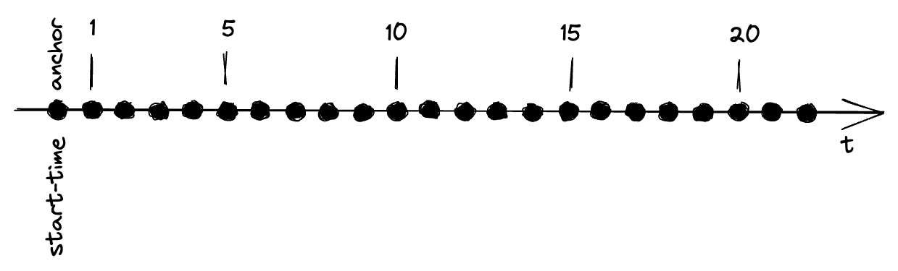
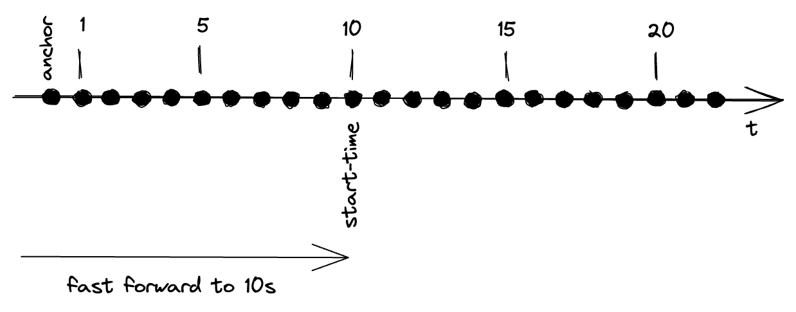
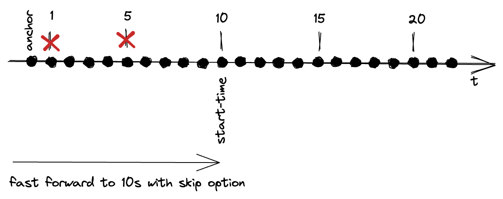
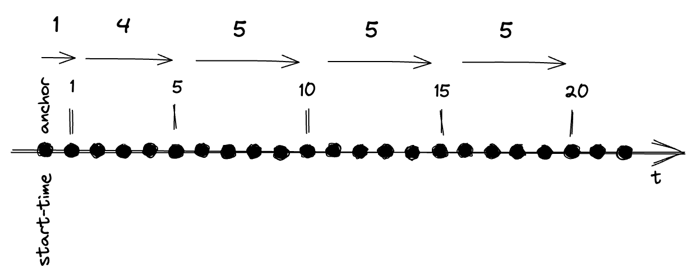
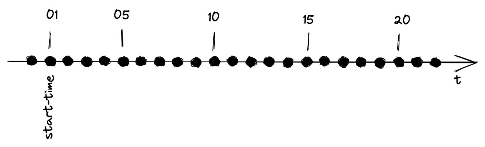
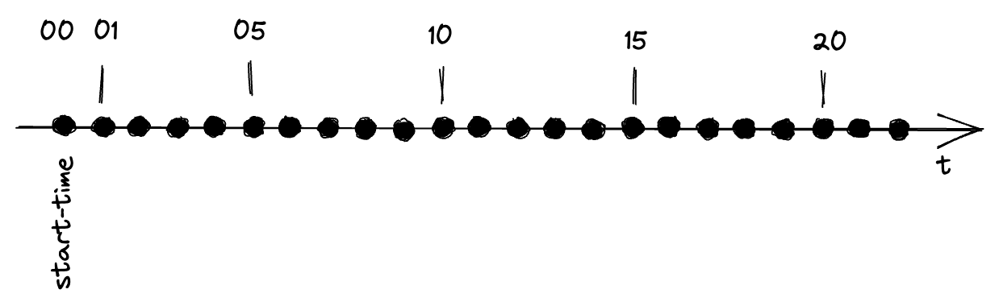
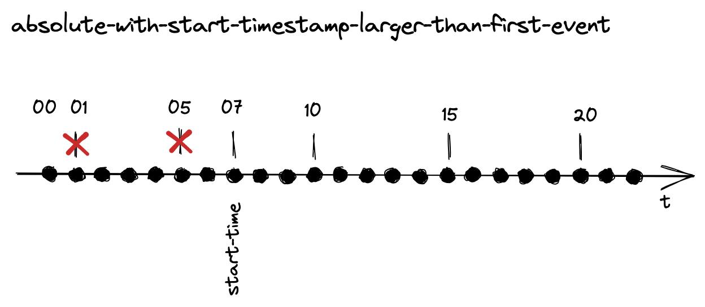

# Using Dev Simulator Origin to simulate streaming data

This recipe shows how to use the StreamSets Dev Simulator Origin to simulate event data taken from one or more CSV files. Each CSV row must contain a timestamp which tells the simulator when to publish the data. 

## Initialise data platform

First [initialise a platys-supported data platform](../documentation/getting-started.md) with the following services enabled

```
platys init --enable-services STREAMSETS,KAFKA,KAFKA_AKHQ,KCAT -s trivadis/platys-modern-data-platform -w 1.16.0
```

Edit the `config.yml` and add the following configuration settings.

```
      STREAMSETS_stage_libs: 'streamsets-datacollector-apache-kafka_2_7-lib'
```

Now generate data platform and download the Streamsets Custom origin to the right folder. 

```
platys gen
```

Download and unpack the Dev Simulator custom origin

```
cd plugins/streamsets/user-libs

wget https://github.com/TrivadisPF/streamsets-dev-simulator/releases/download/0.8.2/dev-simulator-0.8.2.tar.gz 

tar -xvzf dev-simulator-0.8.2.tar.gz 
rm dev-simulator-0.8.2.tar.gz 

cd ../../..
```

Download the data and unpack into `data-transfer` folder

```
cd data-transfer
wget https://github.com/TrivadisPF/platys-modern-data-platform/blob/master/cookbooks/recipes/using-dev-simulator-origin/cookbook-data.tar.gz

tar -xvzf cookbook-data.tar.gz
rm data.tar.gz
```

Start the platform:

```
docker-compose up -d
```

You can find the StreamSets pipelines of this cookbook recipe in the folder `streamsets`. 

All samples write the data to a Kafka topic called `streamsets-simulator`. You need to create that first, either through the graphical UI **AKHQ** or using the command line:

```bash
docker exec -ti kafka-1 kafka-topics --create --bootstrap-server kafka-1:19092 --topic streamsets-simulator
```

To consume from it, use `kcat` as shown here:

```bash
docker exec -ti  kcat kcat -b kafka-1:19092 -t streamsets-simulator -q -o end
```

The data written to Kafka also include the `EventTimestamp` field as a string as well as the start timestamp formatted as string. 

## Using Relative from Anchor Time

When using the **Relative from Anchor Time** mode, the anchor is representing the start of the simulation and all the timestamp of the rows of the input file(s) are relative to that anchor.  The following diagram represents the data of the input files shown below.



### File without header row (01)

The following examples shows the simulator used for a file without a header row and with the timestamp resolution of second.

`relative-anchor-without-header.csv`

```
1,10,1
5,10,2
10,10,3
15,10,4
20,10,5
```

Streamsets Pipeline: `01 - RelativeAnchorTimeWithoutHeader`

Dev Simulator Properties (only the ones which have to change from the defaults):

* **Files**
  * **Files Directory:** `/data-transfer/cookbook-data`
  * **File Name Pattern:** `relative-anchor-without-header.csv`
  * **Different Record Types?:** `false`
* **Event Time**
  * **Timestamp Mode:** `Relative from Anchor Timestamp`
  * **Timestamp Field:** `/0`
  * **Relative Time Resolution:** `seconds`
  * **Anchor Time is Now?:** `true`
* **Data Format**
  * **Header Line:** `No Header Line`

The output on `kcat` should show these events

```bash
{"0":"1","1":"10","2":"1","EventTimestamp":1669533859458,"EventTimestampString":"07:24:19","StartEventTimestampString":"07:24:18"}
{"0":"5","1":"10","2":"2","EventTimestamp":1669533863458,"EventTimestampString":"07:24:23","StartEventTimestampString":"07:24:18"}
{"0":"10","1":"10","2":"3","EventTimestamp":1669533868458,"EventTimestampString":"07:24:28","StartEventTimestampString":"07:24:18"}
{"0":"15","1":"10","2":"4","EventTimestamp":1669533873458,"EventTimestampString":"07:24:33","StartEventTimestampString":"07:24:18"}
{"0":"20","1":"10","2":"5","EventTimestamp":1669533878458,"EventTimestampString":"07:24:38","StartEventTimestampString":"07:24:18"}
```

### File without header and milliseconds (02)

The following examples shows the simulator used for a file without a header row and with the timestamp resolution of milli-seconds.

`relative-anchor-without-header-millisec.csv`

```
1000,10,1
5000,10,2
10000,10,3
15000,10,4
20000,10,5
```

Streamsets: `02 - RelativeAnchorTimeWithoutHeaderMillisec`

Dev Simulator Properties (only the ones which have to change from the defaults):

* **Files**
  * **Files Directory:** `/data-transfer/cookbook-data`
  * **File Name Pattern:** `relative-anchor-without-header-millisec.csv`
  * **Different Record Types?:** `false`
* **Event Time**
  * **Timestamp Mode:** `Relative from Anchor Timestamp`
  * **Timestamp Field:** `/0`
  * **Relative Time Resolution:** `milliseconds`
  * **Anchor Time is Now?:** `true`
* **Data Format**
  * **Header Line:** `No Header Line`

The output on `kcat` should show these events

```bash
{"0":"1000","1":"10","2":"1","EventTimestamp":1669533981035,"EventTimestampString":"07:26:21","StartEventTimestampString":"07:26:20"}
{"0":"5000","1":"10","2":"2","EventTimestamp":1669533985035,"EventTimestampString":"07:26:25","StartEventTimestampString":"07:26:20"}
{"0":"10000","1":"10","2":"3","EventTimestamp":1669533990035,"EventTimestampString":"07:26:30","StartEventTimestampString":"07:26:20"}
{"0":"15000","1":"10","2":"4","EventTimestamp":1669533995035,"EventTimestampString":"07:26:35","StartEventTimestampString":"07:26:20"}
{"0":"20000","1":"10","2":"5","EventTimestamp":1669534000035,"EventTimestampString":"07:26:40","StartEventTimestampString":"07:26:20"}
```

### File without header and milliseconds with decimals (03)

The following examples shows the simulator used for a file without a header row and with the timestamp resolution of milli-seconds with decimals.

`relative-anchor-without-header-millisec-decimals.csv`

```
1000.10,10,1
5000.11,10,2
10000.12,10,3
15000.00,10,4
20000.50,10,5
```

Streamsets: `03 - RelativeAnchorTimeWithoutHeaderMillisecDecimals`

Dev Simulator Properties (only the ones which have to change from the defaults):

* **Files**
  * **Files Directory:** `/data-transfer/cookbook-data`
  * **File Name Pattern:** `relative-anchor-without-header-millisec.csv`
  * **Different Record Types?:** `false`
* **Event Time**
  * **Timestamp Mode:** `Relative from Anchor Timestamp`
  * **Timestamp Field:** `/0`
  * **Relative Time Resolution:** `milliseconds`
  * **Anchor Time is Now?:** `true`
* **Data Format**
  * **Header Line:** `No Header Line`

The output on `kcat` should show these events

```bash
{"0":"1000.10","1":"10","2":"1","EventTimestamp":1669534946098,"EventTimestampString":"07:42:26","StartEventTimestampString":"07:42:25"}
{"0":"5000.11","1":"10","2":"2","EventTimestamp":1669534950098,"EventTimestampString":"07:42:30","StartEventTimestampString":"07:42:25"}
{"0":"10000.12","1":"10","2":"3","EventTimestamp":1669534955098,"EventTimestampString":"07:42:35","StartEventTimestampString":"07:42:25"}
{"0":"15000.00","1":"10","2":"4","EventTimestamp":1669534960098,"EventTimestampString":"07:42:40","StartEventTimestampString":"07:42:25"}
{"0":"20000.50","1":"10","2":"5","EventTimestamp":1669534965099,"EventTimestampString":"07:42:45","StartEventTimestampString":"07:42:25"}
```

### File with header (04)

The following examples shows the simulator used for a file with a header row and with the timestamp resolution of second.

Input File: `relative-anchor-with-header.csv`

```
time,id,value
1,10,1
5,10,2
10,10,3
15,10,4
20,10,5
```

Streamsets: `04 - RelativeAnchorTimeWithHeader`

Dev Simulator Properties (only the ones which have to change from the defaults):

* **Files**
  * **Files Directory:** `/data-transfer/cookbook-data`
  * **File Name Pattern:** `relative-anchor-with-header.csv`
  * **Different Record Types?:** `false` 
* **Event Time**
  * **Timestamp Mode:** `Relative from Anchor Timestamp`
  * **Timestamp Field:** `/time`
  * **Relative Time Resolution:** `seconds`
  * **Anchor Time is Now?:** `true`
* **Data Format**
  * **Header Line:** `With Header Line`

The output on `kcat` should show these events

```bash
{"time":"1","id":"10","value":"1","EventTimestamp":1669535057050,"EventTimestampString":"07:44:17","StartEventTimestampString":"07:44:16"}
{"time":"5","id":"10","value":"2","EventTimestamp":1669535061050,"EventTimestampString":"07:44:21","StartEventTimestampString":"07:44:16"}
{"time":"10","id":"10","value":"3","EventTimestamp":1669535066050,"EventTimestampString":"07:44:26","StartEventTimestampString":"07:44:16"}
{"time":"15","id":"10","value":"4","EventTimestamp":1669535071050,"EventTimestampString":"07:44:31","StartEventTimestampString":"07:44:16"}
{"time":"20","id":"10","value":"5","EventTimestamp":1669535076050,"EventTimestampString":"07:44:36","StartEventTimestampString":"07:44:16"}
```
  
### with header and empty values to remove (05)

The following examples shows the simulator used for a file with a header row and with some empty values. 

Input File: `relative-anchor-with-header-and-empty-values.csv` `

```
time,id,value,emptyval1,emptyval2
1,10,1,,
5,10,2,A,
10,10,3,,
15,10,4,A,
20,10,5,,
```

Streamsets: `05 - RelativeAnchorTimeWithHeaderAndEmptyValues`

Dev Simulator Properties (only the ones which have to change from the defaults):

* **Files**
  * **Files Directory:** `/data-transfer/cookbook-data`
  * **File Name Pattern:** `relative-anchor-with-header-and-empty-values.csv`
  * **Different Record Types?:** `false` 
* **Event Time**
  * **Timestamp Mode:** `Relative from Anchor Timestamp`
  * **Timestamp Field:** `/time`
  * **Relative Time Resolution:** `seconds`
  * **Anchor Time is Now?:** `true`
* **Data Format**
  * **Header Line:** `With Header Line`
  * **Remove Empty Fields**: `true`
 
The output on `kcat` should show these events

```bash
{"time":"1","id":"10","value":"1","EventTimestamp":1669535156643,"EventTimestampString":"07:45:56","StartEventTimestampString":"07:45:55"}
{"time":"5","id":"10","value":"2","emptyval1":"A","EventTimestamp":1669535160643,"EventTimestampString":"07:46:00","StartEventTimestampString":"07:45:55"}
{"time":"10","id":"10","value":"3","EventTimestamp":1669535165643,"EventTimestampString":"07:46:05","StartEventTimestampString":"07:45:55"}
{"time":"15","id":"10","value":"4","emptyval1":"A","EventTimestamp":1669535170643,"EventTimestampString":"07:46:10","StartEventTimestampString":"07:45:55"}
{"time":"20","id":"10","value":"5","EventTimestamp":1669535175643,"EventTimestampString":"07:46:15","StartEventTimestampString":"07:45:55"}
```

## Using Relative from Anchor Time with Fast Forward

When using the **Relative from Anchor Time with Fast Forward** mode, the anchor is representing the start of the simulation and all the timestamp of the rows of the input file(s) are relative to that anchor. The fast forward parameter represents the time-span to move the start-time from the anchor. 

The following diagram represents the data of the input files shown below and a fast forward by a time span of 10 seconds.



### File without header row (06)

The following examples shows the simulator used for a file without a header row and with the timestamp resolution of second.

`relative-anchor-without-header.csv`

```
1,10,1
5,10,2
10,10,3
15,10,4
20,10,5
```

Streamsets: `06 - RelativeAnchorTimeWithoutHeaderAndFastForward`

Dev Simulator Properties (only the ones which have to change from the defaults):

* **Files**
  * **Files Directory:** `/data-transfer/cookbook-data`
  * **File Name Pattern:** `relative-anchor-without-header.csv`
  * **Different Record Types?:** `false`
* **Event Time**
  * **Timestamp Mode:** `Relative from Anchor Timestamp`
  * **Timestamp Field:** `/0`
  * **Relative Time Resolution:** `seconds`
  * **Anchor Time is Now?:** `true`
  * **Fast forward in data:** `true`
  * **Fast forward by time span:** `10`
  * **Skip initial time span:** `false`
* **Data Format**
  * **Header Line:** `No Header Line`

The output on `kcat` should show these events

```bash
{"0":"1","1":"10","2":"1","EventTimestamp":1669535420759,"EventTimestampString":"07:50:20","StartEventTimestampString":"07:50:29"}
{"0":"5","1":"10","2":"2","EventTimestamp":1669535424759,"EventTimestampString":"07:50:24","StartEventTimestampString":"07:50:29"}
{"0":"10","1":"10","2":"3","EventTimestamp":1669535429759,"EventTimestampString":"07:50:29","StartEventTimestampString":"07:50:29"}
{"0":"15","1":"10","2":"4","EventTimestamp":1669535434759,"EventTimestampString":"07:50:34","StartEventTimestampString":"07:50:29"}
{"0":"20","1":"10","2":"5","EventTimestamp":1669535439759,"EventTimestampString":"07:50:39","StartEventTimestampString":"07:50:29"}
```

## Using Relative from Anchor Time with Fast Forward and skip

When using the **Relative from Anchor Time with Fast Forward** mode, the anchor is representing the start of the simulation and all the timestamp of the rows of the input file(s) are relative to that anchor. The fast forward parameter represents the time-span to move the start-time from the anchor. 

The following diagram represents the data of the input files shown below and a fast forward by a time span of 10 seconds.




### File without header row (07)

The following examples shows the simulator used for a file without a header row and with the timestamp resolution of second.

`relative-anchor-without-header.csv`

```
1,10,1
5,10,2
10,10,3
15,10,4
20,10,5
```

Streamsets: `07 - RelativeAnchorTimeWithoutHeaderAndFastForwardWithSkip`

Dev Simulator Properties (only the ones which have to change from the defaults):

* **Files**
  * **Files Directory:** `/data-transfer/cookbook-data`
  * **File Name Pattern:** `relative-anchor-without-header.csv`
  * **Different Record Types?:** `false`
* **Event Time**
  * **Timestamp Mode:** `Relative from Anchor Timestamp`
  * **Timestamp Field:** `/0`
  * **Relative Time Resolution:** `seconds`
  * **Anchor Time is Now?:** `true`
  * **Fast forward in data:** `true`
  * **Fast forward by time span:** `10`
  * **Skip initial time span:** `true`
* **Data Format**
  * **Header Line:** `No Header Line`

The output on `kcat` should show these events

```bash
{"0":"10","1":"10","2":"3","EventTimestamp":1669535597195,"EventTimestampString":"07:53:17","StartEventTimestampString":"07:53:17"}
{"0":"15","1":"10","2":"4","EventTimestamp":1669535602195,"EventTimestampString":"07:53:22","StartEventTimestampString":"07:53:17"}
{"0":"20","1":"10","2":"5","EventTimestamp":1669535607195,"EventTimestampString":"07:53:27","StartEventTimestampString":"07:53:17"}
```
  
## Using Relative from Previous Event 

When using the **Relative from Previous event** mode, the the timestamp of the row is relative to the timestamp of the previous row. 

The following diagram represents the data of the input files shown.



### File with header (08)

The following examples shows the simulator used for a file with a header row and where the timestamps are relative to the timestamp of the previous row.

Input File: `relative-previous-event-with-header.csv`

```
time,id,value
1,10,1
4,10,2
5,10,3
5,10,4
5,10,5
```

Streamsets: `08 - RelativePrevEventTimeWithHeader`

Dev Simulator Properties (only the ones which have to change from the defaults):

* **Files**
  * **Files Directory:** `/data-transfer/cookbook-data`
  * **File Name Pattern:** `relative-previous-event-with-header.csv `
  * **Different Record Types?:** `false` 
* **Event Time**
  * **Timestamp Mode:** `Relative from Previous Event`
  * **Timestamp Field:** `/time`
  * **Relative Time Resolution:** `seconds`
  * **Anchor Time is Now?:** `true`
* **Data Format**
  * **Header Line:** `With Header Line`

The output on `kcat` should show these events

```bash
{"time":"1","id":"10","value":"1","EventTimestamp":1669535653884,"EventTimestampString":"07:54:13","StartEventTimestampString":"07:54:12"}
{"time":"4","id":"10","value":"2","EventTimestamp":1669535657884,"EventTimestampString":"07:54:17","StartEventTimestampString":"07:54:12"}
{"time":"5","id":"10","value":"3","EventTimestamp":1669535662884,"EventTimestampString":"07:54:22","StartEventTimestampString":"07:54:12"}
{"time":"5","id":"10","value":"4","EventTimestamp":1669535667884,"EventTimestampString":"07:54:27","StartEventTimestampString":"07:54:12"}
{"time":"5","id":"10","value":"5","EventTimestamp":1669535672884,"EventTimestampString":"07:54:32","StartEventTimestampString":"07:54:12"}
```  

## Using Relative from Anchor - with multiple record types in same file

When using the **Relative from Anchor with multiple record types** mode, then the rows with the data do not contain uniform record but different record types. 

### File without header (09)

The following examples shows the simulator used for a file without a header row and with multiple records types in the same file. 

`relative-anchor-without-header-with-muliple-types-one-file.csv`

```
0,A,10,1
5,A,10,2
10,A,10,3
11,B,10,4
15,B,10,5
17,A,10,3
```

Streamsets: `09 - RelativeAnchorTimeWithoutHeaderMultiTypeOneFile`

Dev Simulator Properties (only the ones which have to change from the defaults):

* **Files**
  * **Files Directory:** `/data-transfer/cookbook-data`
  * **File Name Pattern:** `relative-anchor-without-header-with-muliple-types-one-file.csv`
  * **Different Record Types?:** `true` 
* **Event Time**
  * **Timestamp Mode:** `Relative from Anchor Timestamp`
  * **Timestamp Field:** `/0`
  * **Relative Time Resolution:** `seconds`
  * **Anchor Time is Now?:** `true`
* **Multi Record Types**
  * **Data Types:** 
     * **Descriminator value 1:** `A`
     * **Descriminator value 2:** `B`
  * **Descriminator field:** `/1`
* **Data Format**
  * **Header Line:** `No Header Line`

The output on `kcat` should show these events

```bash
{"time":"1","id":"10","value":"1","EventTimestamp":1669535653884,"EventTimestampString":"07:54:13","StartEventTimestampString":"07:54:12"}
{"time":"4","id":"10","value":"2","EventTimestamp":1669535657884,"EventTimestampString":"07:54:17","StartEventTimestampString":"07:54:12"}
{"time":"5","id":"10","value":"3","EventTimestamp":1669535662884,"EventTimestampString":"07:54:22","StartEventTimestampString":"07:54:12"}
{"time":"5","id":"10","value":"4","EventTimestamp":1669535667884,"EventTimestampString":"07:54:27","StartEventTimestampString":"07:54:12"}
{"time":"5","id":"10","value":"5","EventTimestamp":1669535672884,"EventTimestampString":"07:54:32","StartEventTimestampString":"07:54:12"}
```

### File with header (10)

The following examples shows the simulator used for a file with a header row .

`relative-anchor-with-header-with-muliple-types-one-file.csv`

```csv
time,descriminator,id,value
0,A,10,1
5,A,10,2
10,A,10,3
11,B,10,4
15,B,10,5
17,A,10,3
```

Streamsets: `10 - RelativeAnchorTimeWithHeaderMultiTypeOneFile `

Dev Simulator Properties (only the ones which have to change from the defaults):

* **Files**
  * **Files Directory:** `/data-transfer/cookbook-data`
  * **File Name Pattern:** `relative-anchor-with-header-with-muliple-types-one-file.csv`
  * **Different Record Types?:** `true` 
* **Event Time**
  * **Timestamp Mode:** `Relative from Anchor Timestamp`
  * **Timestamp Field:** `/time`
  * **Relative Time Resolution:** `seconds`
  * **Anchor Time is Now?:** `true`
* **Multi Record Types**
  * **Data Types:** 
     * **Descriminator value 1:** `A`
     * **Descriminator value 2:** `B`
  * **Descriminator field:** `/descriminator`
* **Data Format**
  * **Header Line:** `With Header Line`

The output on `kcat` should show these events

```bash
{"time":"0","descriminator":"A","id":"10","value":"1","EventTimestamp":1669535921514,"EventTimestampString":"07:58:41","StartEventTimestampString":"07:58:41","type":"A"}
{"time":"5","descriminator":"A","id":"10","value":"2","EventTimestamp":1669535926514,"EventTimestampString":"07:58:46","StartEventTimestampString":"07:58:41","type":"A"}
{"time":"10","descriminator":"A","id":"10","value":"3","EventTimestamp":1669535931514,"EventTimestampString":"07:58:51","StartEventTimestampString":"07:58:41","type":"A"}
{"time":"11","descriminator":"B","id":"10","value":"4","EventTimestamp":1669535932514,"EventTimestampString":"07:58:52","StartEventTimestampString":"07:58:41","type":"B"}
{"time":"15","descriminator":"B","id":"10","value":"5","EventTimestamp":1669535936514,"EventTimestampString":"07:58:56","StartEventTimestampString":"07:58:41","type":"B"}
{"time":"17","descriminator":"A","id":"10","value":"3","EventTimestamp":1669535938514,"EventTimestampString":"07:58:58","StartEventTimestampString":"07:58:41","type":"A"}
```

## Using Relative from Anchor - with multiple record types in file per type

When using the **Relative from Anchor with multiple record types in file per type** mode, then the rows with the data do not contain uniform record but different record types, but they are in different files, one file per record type. 

### File with header (11)

The following examples shows the simulator used for a file with a header row and with multiple records types, one file for each type. 

`relative-anchor-with-header-with-muliple-types-fileA.csv`

```csv
time,descriminator,id,value
11,B,10,4
15,B,10,5
```

`relative-anchor-with-header-with-muliple-types-fileB.csv`

```csv
time,descriminator,id,value
0,A,10,1
5,A,10,2
10,A,10,3
17,A,10,3
```

Streamsets: `11 - RelativeAnchorTimeWithHeaderMultiTypeMultiFile`

Dev Simulator Properties (only the ones which have to change from the defaults):

* **Files**
  * **Files Directory:** `/data-transfer/cookbook-data`
  * **File Name Pattern:** `relative-anchor-with-header-with-muliple-types-file*.csv`
  * **Different Record Types?:** `true` 
  
* **Event Time**
  * **Timestamp Mode:** `Relative from Anchor Timestamp`
  * **Timestamp Field:** `/time`
  * **Relative Time Resolution:** `seconds`
  * **Anchor Time is Now?:** `true`
  
* **Multi Record Types**
  * **Data Types:** 
     * **Descriminator value 1:** `A`
     * **Descriminator value 2:** `B`
  * **Descriminator field:** `/descriminator`
  
* **Data Format**
  * **Header Line:** `With Header Line`

The output on `kcat` should show these events


```bash
{"time":"0","descriminator":"A","id":"10","value":"1","EventTimestamp":1669536246778,"EventTimestampString":"08:04:06","StartEventTimestampString":"08:04:06","type":"A"}
{"time":"5","descriminator":"A","id":"10","value":"2","EventTimestamp":1669536251778,"EventTimestampString":"08:04:11","StartEventTimestampString":"08:04:06","type":"A"}
{"time":"10","descriminator":"A","id":"10","value":"3","EventTimestamp":1669536256778,"EventTimestampString":"08:04:16","StartEventTimestampString":"08:04:06","type":"A"}
{"time":"11","descriminator":"B","id":"10","value":"4","EventTimestamp":1669536257778,"EventTimestampString":"08:04:17","StartEventTimestampString":"08:04:06","type":"B"}
{"time":"15","descriminator":"B","id":"10","value":"5","EventTimestamp":1669536261778,"EventTimestampString":"08:04:21","StartEventTimestampString":"08:04:06","type":"B"}
{"time":"17","descriminator":"A","id":"10","value":"3","EventTimestamp":1669536263778,"EventTimestampString":"08:04:23","StartEventTimestampString":"08:04:06","type":"A"}
```

## Using Absolute

When using the **Absolute** mode, a file with absolute timestamp is used and the earliest timestamp is used for the start timestamp. 

The following diagram represents the data of the input files shown.



### File without header (12)

The following examples shows the simulator used for a file without a header row and with absolute timestamps.

`absolute-without-header.csv`

```
2021-11-16T09:00:01+0100,10,1
2021-11-16T09:00:05+0100,10,2
2021-11-16T09:00:10+0100,10,3
2021-11-16T09:00:15+0100,10,3
2021-11-16T09:00:20+0100,10,3
```

`2021-11-16T09:00:01` will be used for the start timestamp.

Streamsets: `12 - AbsoluteTimeWithoutHeader`

Dev Simulator Properties (only the ones which have to change from the defaults):

* **Files**
  * **Files Directory:** `/data-transfer/cookbook-data`
  * **File Name Pattern:** `absolute-without-header.csv`
  * **Different Record Types?:** `false`
  
* **Event Time**
  * **Timestamp Mode:** `Absolute`
  * **Timestamp Field:** `/0`
  * **Timestamp Format:** `yyyy-MM-dd'T'HH:mm:ssZ`
  
* **Data Format**
  * **Header Line:** `No Header Line`

The output on `kcat` should show these events

```bash
{"0":"2021-11-16T09:00:01+0100","1":"10","2":"1","EventTimestamp":1637049601000,"EventTimestampString":"2021-11-16 08:00:01","StartEventTimestampString":"08:00:01"}
{"0":"2021-11-16T09:00:05+0100","1":"10","2":"2","EventTimestamp":1637049605000,"EventTimestampString":"2021-11-16 08:00:05","StartEventTimestampString":"08:00:01"}
{"0":"2021-11-16T09:00:10+0100","1":"10","2":"3","EventTimestamp":1637049610000,"EventTimestampString":"2021-11-16 08:00:10","StartEventTimestampString":"08:00:01"}
{"0":"2021-11-16T09:00:15+0100","1":"10","2":"3","EventTimestamp":1637049615000,"EventTimestampString":"2021-11-16 08:00:15","StartEventTimestampString":"08:00:01"}
{"0":"2021-11-16T09:00:20+0100","1":"10","2":"3","EventTimestamp":1637049620000,"EventTimestampString":"2021-11-16 08:00:20","StartEventTimestampString":"08:00:01"}
```

### File without header and millisecond timestamps (13)

The following examples shows the simulator used for a file without a header row and with absolute timestamps in milliseconds.

`absolute-millisecond-without-header.csv`

```
2021-11-16T09:00:01.001+0100,10,1
2021-11-16T09:00:01.011+0100,10,1
2021-11-16T09:00:01.021+0100,10,1
2021-11-16T09:00:01.031+0100,10,1
2021-11-16T09:00:01.041+0100,10,1
2021-11-16T09:00:01.061+0100,10,1
2021-11-16T09:00:01.081+0100,10,1
2021-11-16T09:00:02.001+0100,10,1
2021-11-16T09:00:02.011+0100,10,1
2021-11-16T09:00:02.021+0100,10,1
2021-11-16T09:00:02.031+0100,10,1
2021-11-16T09:00:02.041+0100,10,1
2021-11-16T09:00:02.061+0100,10,1
2021-11-16T09:00:02.081+0100,10,1
```

Streamsets: `13 - AbsoluteTimeWithoutHeaderMillisec`

Dev Simulator Properties (only the ones which have to change from the defaults):

* **Files**
  * **Files Directory:** `/data-transfer/cookbook-data`
  * **File Name Pattern:** `absolute-millisecond-without-header.csv`
  * **Different Record Types?:** `false`
  
* **Event Time**
  * **Timestamp Mode:** `Absolute`
  * **Timestamp Field:** `/0`
  * **Other Date Format:** `yyyy-MM-dd'T'HH:mm:ss.SSSZ`

* **Data Format**
  * **Header Line:** `No Header Line`  

The output on `kcat` should show these events

```bash
{"0":"2021-11-16T09:00:01.001+0100","1":"10","2":"1","EventTimestamp":1637049601001,"EventTimestampString":"2021-11-16 08:00:01.001","StartEventTimestampString":"08:00:01.001"}
{"0":"2021-11-16T09:00:01.011+0100","1":"10","2":"1","EventTimestamp":1637049601011,"EventTimestampString":"2021-11-16 08:00:01.011","StartEventTimestampString":"08:00:01.001"}
{"0":"2021-11-16T09:00:01.021+0100","1":"10","2":"1","EventTimestamp":1637049601021,"EventTimestampString":"2021-11-16 08:00:01.021","StartEventTimestampString":"08:00:01.001"}
{"0":"2021-11-16T09:00:01.031+0100","1":"10","2":"1","EventTimestamp":1637049601031,"EventTimestampString":"2021-11-16 08:00:01.031","StartEventTimestampString":"08:00:01.001"}
{"0":"2021-11-16T09:00:01.041+0100","1":"10","2":"1","EventTimestamp":1637049601041,"EventTimestampString":"2021-11-16 08:00:01.041","StartEventTimestampString":"08:00:01.001"}
{"0":"2021-11-16T09:00:01.061+0100","1":"10","2":"1","EventTimestamp":1637049601061,"EventTimestampString":"2021-11-16 08:00:01.061","StartEventTimestampString":"08:00:01.001"}
{"0":"2021-11-16T09:00:01.081+0100","1":"10","2":"1","EventTimestamp":1637049601081,"EventTimestampString":"2021-11-16 08:00:01.081","StartEventTimestampString":"08:00:01.001"}
{"0":"2021-11-16T09:00:02.001+0100","1":"10","2":"1","EventTimestamp":1637049602001,"EventTimestampString":"2021-11-16 08:00:02.001","StartEventTimestampString":"08:00:01.001"}
{"0":"2021-11-16T09:00:02.011+0100","1":"10","2":"1","EventTimestamp":1637049602011,"EventTimestampString":"2021-11-16 08:00:02.011","StartEventTimestampString":"08:00:01.001"}
{"0":"2021-11-16T09:00:02.021+0100","1":"10","2":"1","EventTimestamp":1637049602021,"EventTimestampString":"2021-11-16 08:00:02.021","StartEventTimestampString":"08:00:01.001"}
{"0":"2021-11-16T09:00:02.031+0100","1":"10","2":"1","EventTimestamp":1637049602031,"EventTimestampString":"2021-11-16 08:00:02.031","StartEventTimestampString":"08:00:01.001"}
{"0":"2021-11-16T09:00:02.041+0100","1":"10","2":"1","EventTimestamp":1637049602041,"EventTimestampString":"2021-11-16 08:00:02.041","StartEventTimestampString":"08:00:01.001"}
{"0":"2021-11-16T09:00:02.061+0100","1":"10","2":"1","EventTimestamp":1637049602061,"EventTimestampString":"2021-11-16 08:00:02.061","StartEventTimestampString":"08:00:01.001"}
{"0":"2021-11-16T09:00:02.081+0100","1":"10","2":"1","EventTimestamp":1637049602081,"EventTimestampString":"2021-11-16 08:00:02.081","StartEventTimestampString":"08:00:01.001"}
```

## Using Absolute with Start Timestamp earlier than first Event

When using the **Absolute with Start Timestamp earlier than first Event** mode, a start timestamp is specified which is before for equal to the first timestamp in the data. The start timestamp specified is used as the start time for the simulation

The following diagram represents the data of the input files shown.



### File without header (14)

The following examples shows the simulator used for a file without a header row and with absolute timestamps.

`absolute-without-header.csv`

```
2021-11-16T09:00:01+0100,10,1
2021-11-16T09:00:05+0100,10,2
2021-11-16T09:00:10+0100,10,3
2021-11-16T09:00:15+0100,10,3
2021-11-16T09:00:20+0100,10,3
```

Streamsets: `14 - AbsoluteTimeWithoutHeaderAndStartTimeEarlierFirstEvent`

Dev Simulator Properties (only the ones which have to change from the defaults):

* **Files**
  * **Files Directory:** `/data-transfer/cookbook-data`
  * **File Name Pattern:** `absolute-without-header.csv`
  * **Different Record Types?:** `false`
  
* **Event Time**
  * **Timestamp Mode:** `Absolute with Start Timestamp`
  * **Timestamp Field:** `/0`
  * **Timestamp Format:** `yyyy-MM-dd'T'HH:mm:ssZ`
  * **Simulation Start Timestamp:** `2021-11-16T08:59:50+0100`
  * **Simulation Start Timestamp Format** `yyyy-MM-dd'T'HH:mm:ssZ`
  
* **Data Format**
  * **Header Line:** `No Header Line`

The output on `kcat` should show these events

```bash
{"0":"2021-11-16T09:00:01+0100","1":"10","2":"1","EventTimestamp":1637049601000,"EventTimestampString":"2021-11-16 08:00:01","StartEventTimestampString":"07:59:50"}
{"0":"2021-11-16T09:00:05+0100","1":"10","2":"2","EventTimestamp":1637049605000,"EventTimestampString":"2021-11-16 08:00:05","StartEventTimestampString":"07:59:50"}
{"0":"2021-11-16T09:00:10+0100","1":"10","2":"3","EventTimestamp":1637049610000,"EventTimestampString":"2021-11-16 08:00:10","StartEventTimestampString":"07:59:50"}
{"0":"2021-11-16T09:00:15+0100","1":"10","2":"3","EventTimestamp":1637049615000,"EventTimestampString":"2021-11-16 08:00:15","StartEventTimestampString":"07:59:50"}
{"0":"2021-11-16T09:00:20+0100","1":"10","2":"3","EventTimestamp":1637049620000,"EventTimestampString":"2021-11-16 08:00:20","StartEventTimestampString":"07:59:50"}
```
  
## Using Absolute with Start Timestamp later than first event

When using the **Absolute with Start Timestamp** mode with a timestamp which is later than the first event, then all the rows with a timestamp lower/earlier than this timestamp **will be skipped**. 

The following diagram represents the data of the input files shown.



### File without header (15)

The following examples shows the simulator used for a file without a header row and with absolute timestamps.

`absolute-without-header.csv`

```
2021-11-16T09:00:01+0100,10,1
2021-11-16T09:00:05+0100,10,2
2021-11-16T09:00:10+0100,10,3
2021-11-16T09:00:15+0100,10,3
2021-11-16T09:00:20+0100,10,3
```

Streamsets: `15 - AbsoluteTimeWithoutHeaderAndStartTimeLaterFirstEvent`

Dev Simulator Properties (only the ones which have to change from the defaults):

* **Files**
  * **Files Directory:** `/data-transfer/cookbook-data`
  * **File Name Pattern:** `absolute-without-header.csv`
  * **Different Record Types?:** `false`
  
* **Event Time**
  * **Timestamp Mode:** `Absolute with Start Timestamp`
  * **Timestamp Field:** `/0`
  * **Timestamp Format:** `yyyy-MM-dd'T'HH:mm:ssZ`
  * **Simulation Start Timestamp:** `2021-11-16T09:00:07+0100`
  * **Simulation Start Timestamp Format** `yyyy-MM-dd'T'HH:mm:ssZ`
  
* **Data Format**
  * **Header Line:** `No Header Line`

The output on `kcat` should show 3 events

```bash
{"0":"2021-11-16T09:00:10+0100","1":"10","2":"3","EventTimestamp":1637049610000,"EventTimestampString":"2021-11-16 08:00:10","StartEventTimestampString":"08:00:07"}
{"0":"2021-11-16T09:00:15+0100","1":"10","2":"3","EventTimestamp":1637049615000,"EventTimestampString":"2021-11-16 08:00:15","StartEventTimestampString":"08:00:07"}
{"0":"2021-11-16T09:00:20+0100","1":"10","2":"3","EventTimestamp":1637049620000,"EventTimestampString":"2021-11-16 08:00:20","StartEventTimestampString":"08:00:07"}
```