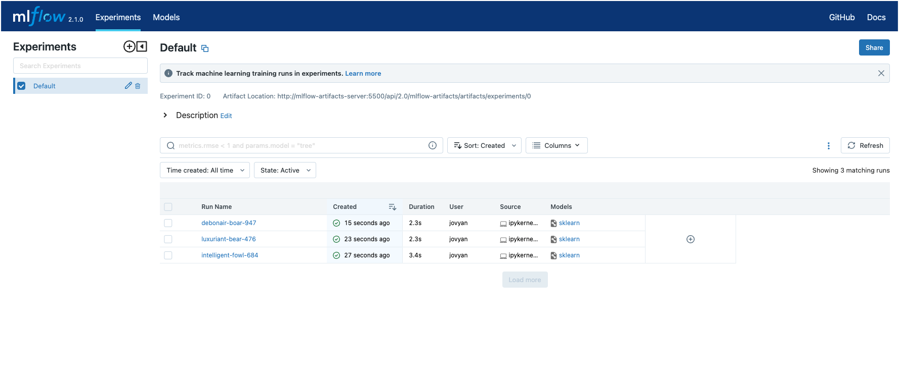

# Using MLflow from Jupyter

This recipe will show how to use MLflow from Jupyter. We will be using the [Elastic Net example](https://github.com/mlflow/mlflow/tree/master/examples/sklearn_elasticnet_wine) from the MLFlow [Tutorials and Examples](https://mlflow.org/docs/latest/tutorials-and-examples/index.html) page.

## Initialise data platform

First [initialise a platys-supported data platform](../documentation/getting-started) with the following services enabled

```bash
platys init --enable-services MLFLOW_SERVER,MINIO,JUPYTER -s trivadis/platys-modern-data-platform -w 1.16.0
```

add to `config.yml`

```yaml
      JUPYTER_edition: 'datascience'
      JUPYTER_python_packages: 'mlflow'
      JUPYTER_token: 'abc123!'
```

Now generate and start the platform 

```bash
platys gen

docker-compose up -d
```

## Working with MLflow

Navigate to Jupyter on <http://dataplatform:28888>. 

Create a new notebook and add the following cell

```python
# Wine Quality Sample
def train(in_alpha, in_l1_ratio):
    import os
    import warnings
    import sys

    import pandas as pd
    import numpy as np
    from sklearn.metrics import mean_squared_error, mean_absolute_error, r2_score
    from sklearn.model_selection import train_test_split
    from sklearn.linear_model import ElasticNet

    import mlflow
    import mlflow.sklearn

    import logging

    logging.basicConfig(level=logging.WARN)
    logger = logging.getLogger(__name__)

    def eval_metrics(actual, pred):
        rmse = np.sqrt(mean_squared_error(actual, pred))
        mae = mean_absolute_error(actual, pred)
        r2 = r2_score(actual, pred)
        return rmse, mae, r2

    warnings.filterwarnings("ignore")
    np.random.seed(40)

    # Read the wine-quality csv file from the URL
    csv_url = (
        "http://archive.ics.uci.edu/ml/machine-learning-databases/wine-quality/winequality-red.csv"
    )
    try:
        data = pd.read_csv(csv_url, sep=";")
    except Exception as e:
        logger.exception(
            "Unable to download training & test CSV, check your internet connection. Error: %s", e
        )

    # Split the data into training and test sets. (0.75, 0.25) split.
    train, test = train_test_split(data)

    # The predicted column is "quality" which is a scalar from [3, 9]
    train_x = train.drop(["quality"], axis=1)
    test_x = test.drop(["quality"], axis=1)
    train_y = train[["quality"]]
    test_y = test[["quality"]]

    # Set default values if no alpha is provided
    if float(in_alpha) is None:
        alpha = 0.5
    else:
        alpha = float(in_alpha)

    # Set default values if no l1_ratio is provided
    if float(in_l1_ratio) is None:
        l1_ratio = 0.5
    else:
        l1_ratio = float(in_l1_ratio)

    # Useful for multiple runs (only doing one run in this sample notebook)
    with mlflow.start_run():
        # Execute ElasticNet
        lr = ElasticNet(alpha=alpha, l1_ratio=l1_ratio, random_state=42)
        lr.fit(train_x, train_y)

        # Evaluate Metrics
        predicted_qualities = lr.predict(test_x)
        (rmse, mae, r2) = eval_metrics(test_y, predicted_qualities)

        # Print out metrics
        print("Elasticnet model (alpha=%f, l1_ratio=%f):" % (alpha, l1_ratio))
        print("  RMSE: %s" % rmse)
        print("  MAE: %s" % mae)
        print("  R2: %s" % r2)

        # Log parameter, metrics, and model to MLflow
        mlflow.log_param("alpha", alpha)
        mlflow.log_param("l1_ratio", l1_ratio)
        mlflow.log_metric("rmse", rmse)
        mlflow.log_metric("r2", r2)
        mlflow.log_metric("mae", mae)

        mlflow.sklearn.log_model(lr, "model")
```

Now let's invoke it with different parameters

```python
train(0.5, 0.5)
```

```python
train(0.2, 0.2)
```

```python
train(0.1, 0.1)
```

## Check it in MLFlow dashboard

Navigate to <http://dataplatform:28229> to check the results.

