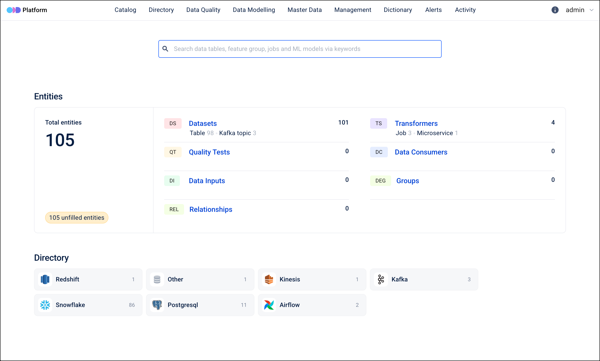

# Using Open Data Discovery Platform (ODD)

This recipe will show how to setup and use the [ODD Platform](https://opendatadiscovery.org/).

## Initialise data platform

First [initialise a platys-supported data platform](../documentation/getting-started) with the needed services enabled and generate the platform:

```bash
platys init --enable-services ODD_PLATFORM -s trivadis/platys-modern-data-platform -w 1.19.1
```

If you want to start it with some sample data, edit `config.yml` and set `ODD_PLATFORM_provision_sample_data` to `true`.

Now generate the platform 

```bash
platys gen
```

and start the platform

```bash
docker compose up -d
```

Wait for the `odd-platform` service to become healthy 


```
> docker compose up -d
WARN[0000] The "DATAPLATFORM_HOME" variable is not set. Defaulting to a blank string.
[+] Running 6/6
 ✔ Network platys-platform          Created                                                                            0.0s
 ✔ Container odd-platform-db        Healthy                                                                           10.9s
 ✔ Container markdown-renderer      Started                                                                            0.2s
 ✔ Container markdown-viewer        Started                                                                            0.2s
 ✔ Container odd-platform           Healthy                                                                          103.5s
 ✔ Container odd-platform-enricher  Started                                                                          103.6s
guido.schmutz@AMAXDKFVW0HYY ~/w/platys-catalog>
```

and then navigate to <http://dataplatform:28399>.

Depending on the choice above, you will either see the catalog be empty or the sample data loaded similar to shown here.




## Create a collector and enable the ODD Collector service

Navigate to **Management** on the top menu and  **Collectors** on the left-hand menu.  Create a new collector by clicking on **+ Add collector**.

Enter **Name** and optionally chose a **Namespace** and click **Save**. Copy and save the token shown on page about the collector just created.

Navigate to `config.yml` file and enable the ODD collector for automatic data ingestion by setting `ODD_PLATFORM_collector_enabled` to `true` and configure the `ODD_PLATFORM_token` setting with the token generated before. 

Create a file named `collector_config.yaml` in `./custom-conf/odd-platform` folder with the plugins you want to run. Here an example for harvesting the Postgresql database of ODD itself.

```yaml
platform_host_url: !ENV ${PLATFORM_HOST_URL}
default_pulling_interval: 10
token: !ENV ${TOKEN}
plugins:
  - type: postgresql
    name: test_postgresql_adapter
    host: "odd-platform-db"
    port: 5432
    database: "odd_platform_db"
    user: "odd_platform"
    password: "abc123!"
```

To find out more about the available plugins and examples, see <https://github.com/opendatadiscovery/odd-collectors>.

Re-Generate the platfrom and update it 

```bash
platys gen

docker compose up -d
```

Check the log of the newly created `odd-collector` service.

```
guido.schmutz@AMAXDKFVW0HYY ~/w/platys-catalog> docker logs -f odd-collector
2026-01-25 17:41:41.180 | INFO     | __main__:<module>:12 - Starting collector. Version: 0.1.72
2026-01-25 17:41:41.194 | WARNING  | odd_collector_sdk.utils.print_version:print_versions:15 - Could not get version for: odd_collector. Reason: odd_collector
2026-01-25 17:41:41.217 | INFO     | odd_collector_sdk.domain.collector_config_loader:load:28 - Start reading config
2026-01-25 17:41:41.632 | SUCCESS  | odd_collector_sdk.load_adapter:load_adapters:60 - Loaded 1 adapters!
2026-01-25 17:41:42.064 | INFO     | odd_collector_sdk.collector:run:126 - Config interval interval=10
2026-01-25 17:41:42.219 | INFO     | odd_collector_sdk.job:log_execution:21 - [test_postgresql_adapter] collecting metadata started.
2026-01-25 17:41:48.547 | SUCCESS  | odd_collector_sdk.job:log_execution:28 - [test_postgresql_adapter] metadata collected in 0:00:06.327693.
```

The postgresql meta data has been loaded and you can check it using the UI. 