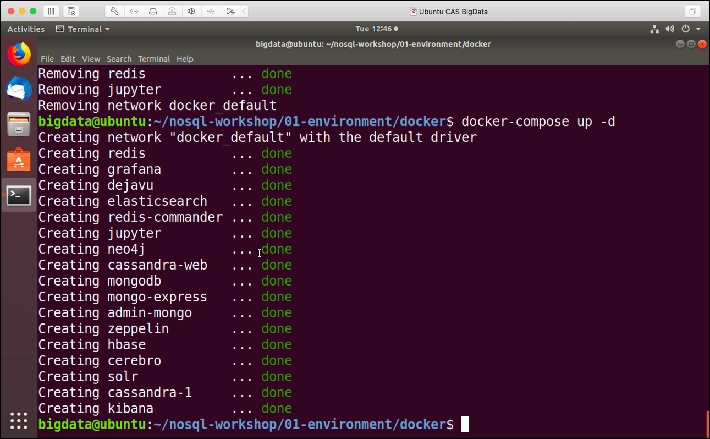

# Provision on Local Virtual Machine Environment

Open and start the virtual machine either by using **VMWare Workstation** on Windows or **VMWare Fusion** on Mac or **Virtual Box**. 

Currently the VM is configured to use 14 GB of Memory. If you have less than 16 GB in total available on your system, make sure to reduce it before starting the virtual machine. 

## Prepare Environment

In the Virtual Machine, start a terminal window and execute the following commands. 

First let's add the environment variables. Make sure to adapt the network interface (**ens33** according to your environment. You can retrieve the interface name by using **ipconfig** on windows or **ifconfig* on Mac/Linux. 

```
# Prepare Environment Variables
export PUBLIC_IP=$(curl ipinfo.io/ip)
export DOCKER_HOST_IP=$(ip addr show ens33 | grep "inet\b" | awk '{print $2}' | cut -d/ -f1)
```

Now for Elasticsearch to run properly, we have to increase the `vm.max_map_count` parameter like shown below.  

```
# needed for elasticsearch
sudo sysctl -w vm.max_map_count=262144   
```

Now let's checkout the NoSQL Workshop project from GitHub:

```
# Get the project
cd /home/bigdata
git clone https://github.com/TrivadisBDS/modern-data-analytics-stack.git
cd modern-data-analytics-stack/base-stack/docker
```

## Start Environment

And finally let's start the environment:

```
# Make sure that the environment is not running
docker-compose down

# Startup Environment
docker-compose up -d
```

The environment should start immediately, as all the necessary images should already be available in the local docker image registry. 

The output should be similar to the one below. 



Your instance is now ready to use. Complete the post installation steps documented the [here](README.md).

## Stop environment

To stop the environment, execute the following command:

```
docker-compose stop
```

after that it can be re-started using `docker-compose start`.

To stop and remove all running container, execute the following command:

```
docker-compose down
```


