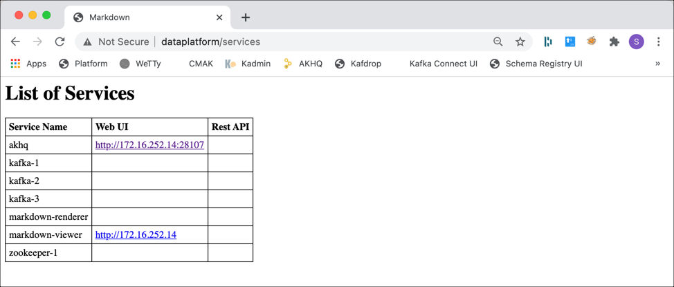

# Getting Started with `platys` and `modern-data-platform` stack

On this page you generate a simple platform which is based on the `modern-data-platform` stack and can then be run using Docker Compose. 

The platform we will create here, uses Kafka and Zookeeper, but the process should be understandable even if you haven't worked with Kafka before. 

## Prerequisites

Make sure that you have already installed the [Docker Engine](https://docs.docker.com/install/), [Docker Compose](https://docs.docker.com/compose/install/) and the [`platys`](https://github.com/TrivadisPF/platys/blob/master/documentation/install.md) toolset. 

## Step 1: Initialise the environment

First create a directory, which will hold the `platys` configuration as well as the generated artefacts:

```bash
mkdir platys-demo-platform
cd platys-demo-platform
```

Now let's initialise the current directory to use the Modern Data Analytics Platform Stack. 

We specify the platform stack name `trivadis/platys-modern-data-platform` to use as well as the stack version `1.17.1` (the current version of this platform stack). 

With the `-n` option we give the platform a meaningful name. It will be used as the name of the docker network, so it is important that it is unique, if you use multiple platforms on the same machine.

```bash
platys init -n demo-platform --stack trivadis/platys-modern-data-platform --stack-version 1.17.1 --structure flat
```

This generates a `config.yml` file, if it does not exist already, with all the services which can be configured for the platform.

```
Running using config file [config.yml]
{"status":"Pulling from trivadis/platys-modern-data-platform","id":"1.181.17.1"}
{"status":"Digest: sha256:4b3278aba39bcdeb43a1aefe1b17fe2edd6facf2843df64db104f6d850392dbe"}
{"status":"Status: Image is up to date for trivadis/platys-modern-data-platform:1.17.1"}
  ______     _                 ___
 /_  __/____(_)   ______ _____/ (_)____
  / / / ___/ / | / / __ `/ __  / / ___/
 / / / /  / /| |/ / /_/ / /_/ / (__  )
/_/ /_/  /_/ |___/\__,_/\__,_/_/____/
    __  ___          __                   ____        __           ____  __      __  ____
   /  |/  /___  ____/ /__  _________     / __ \____ _/ /_____ _   / __ \/ /___ _/ /_/ __/___  _________ ___
  / /|_/ / __ \/ __  / _ \/ ___/ __ \   / / / / __ `/ __/ __ `/  / /_/ / / __ `/ __/ /_/ __ \/ ___/ __ `__ \
 / /  / / /_/ / /_/ /  __/ /  / / / /  / /_/ / /_/ / /_/ /_/ /  / ____/ / /_/ / /_/ __/ /_/ / /  / / / / / /
/_/  /_/\____/\__,_/\___/_/  /_/ /_/  /_____/\__,_/\__/\__,_/  /_/   /_/\__,_/\__/_/  \____/_/  /_/ /_/ /_/

Congratulations! Your new Platform has been initialized in %path%

Just a few more steps and you're ready to go:

1. Edit the config.yml and enable the services you want to use.
2. Some services also allow for properties to be controlled. Use them if needed.
3. Generate the stack according to the settings done in step 1 by running "platys gen".

Visit https://github.com/trivadispf/modern-data-platform-stack/blob/master/documentation/getting-started.md for quickstart guide and full documentation.%!(EXTRA string=config.yml)
```

## Step 2: Configure the platform

Now we can configure the platform, using the `config.yml` file which has been created by the `init` command above.

In an editor (i.e. `nano`) open this configuration file. 

```
nano config.yml
```

You can see the configuration options, available through this platform stack, similar to this (only showing the first few lines):

```
      # Default values for the generator
      # this file can be used as a template for a custom configuration
      # or to know about the different variables available for the generator
      platys:
          platform-name: 'demo-platform'
          platform-stack: 'trivadis/platys-modern-data-platform'
          platform-stack-version: '1.17.1'
          structure: 'flat'
      # ========================================================================
      # Global configuration, valid for all or a group of services 
      # ========================================================================
      # Timezone, use a Linux string such as Europe/Zurich or America/New_York
      use_timezone: ''
      # the name of the repository to use for private images, which are not on docker hub (currently only Oracle images)
      private_docker_repository_name: 'trivadis'
      # the UID to use when using the "user" property in a service to override the user inside the container
      uid: '1000'
      # ========================================================================
      # External Services
      # ========================================================================
      external:
          KAFKA_enable: false
          KAFKA_bootstrap_servers:
          KAFKA_username:
          KAFKA_password:
          SCHEMA_REGISTRY_enable: false
          SCHEMA_REGISTRY_url:
          S3_enable: false
          S3_endpoint:
          S3_path_style_access: false
          S3_access_key:
      # ========================================================================
      # Platys Services
      # ========================================================================
      PROVISIONING_DATA_enable: false
      #
      # ===== Apache Zookeeper ========
      #
      ZOOKEEPER_enable: false
      ZOOKEEPER_volume_map_data: false
      ZOOKEEPER_nodes: 1 # either 1 or 3
      #
      # ===== Apache Zookeeper Navigator ========
      #
      ZOOKEEPER_NAVIGATOR_enable: false
      #
      # ===== Apache Kafka ========
      #
      KAFKA_enable: false
      # one of enterprise, community
      KAFKA_edition: 'community'
      KAFKA_volume_map_data: false
      KAFKA_datacenters: 1
      KAFKA_broker_nodes: 3
      KAFKA_internal_replication_factor: 3
      KAFKA_delete_topic_enable: false
      KAFKA_auto_create_topics_enable: false
      KAFKA_message_timestamp_type: CreateTime

      ...
```

You can now enable the options for the services you want the platform to support by changing the values of the Platys Services from `false` to `true`. The services available are named `XXXX_enable` by convention, where XXXX is the name of the service.

For this sample, we want to create a platform running Kafka and the AKHQ Management UI. So all we have to do is set the `KAFKA_enable` and the `KAFKA_AKHQ_enable` flag to `true`

```
      #
      # ===== Apache Zookeeper ========
      #
      ZOOKEEPER_enable: false
      ZOOKEEPER_volume_map_data: false
      ZOOKEEPER_nodes: 1            # either 1 or 3

      #
      # ===== Apache Kafka ========
      #
      KAFKA_enable: true
      KAFKA_entreprise_enable: false
      KAFKA_volume_map_data: false
      KAFKA_broker_nodes: 3
      KAFKA_delete_topic_enable: false
      KAFKA_auto_create_topics_enable: false
      
      ...
      
      #
      # ===== Apache Kafka HQ ========
      #
      KAFKA_AKHQ_enable: true      
```

You only have to explicitly enable what you need, as each service is disabled by default. Other settings have meaningful defaults as well. So you can also delete the values for all the services you don't need. 

All configuration settings for the `platys-modern-data-platform` platform stack are documented [here](configuration.md).


A shortcut exists with the `--enable-services` flag, which directly generates a `config.yml` file with the services needed. So to enable `KAFKA` and `AKHQ` directly from the `init`, we can use

```
platys init -n demo-platform --enable-services KAFKA,KAFKA_AKHQ --stack trivadis/platys-modern-data-platform --stack-version 1.17.1  
```

which produces the following `config.yml`

```
      # Default values for the generator
      # this file can be used as a template for a custom configuration
      # or to know about the different variables available for the generator
      platys:
          platform-name: 'demo-platform'
          platform-stack: 'trivadis/platys-modern-data-platform'
          platform-stack-version: '1.17.1'
          structure: 'flat'
      # ========================================================================
      # Global configuration, valid for all or a group of services 
      # ========================================================================
      # Timezone, use a Linux string such as Europe/Zurich or America/New_York
      use_timezone: ''
      # the name of the repository to use for private images, which are not on docker hub (currently only Oracle images)
      private_docker_repository_name: 'trivadis'
      #
      # ===== Apache Kafka ========
      #
      KAFKA_enable: true
      #
      # ===== Apache Kafka HQ ========
      #
      KAFKA_AKHQ_enable: true
```

If you want to know the service names you can use with the `--enable-services` flag you can query for it using the `list_services` command.

```
platys list_services --stack trivadis/platys-modern-data-platform --stack-version 1.17.1
```

## Step 3: Generate the platform

Now we are ready to generate the platform. In the `platys-demo-platform` folder, run the following command:

```
platys gen
```

and you should see an output similar to this

```
docker@ubuntu:~/platys-demo1.9$ platys gen
2020/12/06 23:08:06 using configuration file [config.yml] with values:  platform-name: [demo-platform], platform-stack: [trivadis/platys-modern-data-platform] platform-stack-version: [1.17.1], structure [flat]
{"status":"Pulling from trivadis/platys-modern-data-platform","id":"1.17.1"}
{"status":"Digest: sha256:4b3278aba39bcdeb43a1aefe1b17fe2edd6facf2843df64db104f6d850392dbe"}
{"status":"Status: Image is up to date for trivadis/platys-modern-data-platform:1.17.1"}
======================================================================
generating using the following custom stack-config.yml:
      # Default values for the generator
      # this file can be used as a template for a custom configuration
      # or to know about the different variables available for the generator
      platys:
          platform-name: 'demo-platform'
          platform-stack: 'trivadis/platys-modern-data-platform'
          platform-stack-version: '1.17.1'
          structure: 'flat'
      # ========================================================================
      # Global configuration, valid for all or a group of services 
      # ========================================================================
      # Timezone, use a Linux string such as Europe/Zurich or America/New_York
      use_timezone: ''
      # the name of the repository to use for private images, which are not on docker hub (currently only Oracle images)
      private_docker_repository_name: 'trivadis'
      #
      # ===== Apache Kafka ========
      #
      KAFKA_enable: true
      #
      # ===== Apache Kafka HQ ========
      #
      KAFKA_AKHQ_enable: true
      
======================================================================

Process Definition: '/opt/mdps-gen/stack-config.yml'
Loading file '/opt/mdps-gen/stack-config.yml'...
Parsing YAML...
Loading file '/opt/mdps-gen/vars/config.yml'...
Parsing YAML...
Loading file '/tmp/config.yml'...
Parsing YAML...
Render template: 'templates/docker-compose.yml.j2' --> 'destination/docker-compose.yml'
Loading file '/opt/mdps-gen/templates/docker-compose.yml.j2'...
Parsing YAML...
Dumping YAML...
Writing file '/opt/mdps-gen/destination/docker-compose.yml'...
======================================================================
======================================================================
Using timezone = 
======================================================================
grep: /opt/mdps-gen/destination/.gitignore: No such file or directory
```

You now find a fully configured `docker-compose.yml` file (with the services enabled in the `config.yml`) as well as some static configuration files, necessary for the services.

You can look at the `docker-compose.yml` to see all the service definitions which have been generated. We can see that besides the `kafka-1`, `kafka-2`, `kafka-3` and `akhq` there is also `zookeeper-1`, `markdown-viewer` and `markdown-renderer`.  

The generator knows about dependencies between services, and because Kafka needs a running Zookeeper environment, Zookeeper has been automatically enabled. 

The other two services, `markdown-viewer` and `markdown-renderer` is enabled by default in the `config.yml`. It will generate a web page on the information of the platform, once it is running. You can disable it by setting the `MARKDOWN_VIEWER_enable` to `false`. 

## Step 4: Run the platform 

Now the Platform is ready to be started. Before doing that, you have to create some environment variables, depending on the services you use. In minimum you should create

* `DOCKER_HOST_IP` - the IP address of the network interface of the Docker Host
* `PUBLIC_IP` - the IP address of the public network interface of the Docker Host (different to `DOCKER_HOST_IP` if in a public cloud environment

See [here](./setup-environment-variables.md) for how to setup these variables.

Having the environment variables in place, let's start the platform. In a terminal window, execute 

```
docker compose up -d
```

to start the docker compose platform stack in the background (`-d` option). 

Docker will first download all the necessary container images (if not yet available in the local registry) and then start the platform. You should see the following output once the platform is up and running:

```
Creating markdown-viewer   ... done
Creating markdown-renderer ... done
Creating zookeeper-1       ... done
Creating kafka-2           ... done
Creating kafka-1           ... done
Creating kafka-3           ... done
Creating akhq              ... done
```

In a web browser, navigate to <http://${PUBLIC_IP}> and you should see platform info page, which has been generated when starting the platform


Click on the link of *All available services are listed here* and you will see a list of the services and the Web UIs and REST APIs the expose:



### View the Logs

If there is something wrong, you might want to consult the log of the platform stack. 

You can display the active log entries for the whole platform using

```
docker compose logs -f
```

To only see the log of selected services, you can list them after the `docker compose logs -f`

```
docker compose logs -f <service-name> <service-name>
```

## Step 5: Stopping the Platform

To stop and remove the running platform stack, perform

```
docker compose down
```

**Note:** be aware that this completely removes the Docker containers and by that all the data within it. If you haven't mapped the data outside the container, then you might lose your work!


At this point, you have seen the basics of how `platys` works using the `modern-data-platform` stack. 

## Where to go next

* [Explore the full list of Platys commands](https://github.com/TrivadisPF/platys/tree/master/documentation/overview-platys-command.md)
* [Modern Data Platform Stack configuration file reference](configuration.md)

