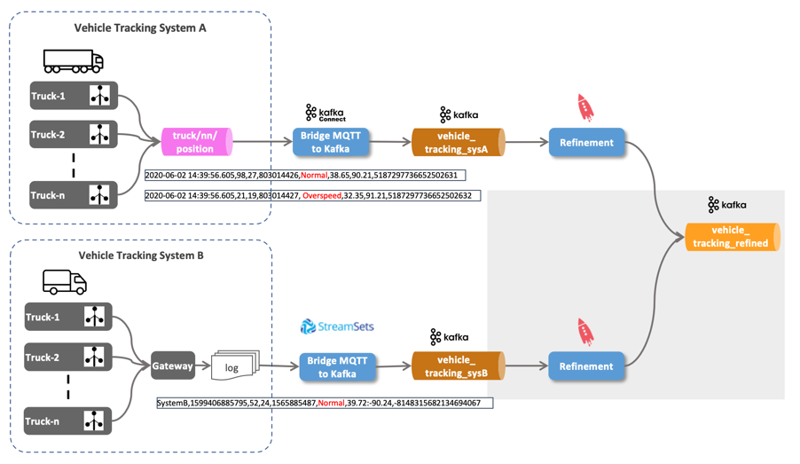

# IoT Vehicle Tracking

In this tutorial we will be ingesting IoT data into a Kafka topic from which it will be analysed with Stream Analytics using ksqlDB and Kafka Streams. The data is not directly sent to Kafka from the IoT devices (vehicles) but first sent through an MQTT broker (IoT gateway). 

The following diagram shows the setup of the data flow which will be implemented step by step. Of course we will not be using real-life data, but have a program simulating trucks and their driving behaviour.


We will see various technologies in action, such as **Kafka**, **MQTT**, **Kafka Connect**, **Kafka Streams** and **ksqlDB**.

The prerequisites for running the platform are [**Docker**](https://www.docker.com/) and [**Docker Compose**](https://docs.docker.com/compose/) as well as an installation of [**Platys CLI**](https://github.com/TrivadisPF/platys/blob/master/documentation/install.md). 

## Create and start a stack using Platys

### Generating the stack

First create a working folder, navigate into this folder and initialise a platys-supported stack

```bash
mkdir tutorial-platform
cd tutorial-platform

platys init -n tutorial-platform --stack trivadis/platys-modern-data-platform --stack-version 1.16.0 --structure flat
```

Edit the `config.yml` file to enable the following services:

Activate `Zookeeper`

```yaml
      ZOOKEEPER_enable: true
```

Activate `Kafka`

```yaml
      KAFKA_enable: true
      KAFKA_broker_nodes: 3      
```

Activate `Kafka Connect` with 2 worker nodes and some connectors pre-installed

```yaml
      KAFKA_CONNECT_enable: true
      KAFKA_CONNECT_nodes: 2
      KAFKA_CONNECT_connectors: confluentinc/kafka-connect-jdbc:10.0.0,confluentinc/kafka-connect-mqtt:1.3.0,debezium/debezium-connector-mysql:1.1.0
```

Activate `ksqlDB` with 2 nodes

```yaml
      KAFKA_KSQLDB_enable: true
      KAFKA_KSQLDB_edition: 'oss'
      KAFKA_KSQLDB_nodes: 2
```

Activate `kcat`, `Kafka Connect UI`, `CMAK` and `AKHQ`

```yaml
      KCAT_enable: true
      
      KAFKA_CONNECT_UI_enable: true
      
      KAFKA_CMAK_enable: true
      
      KAFKA_AKHQ_enable: true            
```

Activate `StreamSets`

```yaml
      STREAMSETS_enable: true
      STREAMSETS_stage_libs: 'streamsets-datacollector-apache-kafka_2_6-lib'      
```

Activate `MySQL` database

```yaml
      MYSQL_enable: true
```

Activate `PostgreSQL` database

```yaml
      POSTGRESQL_enable: true
      POSTGRESQL_volume_map_data: false
      POSTGRESQL_database: postgres
      POSTGRESQL_multiple_databases: 'demodb'
      POSTGRESQL_multiple_users: 'demo'
      POSTGRESQL_multiple_passwords: 'abc123!'
```      

Activate `Adminer` and `CloudBeaver` for DB management

```yaml
      ADMINER_enable: true
      CLOUDBEAVER_enable: true      
```      

Activate `Mosquitto` MQTT broker and `MQTT UI`

```yaml
    MOSQUITTO_enable: true

    MQTT_UI_enable: true
```

Save the file and generate the stack.

```yaml
platys gen
```

### Initialization of database schema

Create a new file `driver.sql` in the folder `init/postgresql/` and add the following content to create the `logistics_db` schema with the `driver` table.

```sql
\connect demodb demo

CREATE SCHEMA IF NOT EXISTS logistics_db;

SET search_path TO logistics_db;

DROP TABLE IF EXISTS driver;

CREATE TABLE driver (id BIGINT, first_name CHARACTER VARYING(45), last_name CHARACTER VARYING(45), available CHARACTER VARYING(1), birthdate DATE, last_update TIMESTAMP);

ALTER TABLE driver ADD CONSTRAINT driver_pk PRIMARY KEY (id);

INSERT INTO "driver" ("id", "first_name", "last_name", "available", "birthdate", "last_update") VALUES (10,'Diann', 'Butler', 'Y', '10-JUN-68', CURRENT_TIMESTAMP);
INSERT INTO "driver" ("id", "first_name", "last_name", "available", "birthdate", "last_update") VALUES (11,'Micky', 'Isaacson', 'Y', '31-AUG-72' ,CURRENT_TIMESTAMP);
INSERT INTO "driver" ("id", "first_name", "last_name", "available", "birthdate", "last_update") VALUES (12,'Laurence', 'Lindsey', 'Y', '19-MAY-78' ,CURRENT_TIMESTAMP);
INSERT INTO "driver" ("id", "first_name", "last_name", "available", "birthdate", "last_update") VALUES (13,'Pam', 'Harrington', 'Y','10-JUN-68' ,CURRENT_TIMESTAMP);
INSERT INTO "driver" ("id", "first_name", "last_name", "available", "birthdate", "last_update") VALUES (14,'Brooke', 'Ferguson', 'Y','10-DEC-66' ,CURRENT_TIMESTAMP);
INSERT INTO "driver" ("id", "first_name", "last_name", "available", "birthdate", "last_update") VALUES (15,'Clint','Hudson', 'Y','5-JUN-75' ,CURRENT_TIMESTAMP);
INSERT INTO "driver" ("id", "first_name", "last_name", "available", "birthdate", "last_update") VALUES (16,'Ben','Simpson', 'Y','11-SEP-74' ,CURRENT_TIMESTAMP);
INSERT INTO "driver" ("id", "first_name", "last_name", "available", "birthdate", "last_update") VALUES (17,'Frank','Bishop', 'Y','3-OCT-60' ,CURRENT_TIMESTAMP);
INSERT INTO "driver" ("id", "first_name", "last_name", "available", "birthdate", "last_update") VALUES (18,'Trevor','Hines', 'Y','23-FEB-78' ,CURRENT_TIMESTAMP);
INSERT INTO "driver" ("id", "first_name", "last_name", "available", "birthdate", "last_update") VALUES (19,'Christy','Stephens', 'Y','11-JAN-73' ,CURRENT_TIMESTAMP);
INSERT INTO "driver" ("id", "first_name", "last_name", "available", "birthdate", "last_update") VALUES (20,'Clarence','Lamb', 'Y','15-NOV-77' ,CURRENT_TIMESTAMP);

INSERT INTO "driver" ("id", "first_name", "last_name", "available", "birthdate", "last_update") VALUES (21,'Lila', 'Page', 'Y', '5-APR-77', CURRENT_TIMESTAMP);
INSERT INTO "driver" ("id", "first_name", "last_name", "available", "birthdate", "last_update") VALUES (22,'Patricia', 'Coleman', 'Y', '11-AUG-80' ,CURRENT_TIMESTAMP);
INSERT INTO "driver" ("id", "first_name", "last_name", "available", "birthdate", "last_update") VALUES (23,'Jeremy', 'Olson', 'Y', '13-JUN-82', CURRENT_TIMESTAMP);
INSERT INTO "driver" ("id", "first_name", "last_name", "available", "birthdate", "last_update") VALUES (24,'Walter', 'Ward', 'Y', '24-JUL-85', CURRENT_TIMESTAMP);
INSERT INTO "driver" ("id", "first_name", "last_name", "available", "birthdate", "last_update") VALUES (25,'Kristen', ' Patterson', 'Y', '14-JUN-73', CURRENT_TIMESTAMP);
INSERT INTO "driver" ("id", "first_name", "last_name", "available", "birthdate", "last_update") VALUES (26,'Jacquelyn', 'Fletcher', 'Y', '24-AUG-85', CURRENT_TIMESTAMP);
INSERT INTO "driver" ("id", "first_name", "last_name", "available", "birthdate", "last_update") VALUES (27,'Walter', '  Leonard', 'Y', '12-SEP-88', CURRENT_TIMESTAMP);
INSERT INTO "driver" ("id", "first_name", "last_name", "available", "birthdate", "last_update") VALUES (28,'Della', ' Mcdonald', 'Y', '24-JUL-79', CURRENT_TIMESTAMP);
INSERT INTO "driver" ("id", "first_name", "last_name", "available", "birthdate", "last_update") VALUES (29,'Leah', 'Sutton', 'Y', '12-JUL-75', CURRENT_TIMESTAMP);
INSERT INTO "driver" ("id", "first_name", "last_name", "available", "birthdate", "last_update") VALUES (30,'Larry', 'Jensen', 'Y', '14-AUG-83', CURRENT_TIMESTAMP);
INSERT INTO "driver" ("id", "first_name", "last_name", "available", "birthdate", "last_update") VALUES (31,'Rosemarie', 'Ruiz', 'Y', '22-SEP-80', CURRENT_TIMESTAMP);
INSERT INTO "driver" ("id", "first_name", "last_name", "available", "birthdate", "last_update") VALUES (32,'Shaun', ' Marshall', 'Y', '22-JAN-85', CURRENT_TIMESTAMP);
```

### Starting the stack

First, make sure that you have set the following two environment variables, which export the Public IP address (if a cloud environment) and the Docker Engine (Docker Host)  IP address:

``` bash
export DOCKER_HOST_IP=<docker-host-ip>
export PUBLIC_IP=<public-host-ip>
```

You can either add them to `/etc/environment` (without export) to make them persistent or use an `.env` file inside the `docker` folder with the two variables.

It is very important that these two are set, otherwise the platform will not run properly.

Now start the stack using `docker-compose`.

``` bash
docker-compose up -d
```

To show all logs of all containers use

``` bash
docker-compose logs -f
```

As a final step, add `dataplatform` as an alias to the `/etc/hosts` file so that the links used in this document work. 

```
<public-host-ip>		dataplatform
```

For a list of available services, navigate to <http://dataplatform:80/services>.

When a terminal is needed, you can use the Web Terminal available at <http://dataplatform:3001/>.

## Step 0 - Initialization

### Creating the necessary Kafka Topics

The Kafka cluster is configured with `auto.topic.create.enable` set to `false`. Therefore we first have to create all the necessary topics, using the `kafka-topics` command line utility of Apache Kafka. 

From a terminal window, use the `kafka-topics` CLI inside the `kafka-1` docker container to create the topics `vehicle_tracking_` and `logisticsdb_driver `.

``` bash
docker exec -it kafka-1 kafka-topics --bootstrap-server kafka-1:19092 --create --topic vehicle_tracking_sysA --partitions 8 --replication-factor 3
docker exec -it kafka-1 kafka-topics --bootstrap-server kafka-1:19092  --create --topic vehicle_tracking_sysB --partitions 8 --replication-factor 3
```

If you don't like to work with the CLI, you can also create the Kafka topics using the graphical user interfaces [Cluster Manager for Kafka (CMAK)](http://dataplatform:28104) or the [Apache Kafka HQ (AKHQ)](http://dataplatform:28107). 

### Check logistics_db Postgresql Database

The necessary tables are created automatically when running the stack using Docker Compose. Use the following command in a terminal window, to show the content of the `driver` table:

``` bash
docker exec -ti postgresql psql -d demodb -U demo -c "SELECT * FROM logistics_db.driver"
``` 

### Setup Shipment MySQL Database

Create the MySQL table with shipment information:

``` bash
docker exec -it mysql bash -c 'mysql -u root -pmanager'
```

```sql
CREATE USER 'debezium'@'%' IDENTIFIED WITH mysql_native_password BY 'dbz';
CREATE USER 'replicator'@'%' IDENTIFIED BY 'replpass';
GRANT SELECT, RELOAD, SHOW DATABASES, REPLICATION SLAVE, REPLICATION CLIENT  ON *.* TO 'debezium';
GRANT REPLICATION SLAVE, REPLICATION CLIENT ON *.* TO 'replicator';

GRANT SELECT, INSERT, UPDATE, DELETE ON sample.* TO sample;

USE sample;

DROP TABLE shipment;

CREATE TABLE shipment (
                id INT PRIMARY KEY,
                vehicle_id INT,
                target_wkt VARCHAR(2000),
                create_ts timestamp DEFAULT CURRENT_TIMESTAMP,
                update_ts timestamp DEFAULT CURRENT_TIMESTAMP ON UPDATE CURRENT_TIMESTAMP
);
                
INSERT INTO shipment (id, vehicle_id, target_wkt)  VALUES (1,11, 'POLYGON ((-91.29638671875 39.04478604850143, -91.4501953125 38.46219172306828, -90.98876953125 37.94419750075404, -89.912109375 37.78808138412046, -88.9892578125 38.37611542403604, -88.92333984375 38.77121637244273, -89.71435546875 39.470125122358176, -90.19775390625 39.825413103424786, -91.29638671875 39.04478604850143))');     

INSERT INTO shipment (id, vehicle_id, target_wkt)  VALUES (2, 42, 'POLYGON ((-91.29638671875 39.04478604850143, -91.4501953125 38.46219172306828, -90.98876953125 37.94419750075404, -89.912109375 37.78808138412046, -88.9892578125 38.37611542403604, -88.92333984375 38.77121637244273, -89.71435546875 39.470125122358176, -90.19775390625 39.825413103424786, -91.29638671875 39.04478604850143))');         

INSERT INTO shipment (id, vehicle_id, target_wkt)  VALUES (3, 12, 'POLYGON ((-91.29638671875 39.04478604850143, -91.4501953125 38.46219172306828, -90.98876953125 37.94419750075404, -89.912109375 37.78808138412046, -88.9892578125 38.37611542403604, -88.92333984375 38.77121637244273, -89.71435546875 39.470125122358176, -90.19775390625 39.825413103424786, -91.29638671875 39.04478604850143))'); 
                
INSERT INTO shipment (id, vehicle_id, target_wkt)  VALUES (4, 13, 'POLYGON ((-91.29638671875 39.04478604850143, -91.4501953125 38.46219172306828, -90.98876953125 37.94419750075404, -89.912109375 37.78808138412046, -88.9892578125 38.37611542403604, -88.92333984375 38.77121637244273, -89.71435546875 39.470125122358176, -90.19775390625 39.825413103424786, -91.29638671875 39.04478604850143))'); 

INSERT INTO shipment (id, vehicle_id, target_wkt)  VALUES (5, 14, 'POLYGON ((-91.29638671875 39.04478604850143, -91.4501953125 38.46219172306828, -90.98876953125 37.94419750075404, -89.912109375 37.78808138412046, -88.9892578125 38.37611542403604, -88.92333984375 38.77121637244273, -89.71435546875 39.470125122358176, -90.19775390625 39.825413103424786, -91.29638671875 39.04478604850143))'); 

INSERT INTO shipment (id, vehicle_id, target_wkt)  VALUES (6, 15, 'POLYGON ((-91.29638671875 39.04478604850143, -91.4501953125 38.46219172306828, -90.98876953125 37.94419750075404, -89.912109375 37.78808138412046, -88.9892578125 38.37611542403604, -88.92333984375 38.77121637244273, -89.71435546875 39.470125122358176, -90.19775390625 39.825413103424786, -91.29638671875 39.04478604850143))'); 

INSERT INTO shipment (id, vehicle_id, target_wkt)  VALUES (7, 32, 'POLYGON ((-91.29638671875 39.04478604850143, -91.4501953125 38.46219172306828, -90.98876953125 37.94419750075404, -89.912109375 37.78808138412046, -88.9892578125 38.37611542403604, -88.92333984375 38.77121637244273, -89.71435546875 39.470125122358176, -90.19775390625 39.825413103424786, -91.29638671875 39.04478604850143))'); 

INSERT INTO shipment (id, vehicle_id, target_wkt)  VALUES (8, 48, 'POLYGON ((-91.29638671875 39.04478604850143, -91.4501953125 38.46219172306828, -90.98876953125 37.94419750075404, -89.912109375 37.78808138412046, -88.9892578125 38.37611542403604, -88.92333984375 38.77121637244273, -89.71435546875 39.470125122358176, -90.19775390625 39.825413103424786, -91.29638671875 39.04478604850143))'); 
```

### Simulating Vehicle Tracking Data

For simulating vehicle tracking data, we are going to use a Java program (adapted from Hortonworks) and maintained [here](https://github.com/TrivadisBDS/various-bigdata-prototypes/tree/master/streaming-sources/iot-truck-simulator/impl).

The simulator can produce data to various targets, such as **Kafka**, **MQTT** or **Files**. These two options are shown below. 
	
Now let's produce the truck events to the MQTT broker running on port 1883. In a terminal window run the following command:

``` bash
docker run --network host --rm trivadis/iot-truck-simulator '-s' 'MQTT' '-h' $DOCKER_HOST_IP '-p' '1883' '-f' 'JSON' '-vf' '1-49'
```

Leave this running in the terminal window. 

---
**Note:** You can shortcut this workshop here by skipping step 1 and publishing directly to Kafka instead of MQTT. In that case perform use the following command instead of the one below `docker run trivadis/iot-truck-simulator '-s' 'KAFKA' '-h' $DOCKER_HOST_IP '-p' '9092' '-f' 'JSON' '-vf' '1-49'` and skip to [Step 2](https://github.com/gschmutz/event-driven-microservices-workshop/tree/main/09-vehicle-tracking-application#step-2---using-ksql-to-refine-the-data).

---	

## Step 1 - Consume Vehicle Tracking messages from MQTT and send to Kafka

In this part we will show how we can consume the data from the MQTT broker and send it to a Kafka topic. We will be using *Kafka Connect* for that. 


### Check message in MQTT

Let's first see that we get vehicle tracking messages in the topic MQTT topic hierarchy `trucks/+/position`. 

There two options for consuming from MQTT
 
 * use dockerized MQTT client in the terminal
 * use browser-based HiveMQ Web UI

#### Using Dockerized MQTT Client

To start consuming using through a command line, perform the following docker command:

``` bash
docker run -it --rm efrecon/mqtt-client sub -h $DOCKER_HOST_IP -t "truck/+/position" -v
```

The consumed messages will show up in the terminal.

#### Using HiveMQ Web UI  

To start consuming using the MQTT UI ([HiveMQ Web UI](https://www.hivemq.com/docs/3.4/web-ui/introduction.html)), navigate to <http://dataplatform:28136> and connect using `dataplatform` for the **Host** field, `9101` for the **Port** field and then click on **Connect**: 


	
When successfully connected, click on Add New Topic Subscription and enter `truck/+/position` into **Topic** field and click **Subscribe**:
	


As soon as messages are produced to MQTT, you should see them either on the CLI or in the MQTT UI (Hive MQ) as shown below.


Alternatively you can also use the [MQTT.fx](https://mqttfx.jensd.de/), [MQTT Explorer](https://mqtt-explorer.com/) or [MQTTLens](https://chrome.google.com/webstore/detail/mqttlens/hemojaaeigabkbcookmlgmdigohjobjm?hl=de) applications to browse for the messages on the MQTT broker. They are all available for installation on Mac or Windows. 

### Setup Kafka Connect to bridge between MQTT and Kafka

In order to get the messages from MQTT into Kafka, we will be using the Kafka Connect framework. Kafka Connect is part of the Apache Kafka project and can run various connectors, either as Source or as a Sink Connector, as shown in the following diagram: 


Connectors are available from Confluent as well as other, 3rd party organisations. A good source for connectors is the [Confluent Hub](https://www.confluent.io/hub/), although it is not complete, some connectors can also be found on GitHub projects.

There are multiple Kafka Connectors available for MQTT. We can either use the one provided by [Confluent Inc.](https://www.confluent.io/connector/kafka-connect-mqtt/) (in preview and available as evaluation license on Confluent Hub) or the one provided as part of the [Landoop Stream-Reactor Project](https://github.com/Landoop/stream-reactor/tree/master/kafka-connect-mqtt) available on GitHub. Here we will use the one provided by Confluent. Just be aware that is part of Confluent Enterprise, but available for evaluation. 

The Confluent MQTT Connector was downloaded when running the Compose stack. You can check that the connector is installed by calling the REST API of the Kafka Connector cluster:

```bash
curl -XGET http://dataplatform:8083/connector-plugins | jq
```

Before we start the connector, let's use a Kafka console listener to consume from the target topic `vehicle_tracking_sysA`. We can use the [`kcat`](https://github.com/edenhill/kcat) utility (formerly kcat`kcat`), which you can either install locally or use the one provided with the Compose stack: 

```bash
docker exec -ti kcat kcat -b kafka-1 -t vehicle_tracking_sysA -f "%k - %s\n"
```

Now let's start the connector:

```bash
curl -X "POST" "$DOCKER_HOST_IP:8083/connectors" \
     -H "Content-Type: application/json" \
     --data '{
  "name": "mqtt-vehicle-position-source",
  "config": {
    "connector.class": "io.confluent.connect.mqtt.MqttSourceConnector",
    "tasks.max": "1",
    "mqtt.server.uri": "tcp://mosquitto-1:1883",
    "mqtt.topics": "truck/+/position",
    "mqtt.clean.session.enabled":"true",
    "mqtt.connect.timeout.seconds":"30",
    "mqtt.keepalive.interval.seconds":"60",
    "mqtt.qos":"0",
    "kafka.topic":"vehicle_tracking_sysA",
    "confluent.topic.bootstrap.servers": "kafka-1:19092,kafka-2:19093",
    "confluent.topic.replication.factor": "3",
    "key.converter": "org.apache.kafka.connect.storage.StringConverter",
    "value.converter": "org.apache.kafka.connect.converters.ByteArrayConverter"
    }
  }'
```

The truck position messages are sent to the `vehicle_tracking_sysA` topic and should show up on the kcat consumer immediately. 

If you want to stop the connector, you can again use the REST API:

```bash
curl -X "DELETE" "$DOCKER_HOST_IP:8083/connectors/mqtt-vehicle-position-source"
```

### Monitor connector in Kafka Connect UI

Navigate to the [Kafka Connect UI](http://dataplatform:28103) to view the connector in a graphical window.

## Step 2 - Using KSQL to Refine the data

In this part we will refine the data and place it in a new topic. The idea here is to have one normalised topic in Avro format, where all the tracking data from both system A and B will be placed, so that further processing can take it from there. For the refinement we will be using ksqlDB.


### What is ksqlDB? 

ksqlDB is an event streaming database purpose-built to help developers create stream processing applications on top of Apache Kafka.


[_Source: Confluent_](https://docs.ksqldb.io/en/latest/)

### Connect to ksqlDB engine

Let's connect to the ksqlDB shell

``` bash
docker exec -it ksqldb-cli ksql http://ksqldb-server-1:8088
```

### Use ksqlDB for displaying messages

Show the available Kafka topics

```sql
show topics;
```

Let's consume the data from the `truck_position` topic, assuming the truck simulator and the MQTT connector is still running.

```sql
print 'vehicle_tracking_sysA';
```

You can also add the keyword `from beginning` to start consuming at the beginning of the topic.

```sql
print 'vehicle_tracking_sysA' from beginning;
```

You can also use the show commands for showing the other KSQL objects (which we will now create)

```sql
show streams;
show tables;
show queries;
```

### Create a Stream and SELECT from it

First drop the stream if it already exists:

``` sql
DROP STREAM IF EXISTS vehicle_tracking_sysA_s;
```

Now let's create the ksqlDB Stream

``` sql
CREATE STREAM IF NOT EXISTS vehicle_tracking_sysA_s 
  (mqttTopic VARCHAR KEY,
  timestamp VARCHAR, 
   truckId VARCHAR, 
   driverId BIGINT, 
   routeId BIGINT,
   eventType VARCHAR,
   latitude DOUBLE,
   longitude DOUBLE,
   correlationId VARCHAR)
  WITH (kafka_topic='vehicle_tracking_sysA',
        value_format='JSON');
```

We are using the `JSON` value format, as our stream is a JSON-formatted string. 

Let's see the live data by using a `SELECT` on the Stream with the `EMIT CHANGES` clause:

``` sql
SELECT * FROM vehicle_tracking_sysA_s EMIT CHANGES;
```

This is a so-called *Push Query* (declared by the `EMIT CHANGES` clause). A push query is a form of query issued by a client that subscribes to a result as it changes in real-time.  


[_Source: Confluent_](https://docs.ksqldb.io/en/latest/concepts/queries/push/)

You should see a continuous stream of events as a result of the SELECT statement, similar as shown below:

```
ksql> SELECT * from vehicle_tracking_sysA_s EMIT CHANGES;
+------------------------------+------------------------------+------------------------------+------------------------------+------------------------------+------------------------------+------------------------------+------------------------------+------------------------------+
|MQTTTOPIC                     |TIMESTAMP                     |TRUCKID                       |DRIVERID                      |ROUTEID                       |EVENTTYPE                     |LATITUDE                      |LONGITUDE                     |CORRELATIONID                 |
+------------------------------+------------------------------+------------------------------+------------------------------+------------------------------+------------------------------+------------------------------+------------------------------+------------------------------+
|truck/11/position             |1599398981285                 |11                            |17                            |1594289134                    |Normal                        |38.99                         |-93.45                        |-8240058917944842967          |
|truck/42/position             |1599398981846                 |42                            |22                            |1325562373                    |Normal                        |37.15                         |-97.32                        |-8240058917944842967          |
|truck/10/position             |1599398982135                 |10                            |10                            |1962261785                    |Normal                        |38.09                         |-91.44                        |-8240058917944842967          |
|truck/34/position             |1599398982454                 |34                            |16                            |1198242881                    |Normal                        |39.01                         |-93.85                        |-8240058917944842967          |
```

We have submitted our first simple KSQL statement. Let's now add some analytics to this base statement. 


Get info on the stream using the `DESCRIBE` command

```sql
DESCRIBE vehicle_tracking_sysA_s;
DESCRIBE EXTENDED vehicle_tracking_sysA_s;
```

### Create a new "refined" stream where the data is transformed into Avro

First drop the stream if it already exists:

``` sql
DROP STREAM IF EXISTS vehicle_tracking_refined_s;
```

And now create the refined ksqlDB Stream with a `CREATE STREAM ... AS SELECT ...` statement. We include an additional column `source`, which holds the system the data is coming from.

``` sql
CREATE STREAM IF NOT EXISTS vehicle_tracking_refined_s 
  WITH (kafka_topic='vehicle_tracking_refined',
        value_format='AVRO',
        VALUE_AVRO_SCHEMA_FULL_NAME='com.trivadis.avro.VehicleTrackingRefined')
AS SELECT truckId AS ROWKEY
		, 'Tracking_SysA' AS source
		, timestamp
		, AS_VALUE(truckId) AS vehicleId
		, driverId
		, routeId
		, eventType
		, latitude
		, longitude
		, correlationId
FROM vehicle_tracking_sysA_s
PARTITION BY truckId
EMIT CHANGES;
```

To check that the refined topic does in fact hold Avro formatted data, let's just do a normal kcat on the `truck_position_refined` topic

``` bash
docker exec -ti kcat kcat -b kafka-1 -t vehicle_tracking_refined
```

we can see that it is serialized as Avro 

```
                            Normal���Q�B@ףp=
WX�$343671958179690963
1598125263176886����
                             Normal��Q��C@�p=
דW�$343671958179690963
% Reached end of topic truck_position_refined [0] at offset 367
159812526333671�ߩ�2Unsafe following distance�Q���B@���(\?W�$343671958179690963
% Reached end of topic truck_position_refined [5] at offset 353
% Reached end of topic truck_position_refined [2] at offset 324
1598125263526101����
                              Normal=
ףpE@R����V�$343671958179690963
% Reached end of topic truck_position_refined [7] at offset 355
```

we can use the `-s` and `-r` option to specify the Avro Serde and the URL of the schema registry and the output is readable:

``` bash
docker exec -ti kcat kcat -b kafka-1 -t vehicle_tracking_refined -s value=avro -r http://schema-registry-1:8081
```

You can use the Schema Registry UI on <http://dataplatform:28102> to view the Avro Schema created by ksqlDB.

## Step 3 - Integrate System B

In this part we will show how we can integrate the data from the 2nd vehicle tracking system (System B), where the only integration point available is a set of log files. We can tail these log files and by that get the information as soon as it arrives. We convert the file source into a streaming data source by that. We will be using [StreamSets Data Collector](https://streamsets.com/products/dataops-platform/data-collector/) for the tail operation, as in real life this data collector would have to run on the Vehicle Tracking System itself or at least on a machine next to it. At the end it needs to be able to access the actual, active file while it is being written to by the application. StreamSets even has an Edge option which is a down-sized version of the full version and is capable of running on a Rasperry Pi.


Let's again start a simulator, but this time simulating the file where the tracking data is appended to:

```bash
docker run -v "${PWD}/data-transfer/logs:/out" --rm trivadis/iot-truck-simulator "-s" "FILE" "-f" "CSV" "-d" "1000" "-vf" "50-100" "-es" "2"
```

Create a StreamSets data flow to tail File into Kafka topic `vehicle_tracking_sysB`. 


You can import that data flow from `./streamsets/File_to_Kafka.json` if you don't want to create it from scratch. 

Now let's listen on the new topic

```bash
docker exec -ti kcat kcat -b kafka-1 -t vehicle_tracking_sysB -f "%k - %s\n" -q
```

and then start the flow in StreamSets. You should see the data from the file arriving as a stream of vehicle tracking data. 

```
Field[STRING:97] - {"text":"SystemB,1599556302227,97,21,1325712174,Normal,37.7:-92.61,4331001611104251967"}
Field[STRING:97] - {"text":"SystemB,1599556302994,97,21,1325712174,Normal,37.6:-92.74,4331001611104251967"}
Field[STRING:97] - {"text":"SystemB,1599556303791,97,21,1325712174,Normal,37.51:-92.89,4331001611104251967"}
```

The first part (before the dash) shows the content of the Kafka key, generated in the `Expression Evaluator` component in StreamSets. The second part represents the Kafka value. Compared to the data from System A, this system delivers its data in CSV format. Additionally the system name is produced and there is only one value for latitude/longitude, it is sent as string and the two values are delimited by a colon character (`:`).

## Step 4 - Refinement of data from System B into same topic as above

In this part we will do the refinement on the raw data from System B and place it into the same topic `vehicle_tracking_refined` as used in step 2.



Firs lets create the Stream on the raw data topic:

```sql
DROP STREAM IF EXISTS vehicle_tracking_sysB_s;

CREATE STREAM IF NOT EXISTS vehicle_tracking_sysB_s 
  (ROWKEY VARCHAR KEY,
   system VARCHAR,
   timestamp VARCHAR, 
   vehicleId VARCHAR, 
   driverId BIGINT, 
   routeId BIGINT,
   eventType VARCHAR,
   latLong VARCHAR,
   correlationId VARCHAR)
  WITH (kafka_topic='vehicle_tracking_sysB',
        value_format='DELIMITED');
```

System B delivers the latitude and longitude in one field as a string, with the two values delimited by a colon character.

```sql
DESCRIBE vehicle_tracking_sysB_s;
DESCRIBE vehicle_tracking_refined_s;
```

Now we can use the `INSERT` statement to write the data into the `vehicle_tracking_refined_s` stream we have created in step 2. We have to make sure that the structure matches (the refinement we perform), which in this case is providing the right value for the `soruce` column as well as splitting the `latLong` value into a `latitude` and `longitude` value:

``` sql
INSERT INTO vehicle_tracking_refined_s 
SELECT ROWKEY
    , 'Tracking_SysB' AS source
	, timestamp
	, vehicleId
	, driverId
	, routeId
	, eventType
	, cast(split(latLong,':')[1] as DOUBLE) as latitude
	, CAST(split(latLong,':')[2] AS DOUBLE) as longitude
	, correlationId
FROM vehicle_tracking_sysB_s
EMIT CHANGES;
```

## Step 5 - Pull Query on Vehicle Tracking Info ("Device Shadow")

So with the vehicle position data from both source systems normalized into the `vehicle_tracking_refined` topic and available in ksqlDB throught the `vehicle_tracking_refined_s` stream object, is it possible to query for the latest position for a given vehicle. 


In ksqlDB suche queries are called *pull queries*, in contrast to the streaming queries we have seen so far, known as *push queries* (using the `EMIT CHANGES` clause). A pull query is a form of query issued by a client that retrieves a result as of "now", like a query against a traditional RDBS. 


[_Source: Confluent_](https://docs.ksqldb.io/en/latest/concepts/queries/pull/)

So let's do a `SELECT` on the stream, restricting on the `vehicleId` without an `EMIT CHANGES`

``` sql
SELECT * FROM vehicle_tracking_refined_s WHERE vehicleId = 42;
```

We get the following error from ksqlDB: `Pull queries are not supported on streams.`. 

Pull queries only work on Materialized Views, which are the `Table`s and not the `Stream`s. So can we create a table which delivers the information?

Of course! Here is the necessary statement:

``` sql
DROP TABLE IF EXISTS vehicle_tracking_refined_t DELETE TOPIC;

CREATE TABLE IF NOT EXISTS vehicle_tracking_refined_t
WITH (kafka_topic = 'vehicle_tracking_refined_t')
AS
SELECT vehicleId
       , latest_by_offset(driverId)	   driverId
		, latest_by_offset(source)			source
		, latest_by_offset(eventType)		eventType
		, latest_by_offset(latitude)		latitude
		, latest_by_offset(longitude)		longitude
FROM vehicle_tracking_refined_s
GROUP BY vehicleId
EMIT CHANGES;
```

This table uses the vehicleId as the primary key (due to the GROUP BY) and materializes all values as the latest one from the aggregation. 

``` sql
DESCRIBE vehicle_tracking_refined_t;
```

A describe on the table shows that this primary key is of type `STRING`:

```
ksql> DESCRIBE vehicle_tracking_refined_t;

Name                 : VEHICLE_TRACKING_REFINED_T
 Field     | Type
--------------------------------------------
 VEHICLEID | VARCHAR(STRING)  (primary key)
 DRIVERID  | BIGINT
 SOURCE    | VARCHAR(STRING)
 EVENTTYPE | VARCHAR(STRING)
 LATITUDE  | DOUBLE
 LONGITUDE | DOUBLE
--------------------------------------------
```

So to test the pull query, we have to switch to a string, otherwise an error is shown:

``` sql
SELECT * FROM vehicle_tracking_refined_t WHERE vehicleId = '42';
```

But we could also change the `CREATE TABLE` statement to CAST the `vehicleId` into a `BIGINT`:


``` sql
DROP TABLE IF EXISTS vehicle_tracking_refined_t DELETE TOPIC;

CREATE TABLE IF NOT EXISTS vehicle_tracking_refined_t
WITH (kafka_topic = 'vehicle_tracking_refined_t')
AS
SELECT CAST(vehicleId AS BIGINT)			vehicleId
       , latest_by_offset(driverId)	   driverId
		, latest_by_offset(source)			source
		, latest_by_offset(eventType)		eventType
		, latest_by_offset(latitude)		latitude
		, latest_by_offset(longitude)		longitude
FROM vehicle_tracking_refined_s
GROUP BY CAST(vehicleId AS BIGINT)
EMIT CHANGES;
```

Now we can use it with an integer:

``` sql
SELECT * FROM vehicle_tracking_refined_t WHERE vehicleId = 42;
```

## Step 6 - Investigate Driving behaviour

In this part we will be using ksqlDB and as an alternative solution Kafka Streams or Faust to analyse the data in the refined topic `vehicle_tracking_refined`.


Now with the data from both system integrated, let's work with it!

In this new stream we are only interested in the messages where the `eventType` is not normal. First let's create a SELECT statement which performs the right result, using the ksqlDB CLI:

``` sql
SELECT * FROM vehicle_tracking_refined_s 
WHERE eventType != 'Normal'
EMIT CHANGES;
```

Now let's create a new stream with that information. 

``` sql
DROP STREAM IF EXISTS problematic_driving_s;

CREATE STREAM IF NOT EXISTS problematic_driving_s
  WITH (kafka_topic='problematic_driving',
        value_format='AVRO',
        partitions=8)
AS 
SELECT * 
FROM vehicle_tracking_refined_s
WHERE eventtype != 'Normal';
```

We can see that the stream now only contains the messages filtered down to the relevant ones:

``` sql
SELECT * FROM problematic_driving_s
EMIT CHANGES;
```

We can also see the same information by directly getting the data from the underlaying kafka topic `problematic_driving`:

``` bash
docker exec -ti kcat kcat -b kafka-1 -t problematic_driving -s value=avro -r http://schema-registry-1:8081
```

### Alternative using Kafka Streams

The same logic can also be implemented using Kafka Streams. In the folder `java` you will find the Kafka Streams project `kafka-streams-vehicle-tracking` with the implementation. The value we consume from the `vehicle_tracking_refined` topic is serialized as Avro. Therefore we configure Kafka Streams to use the `SpecificAvroSerde`.

```java
package com.trivadis.kafkastreams;

import com.trivadis.avro.VehicleTrackingRefined;
import io.confluent.kafka.serializers.AbstractKafkaAvroSerDeConfig;
import io.confluent.kafka.streams.serdes.avro.SpecificAvroSerde;
import org.apache.commons.cli.*;
import org.apache.kafka.clients.consumer.ConsumerConfig;
import org.apache.kafka.common.serialization.Serdes;
import org.apache.kafka.streams.KafkaStreams;
import org.apache.kafka.streams.StreamsBuilder;
import org.apache.kafka.streams.StreamsConfig;
import org.apache.kafka.streams.kstream.KStream;

import java.util.Properties;

public class DetectProblematicDriving {

	static final String VEHICLE_TRACKING_REFINED_STREAM = "vehicle_tracking_refined";
	static final String PROBLEMATIC_DRIVING_STREAM = "problematic_driving-kstreams";

	public static void main(final String[] args) {
		final String applicationId = "test";
		final String clientId = "test";
		final String bootstrapServer = "dataplatform:9092";
		final String schemaRegistryUrl = "http://dataplatform:8081";
		final boolean cleanup = false;
		final String stateDirPath = "C:\\tmp\\kafka-streams";

		final KafkaStreams streams = buildFeed(applicationId, clientId, bootstrapServer, schemaRegistryUrl, stateDirPath);

		if (cleanup) {
			streams.cleanUp();
		}
		streams.start();

		// Add shutdown hook to respond to SIGTERM and gracefully close Kafka Streams
		Runtime.getRuntime().addShutdownHook(new Thread(new Runnable() {
			@Override
			public void run() {
				streams.close();
			}
		}));
	}

	private static KafkaStreams buildFeed(final String applicationId, final String clientId, final String bootstrapServers, final String schemaRegistryUrl,
										  final String stateDir) {

		final Properties streamsConfiguration = new Properties();

		// Give the Streams application a unique name. The name must be unique in the
		// Kafka cluster
		// against which the application is run.
		streamsConfiguration.put(StreamsConfig.APPLICATION_ID_CONFIG, applicationId);
		streamsConfiguration.put(StreamsConfig.CLIENT_ID_CONFIG, clientId);

		// Where to find Kafka broker(s).
		streamsConfiguration.put(StreamsConfig.BOOTSTRAP_SERVERS_CONFIG, bootstrapServers);

		// Where to find the Confluent schema registry instance(s)
		streamsConfiguration.put(AbstractKafkaAvroSerDeConfig.SCHEMA_REGISTRY_URL_CONFIG, schemaRegistryUrl);

		// Specify default (de)serializers for record keys and for record values.
		streamsConfiguration.put(StreamsConfig.DEFAULT_KEY_SERDE_CLASS_CONFIG, Serdes.String().getClass().getName());
		streamsConfiguration.put(StreamsConfig.DEFAULT_VALUE_SERDE_CLASS_CONFIG, SpecificAvroSerde.class);
		streamsConfiguration.put(StreamsConfig.STATE_DIR_CONFIG, stateDir);
		streamsConfiguration.put(ConsumerConfig.AUTO_OFFSET_RESET_CONFIG, "earliest");

		// Records should be flushed every 10 seconds. This is less than the default
		// in order to keep this example interactive.
		streamsConfiguration.put(StreamsConfig.COMMIT_INTERVAL_MS_CONFIG, 10 * 1000);

		// If Confluent monitoring interceptors are on the classpath,
		// then the producer and consumer interceptors are added to the
		// streams application.
		// MonitoringInterceptorUtils.maybeConfigureInterceptorsStreams(streamsConfiguration);


		final StreamsBuilder builder = new StreamsBuilder();

		// read the source stream (keyed by objectId)
		final KStream<String, VehicleTrackingRefined> vehicleTracking = builder.stream(VEHICLE_TRACKING_REFINED_STREAM);

		vehicleTracking.peek((k,v) -> System.out.println("vehicleTracking.peek(...) : " + k + " : " + v));

		// filter out all events where eventType equals "Normal"
		final KStream<String, VehicleTrackingRefined> vehicleTrackingFiltered = vehicleTracking.filterNot((k,v) -> "Normal".equals (v.getEVENTTYPE().toString()));

		// Send the Matches to the Kafka Topic
		vehicleTrackingFiltered.to(PROBLEMATIC_DRIVING_STREAM);

		// read the driver
		//final KTable<String, Driver> driver = builder.table(DRIVER_STREAM);

		// Left Join Positions Mecomo Raw with Barge to get the barge id
		//KStream<String, PositionMecomo> positionsMecomo  =  positionsMecomoRaw.leftJoin(barge,
		//		(leftValue, rightValue) -> createFrom(leftValue, (rightValue != null ? rightValue.getId() : -1) ),
		//		Joined.<String, PositionMecomoRaw, Barge>keySerde(Serdes.String())
		//);

		return new KafkaStreams(builder.build(), streamsConfiguration);
	}
}
```

To not give any conflicts with the ksqlDB version, the Kafka Streams implementation publishes to its own topic `problematic_driving-kstreams`. So let's create that first

``` bash
docker exec -it kafka-1 kafka-topics --zookeeper zookeeper-1:2181 --create --topic problematic_driving-kstreams --partitions 8 --replication-factor 3
```

Now you can run the Kafka Streams application and you should see the problematic driving in the `problematic_driving-kstreams` topic

``` bash
docker exec -ti kcat kcat -b kafka-1 -t problematic_driving-kstreams -s value=avro -r http://schema-registry-1:8081 -o end -q
```

### Alternative using Faust

The same logic can also be implemented using Faust. In the folder `python` you will find the Faust project `faust-vehicle-tracking` with the implementation. The value we have availabke from the `vehicle_tracking_refined` topic is serialized as Avro. Avro is supported by Faut, but the current implementation works on Json. Therefore we first convert the Avro messges into Json using ksqlDB.

```sql
CREATE STREAM vehicle_tracking_refined_json_s
  WITH (kafka_topic='vehicle_tracking_refined_json',
        value_format='JSON', 
        partitions=8, replicas=3)
AS 
SELECT * 
FROM vehicle_tracking_refined_s
EMIT CHANGES;        
```

You can install Faust either via the Python Package Index (PyPI) or from source.

```
pip install -U faust
```

Faust also defines a group of setuptools extensions that can be used to install Faust and the dependencies for a given feature. Fine more about it [here](https://faust.readthedocs.io/en/latest/userguide/installation.html).

In your home directory, create a folder `faust-vehicle-tracking` and navigate into the folder

```
cd
mkdir -p faust-vehicle-tracking/src
cd faust-vehicle-tracking/src
```

Create a file `__main__.py` and add the following code

```python
from src.app import app

app.main()
```

Create a file `app.py` and add the following code

```python
import faust

kafka_brokers = ['dataplatform:29092']

# convenience func for launching the app
def main() -> None:
    app.main()

app = faust.App('vehicle-tracking-app', broker=kafka_brokers)

# GameEvent Schema
class VehiclePosition(faust.Record, validation=True, serializer='json'):
    TIMESTAMP: str
    VEHICLEID: str
    DRIVERID: int
    ROUTEID: int
    EVENTTYPE: str
    LATITUDE: float
    LONGITUDE: float


rawVehiclePositionTopic = app.topic('vehicle_tracking_refined_json', value_type= VehiclePosition)
problematicDrivingTopic = app.topic('problematic_driving_faust', value_type= VehiclePosition)


@app.agent(rawVehiclePositionTopic)
async def process(positions):
    async for position in positions:
        print(f'Position for {position. VEHICLEID}')
        
        if position.EVENTTYPE != 'Normal': 
            await problematicDrivingTopic.send(value=position)   
```

Create the new topic `problematic_driving_faust ` where the dangerous drving behaviour will be published to:

```
docker exec -ti kafka-1 kafka-topics --zookeeper zookeeper-1:2181 --create --topic problematic_driving_faust --partitions 8 --replication-factor 3
```

Now you can run the Faust application the application. From the `src` folder run

```bash
cd ..
python3 -m src worker -l info
```

and you should see the problematic driving in the `problematic_driving-kstreams` topic

``` bash
docker exec -ti kcat kcat -b kafka-1 -t problematic_driving_faust -o end -q
```

## Step 7 - Materialize Driver Information ("static information")

In this part of the workshop, we are integrating the `driver` information from the Dispatching system into a Kafka topic, so it is available for enrichments of data streams.  


We will use the Kafka Connect [JDBC Source Connector](https://www.confluent.io/hub/confluentinc/kafka-connect-jdbc) for periodically retrieving the data from the database table and publish it to the Kafka topic `logisticsdb_driver`. The connector is pre-installed as part of the dataplatform.

Instead of configuring the connector through the REST API, as we have seen before with the MQTT connector, we will use the ksqlDB integration with the [CREATE CONNECTOR](https://docs.ksqldb.io/en/latest/developer-guide/ksqldb-reference/create-connector/) command.

First let's create the Kafka topic `logisticsdb_driver`.

```bash
docker exec -it kafka-1 kafka-topics --zookeeper zookeeper-1:2181 --create --topic logisticsdb_driver --partitions 8 --replication-factor 3 --config cleanup.policy=compact --config segment.ms=100 --config delete.retention.ms=100 --config min.cleanable.dirty.ratio=0.001
```

Now in the ksqlDB shell configure the following settings

``` sql
set 'commit.interval.ms'='5000';
set 'cache.max.bytes.buffering'='10000000';
set 'auto.offset.reset'='earliest';
```

and create the connector ([CREATE CONNECTOR](https://docs.ksqldb.io/en/latest/developer-guide/ksqldb-reference/create-connector/))

``` sql
DROP CONNECTOR jdbc_logistics_sc;
```

``` sql
CREATE SOURCE CONNECTOR jdbc_logistics_sc WITH (
    "connector.class"='io.confluent.connect.jdbc.JdbcSourceConnector',
    "tasks.max" = '1',
    "connection.url" = 'jdbc:postgresql://postgresql/demodb?user=demo&password=abc123!',
    "mode" = 'timestamp',
    "timestamp.column.name" = 'last_update',
    "schema.pattern" = 'logistics_db',
    "table.whitelist" = 'driver',
    "validate.non.null" = 'false',
    "topic.prefix" = 'logisticsdb_',
    "poll.interval.ms" = '10000',
    "key.converter" = 'org.apache.kafka.connect.converters.LongConverter',
    "key.converter.schemas.enable" = 'false',
    "value.converter" = 'org.apache.kafka.connect.json.JsonConverter',
    "value.converter.schemas.enable" = 'false',
    "transforms" = 'createKey,extractInt',
    "transforms.createKey.type" = 'org.apache.kafka.connect.transforms.ValueToKey',
    "transforms.createKey.fields" = 'id',
    "transforms.extractInt.type" = 'org.apache.kafka.connect.transforms.ExtractField$Key',
    "transforms.extractInt.field" = 'id'
    );
```

we can see that all the drivers from the `driver` table have been produced into the `logisticsdb_driver` topic by using `kcat`:

```bash
docker exec -ti kcat kcat -b kafka-1 -t logisticsdb_driver -o beginning
```

you can also use the `print` command from ksqlDB instead

```sql
print logisticsdb_driver
```

back in the ksqlDB console, create a ksqlDB table on the topic

``` sql
DROP TABLE IF EXISTS driver_t;

CREATE TABLE IF NOT EXISTS driver_t (id BIGINT PRIMARY KEY,
   first_name VARCHAR,  
   last_name VARCHAR,  
   available VARCHAR, 
   birthdate VARCHAR)  
  WITH (kafka_topic='logisticsdb_driver', 
        value_format='JSON');
```

```sql
SELECT * FROM driver_t EMIT CHANGES;
```

Now perform an update on one of the drivers in the PostgreSQL database (original source):

```sql
docker exec -ti postgresql psql -d demodb -U demo -c "UPDATE logistics_db.driver SET available = 'N', last_update = CURRENT_TIMESTAMP  WHERE id = 11"
```

## Step 8 - Join with Driver ("static information")

In this part of the workshop, we are joining the `driver` ksqlDB table with the `problematic_driving_s` ksqlDB stream to enrich it with valuable information.


Now with the ksqlDB table in place, let's join it with the `problematic_driving_s` ksqlDB stream to enrich it with driver information available in the `driver_t` table (first_name, last_name and availability):

``` sql
SELECT pd.driverId, d.first_name, d.last_name, d.available, pd.vehicleId, pd.routeId, pd.eventType 
FROM problematic_driving_s 	pd
LEFT JOIN driver_t 				d
ON pd.driverId  = d.id
EMIT CHANGES;
```

We can see that the join looks like it has been taken from an RDMBS-based system. The enriched stream can be seen appearing in live on the ksqlDB CLI.

How can we make that enriched dataset (data stream) available in a more permanent fashion? We do that by creating a new Stream based on the SELECT statement just issued. Stop the query by entering `CTRL-C` and execute the following statement:


``` sql
DROP STREAM IF EXISTS problematic_driving_and_driver_s;
```

``` sql
CREATE STREAM IF NOT EXISTS problematic_driving_and_driver_s \
  WITH (kafka_topic='problematic_driving_and_driver', \
        value_format='AVRO', \
        partitions=8) \
AS 
SELECT pd.driverId, d.first_name, d.last_name, d.available, pd.vehicleId, pd.routeId, pd.eventType 
FROM problematic_driving_s 	pd
LEFT JOIN driver_t 				d
ON pd.driverId  = d.id;
```

we can use `kcat` to show the data stream in the newly created Kafka topic `problematic_driving_and_driver_ksql` to show the enrichment in action:

``` bash
docker exec -ti kcat kcat -b kafka-1 -t problematic_driving_and_driver -s value=avro -r http://schema-registry-1:8081
```

## Step 9 - Aggregate Driving Behaviour

In this part of the workshop, we are using the aggregate operators `count` to perform aggregations over time windows.


The first one is a tumbling window of 1 hour

``` sql
DROP TABLE IF EXISTS event_type_by_1hour_tumbl_t DELETE TOPIC;
```

``` sql
CREATE TABLE event_type_by_1hour_tumbl_t AS
SELECT windowstart AS winstart
	, windowend 	AS winend
	, eventType
	, count(*) 	AS nof 
FROM problematic_driving_s 
WINDOW TUMBLING (SIZE 60 minutes)
GROUP BY eventType;
```

The second one is a tumbling window of 1 hour with a slide of 30 minutes.

``` sql
CREATE TABLE event_type_by_1hour_hopp_t AS
SELECT windowstart AS winstart
	, windowend 	AS winend
	, eventType
	, count(*) 	AS nof 
FROM problematic_driving_s 
WINDOW HOPPING (SIZE 60 minutes, ADVANCE BY 30 minutes)
GROUP BY eventType;
```

If you are doing a select on the table, you can format the time elements of the time window as shown below

```
SELECT TIMESTAMPTOSTRING(WINDOWSTART,'yyyy-MM-dd HH:mm:SS','CET') wsf
, TIMESTAMPTOSTRING(WINDOWEND,'yyyy-MM-dd HH:mm:SS','CET') wef
, ws
, we
, eventType
, nof
FROM event_type_by_1hour_tumbl_t
WHERE ws > UNIX_TIMESTAMP()-300001 and ws < UNIX_TIMESTAMP()- 240001
EMIT CHANGES;
```


## Step 10 - Materialize Shipment Information ("static information")

In this part of the workshop we are integrating the `shipment` information from the Shipment system into a Kafka topic, so it is available for anayltics. 


We will use the Kafka Connect [Debezium MySQL CDC Source Connector](https://www.confluent.io/hub/debezium/debezium-connector-mysql) to monitor and record all row-level changes in on the `shipment` database table and publish it to the Kafka topic `sample.sample.shipment` (implementation of the log-based change data capture). The connector is pre-installed as part of the dataplatform.

We are again using the [CREATE CONNECTOR](https://docs.ksqldb.io/en/latest/developer-guide/ksqldb-reference/create-connector/) command for configuring the connector instead of the REST API.

First let's create the new Kafka topic

``` bash
docker exec -it kafka-1 kafka-topics --zookeeper zookeeper-1:2181 --create --topic sample.sample.shipment --partitions 8 --replication-factor 3
```

alternatively I could also be created as a compacted log topic

```bash
docker exec -it kafka-1 kafka-topics --zookeeper zookeeper-1:2181 --create --topic sample.sample.shipment --partitions 8 --replication-factor 3 --config cleanup.policy=compact --config segment.ms=100 --config delete.retention.ms=100 --config min.cleanable.dirty.ratio=0.001
```

Now we can create the connector

```sql
DROP CONNECTOR debz_shipment_sc;

CREATE SOURCE CONNECTOR debz_shipment_sc WITH (
    'connector.class' = 'io.debezium.connector.mysql.MySqlConnector',
    'database.hostname' = 'mysql',
    'database.port' = '3306',
    'database.user' = 'debezium',
    'database.password' = 'dbz',
    'database.server.id' = '42',
    'database.server.name' = 'sample',
    'table.whitelist' = 'sample.shipment',
    'database.history.kafka.bootstrap.servers' = 'kafka-1:19092',
    'database.history.kafka.topic' = 'dbhistory.sample' ,
    'schema_only_recovery' = 'true',
    'include.schema.changes' = 'false',
    'transforms'= 'unwrap, extractkey',
    'transforms.unwrap.type'= 'io.debezium.transforms.ExtractNewRecordState',
    'transforms.extractkey.type'= 'org.apache.kafka.connect.transforms.ExtractField$Key',
    'transforms.extractkey.field'= 'id',
    'key.converter'= 'org.apache.kafka.connect.storage.StringConverter',
    'value.converter'= 'io.confluent.connect.avro.AvroConverter',
    'value.converter.schema.registry.url'= 'http://schema-registry-1:8081'
    );
```

Now let's create the corresponding ksqlDB table

``` sql
DROP TABLE IF EXISTS shipment_t;

CREATE TABLE IF NOT EXISTS shipment_t (id VARCHAR PRIMARY KEY,
   vehicle_id INTEGER,  
   target_wkt VARCHAR)  
  WITH (kafka_topic='sample.sample.shipment', 
        value_format='AVRO');
```

And use a select to test that it is working

```sql
SELECT * FROM shipment_t EMIT CHANGES;
```

If you perform an update in MySQL, you should see a change immediately

```sql
UPDATE shipment SET target_wkt = 'POLYGON ((-91.0986328125 38.839707613545144, -90.87890625 38.238180119798635, -90.263671875 38.09998264736481, -89.75830078125 38.34165619279595, -89.36279296875 38.66835610151506, -89.5166015625 38.95940879245423, -89.93408203124999 39.11301365149975, -90.52734374999999 39.18117526158749, -91.0986328125 38.839707613545144))', update_ts = CURRENT_TIMESTAMP;
```

## Step 11 - Geo-Fencing for "near" destination (to be finished)

In this part of the workshop we are using the `shipment` information to detect when a vehicle is near the destination of the shipment. 


For that we have implemented some additional user defined functions (UDFs) which can be sue din the same way as the built-in funcitons of ksqlDB.

```sql
show functions;
```

```sql
DROP TABLE IF EXISTS shipment_by_vehicle_t;

CREATE TABLE shipment_by_vehicle_t
AS SELECT vehicle_id, collect_list(target_wkt) AS target_wkts
FROM shipment_t
GROUP BY vehicle_id;
```

```sql
SELECT vtr.vehicleId
		,array_lag(collect_list(geo_fence(vtr.latitude, vtr.longitude, sbv.target_wkts[1])),1) AS status_before
		,array_lag(collect_list(geo_fence(vtr.latitude, vtr.longitude, sbv.target_wkts[1])),0) AS status_now
FROM vehicle_tracking_refined_s	vtr
LEFT JOIN shipment_by_vehicle_t	sbv
ON CAST (vtr.vehicleId AS INTEGER) = sbv.vehicle_id
WHERE sbv.target_wkts IS NOT NULL
GROUP BY vehicleId
EMIT CHANGES;
```

```sql
CREATE TABLE geo_fence_status_t AS
SELECT vtr.vehicleId
		, geo_fence (array_lag(collect_list(geo_fence(vtr.latitude, vtr.longitude, sbv.target_wkts[1])),1) ,
					array_lag(collect_list(geo_fence(vtr.latitude, vtr.longitude, sbv.target_wkts[1])),0) 
					) AS status
FROM vehicle_tracking_refined_s	vtr
LEFT JOIN shipment_by_vehicle_t	sbv
ON CAST (vtr.vehicleId AS INTEGER) = sbv.vehicle_id
WHERE sbv.target_wkts IS NOT NULL
GROUP BY vehicleId
EMIT CHANGES;
```


```sql
SELECT vehicleId, geo_fence(array_lag(collect_list(geo_fence(latitude, longitude, 'POLYGON ((-90.626220703125 38.80118939192329, -90.62347412109375 38.460041065720446, -90.06866455078125 38.436379603, -90.04669189453125 38.792626957868904, -90.626220703125 38.80118939192329))')),1), array_lag(collect_list(geo_fence(latitude, longitude, 'POLYGON ((-90.626220703125 38.80118939192329, -90.62347412109375 38.460041065720446, -90.06866455078125 38.436379603, -90.04669189453125 38.792626957868904, -90.626220703125 38.80118939192329))')),0)) status FROM vehicle_tracking_refined_s group by vehicleId EMIT CHANGES;
```

## Step 12 - Dashboard Integration (to be finished)

First let's create a stream backed by the `dashboard` topic, which will be the channel to the Tipboard dashboard solution. 

``` sql
DROP STREAM IF EXISTS dashboard_s;
```

``` sql
CREATE STREAM IF NOT EXISTS dashboard_s
  (ROWKEY BIGINT KEY,
   tile VARCHAR,
   key VARCHAR, 
   data VARCHAR)
  WITH (kafka_topic='dashboard'
  		, partitions=1
       , value_format='JSON');
```


Now import the StreamSets connector between this new stream and the Tipboard dashboard.

### Problematic Drivers

```sql
SELECT first_name, last_name, eventType
FROM problematic_driving_and_driver_s
EMIT CHANGES;
```

```
CREATE STREAM tipboard_text_s 
WITH (value_format = 'JSON', kafka_topic = 'tipboard_text_s', partitions=1)
AS
SELECT driverId AS ROWKEY
	   , 'text' AS tile
		, 'tweet' AS key
		, tipboard_text(concat(first_name, ' ', last_name, ' ', eventType)) AS data
FROM problematic_driving_and_driver_s
EMIT CHANGES;
```

### Geo Fence

``` sql
DROP STREAM geo_fence_status_s;

CREATE STREAM geo_fence_status_s (vehicleId STRING KEY
												, status STRING)
WITH (kafka_topic='GEO_FENCE_STATUS_T'
					, partitions=8
					, value_format='AVRO');
```

```
INSERT INTO dashboard_s
SELECT CAST (vehicleId AS BIGINT) AS ROWKEY
		, 'text' AS tile
		, 'tweet' AS key
		, tipboard_text(concat('Vehicle ', vehicleId, ' is near its destination')) AS data
FROM geo_fence_status_s
WHERE status = 'ENTERING'
PARTITION BY CAST (vehicleId AS BIGINT)
EMIT CHANGES;
```

### Pie Chart

``` sql
DROP STREAM event_type_by_1hour_tumbl_s;

CREATE STREAM event_type_by_1hour_tumbl_s (eventType STRING KEY
												, winstart BIGINT
												, winend BIGINT
												, nof BIGINT)
WITH (kafka_topic='event_type_by_1hour_tumbl_t'
					, partitions=8
					, value_format='AVRO'
					, window_type='Tumbling'
					, window_size='60 minutes');

SELECT winstart
		, collect_list(eventType) 
		, collect_list(nof) 
FROM  event_type_by_1hour_tumbl_s 
GROUP BY winstart
EMIT CHANGES;

SELECT winstart, as_map(collect_list(eventType), collect_list(nof) ) as counts
FROM  event_type_by_1hour_tumbl_s 
GROUP BY winstart
EMIT CHANGES;

DROP TABLE tipboard_pie_t DELETE TOPIC;

CREATE TABLE tipboard_pie_t 
WITH (value_format = 'JSON', kafka_topic = 'tipboard_pie_t', partitions=1)
AS
SELECT winstart
		, 'pie_chart' AS tile
		, 'pie' AS key
		, tipboard_pie_chart('Last Hour', as_map(collect_list(eventType), collect_list(nof) )) as data
FROM  event_type_by_1hour_tumbl_s 
GROUP BY winstart
EMIT CHANGES;


